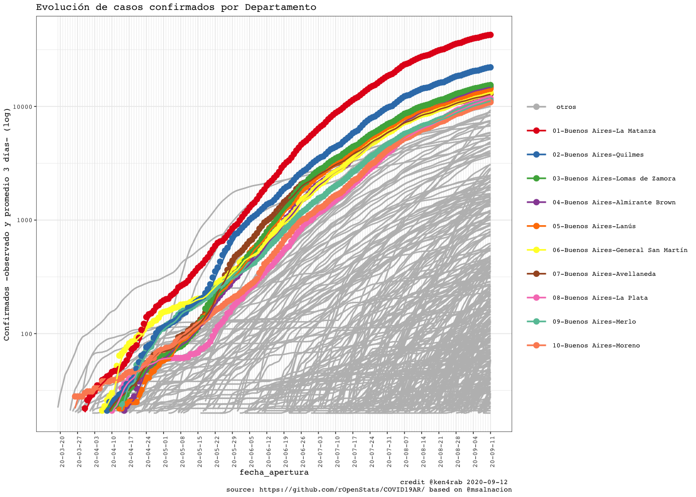
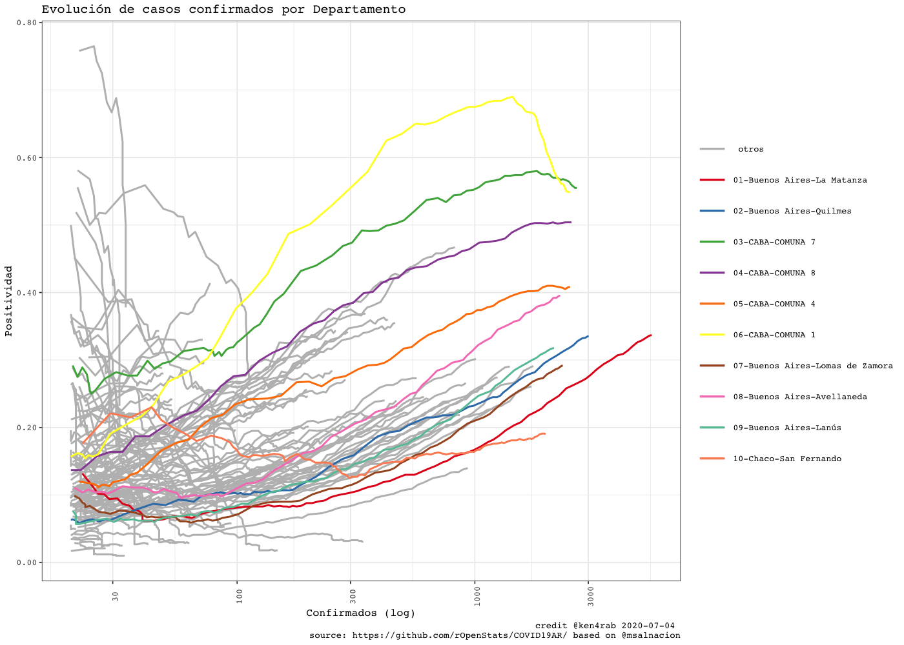
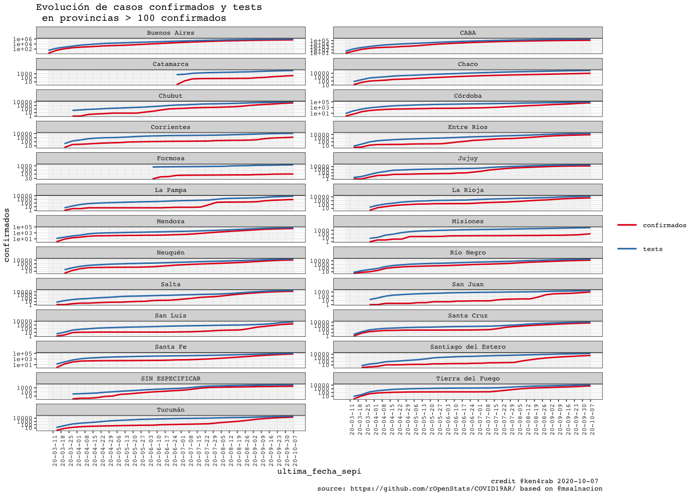
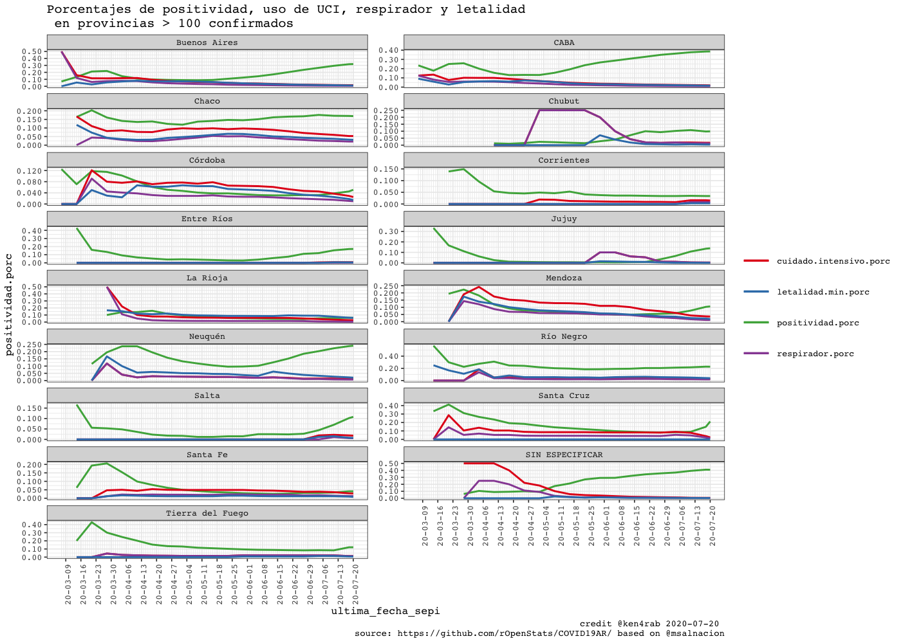
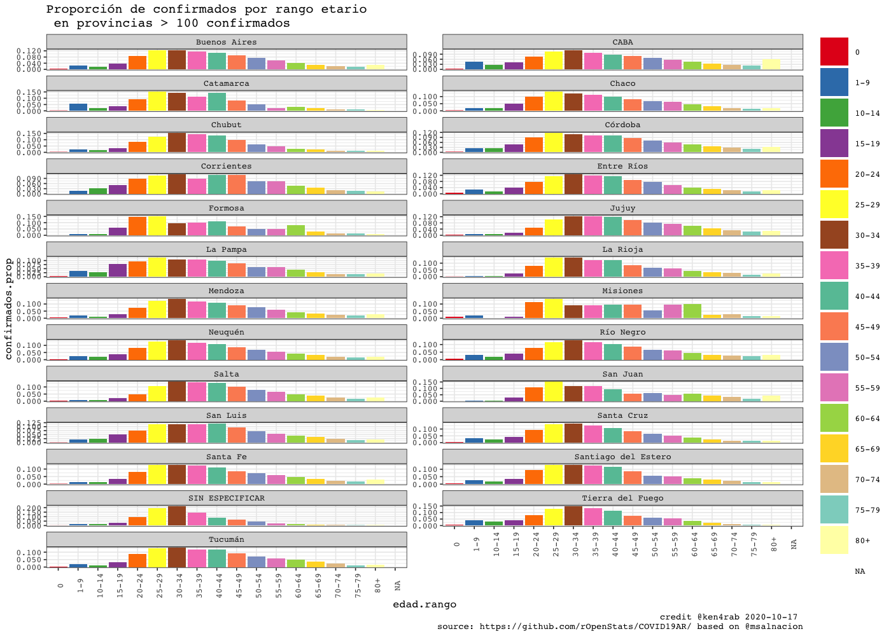
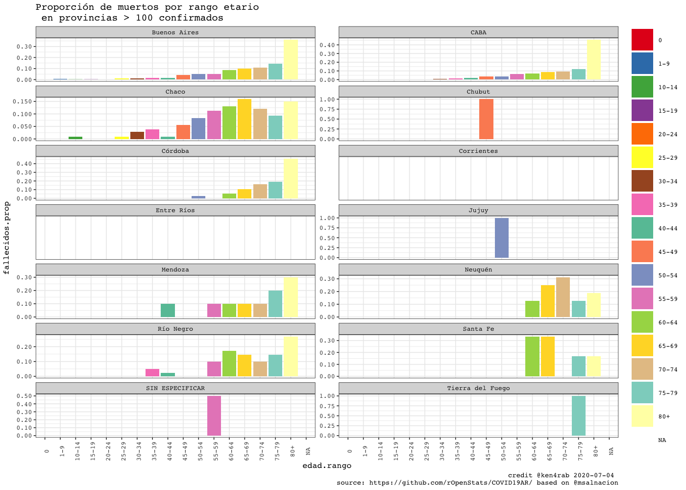
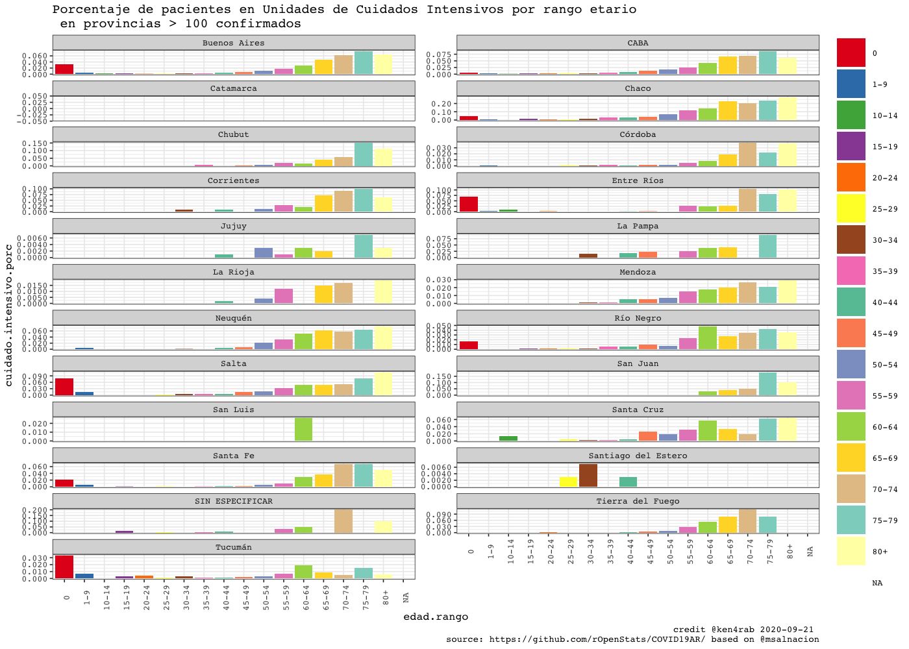
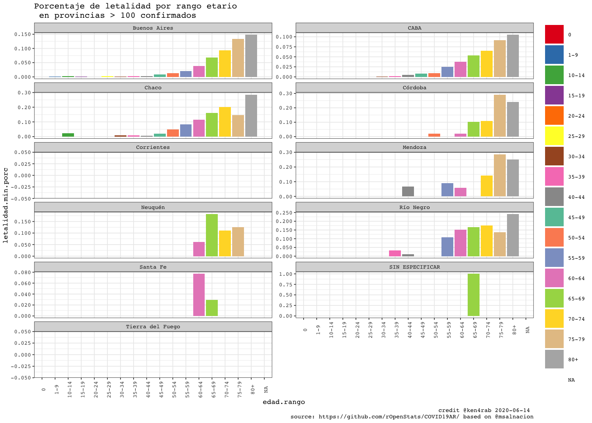
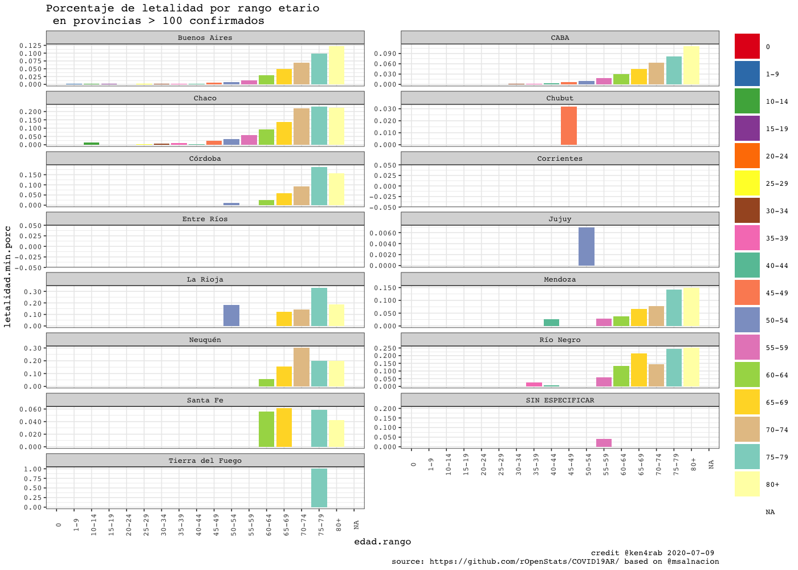

<!-- README.md is generated from README.Rmd. Please edit that file -->


COVID19AR
=========

A package for analysing COVID-19 Argentina’s outbreak

<!-- . -->

Package
=======

| Release                                                                                                | Usage                                                                                                    | Development                                                                                                                                                                                            |
|:-------------------------------------------------------------------------------------------------------|:---------------------------------------------------------------------------------------------------------|:-------------------------------------------------------------------------------------------------------------------------------------------------------------------------------------------------------|
|                                                                                                        | [](https://cran.r-project.org/) | [](https://travis-ci.org/rOpenStats/COVID19AR)                                                                                  |
| [](https://cran.r-project.org/package=COVID19AR) |                                                                                                          | [](https://codecov.io/gh/rOpenStats/COVID19AR)                                                                     |
|                                                                                                        |                                                                                                          | [](https://www.repostatus.org/#active) |

Argentina COVID19 open data
===========================

-   [Casos daily
    file](https://sisa.msal.gov.ar/datos/descargas/covid-19/files/Covid19Casos.csv)
-   [Determinaciones daily
    file](https://sisa.msal.gov.ar/datos/descargas/covid-19/files/Covid19Determinaciones.csv)

How to get started (Development version)
========================================

Install the R package using the following commands on the R console:

    # install.packages("devtools")
    devtools::install_github("rOpenStats/COVID19AR")

How to use it
=============

First add variable with your preferred configurations in `~/.Renviron`.
COVID19AR\_data\_dir is mandatory while COVID19AR\_credits can be
configured if you want to publish your own research.

    COVID19AR_data_dir = "~/.R/COVID19AR"
    COVID19AR_credits = "@youralias"

    library(COVID19AR)
    #> Loading required package: dplyr
    #> 
    #> Attaching package: 'dplyr'
    #> The following objects are masked from 'package:stats':
    #> 
    #>     filter, lag
    #> The following objects are masked from 'package:base':
    #> 
    #>     intersect, setdiff, setequal, union
    #> Loading required package: knitr
    #> Loading required package: magrittr
    #> Loading required package: lgr
    #> Warning: replacing previous import 'ggplot2::Layout' by 'lgr::Layout' when
    #> loading 'COVID19AR'
    #> Warning: replacing previous import 'readr::col_factor' by 'scales::col_factor'
    #> when loading 'COVID19AR'
    #> Warning: replacing previous import 'magrittr::equals' by 'testthat::equals' when
    #> loading 'COVID19AR'
    #> Warning: replacing previous import 'magrittr::not' by 'testthat::not' when
    #> loading 'COVID19AR'
    #> Warning: replacing previous import 'magrittr::is_less_than' by
    #> 'testthat::is_less_than' when loading 'COVID19AR'
    #> Warning: replacing previous import 'dplyr::matches' by 'testthat::matches' when
    #> loading 'COVID19AR'
    library(ggplot2)
    #> 
    #> Attaching package: 'ggplot2'
    #> The following object is masked from 'package:lgr':
    #> 
    #>     Layout

COVID19AR datos abiertos del Ministerio de Salud de la Nación
=============================================================

opendata From Ministerio de Salud de la Nación Argentina

    log.dir <- file.path(getEnv("data_dir"), "logs")
    dir.create(log.dir, recursive = TRUE, showWarnings = FALSE)
    log.file <- file.path(log.dir, "covid19ar.log")
    lgr::get_logger("root")$add_appender(AppenderFile$new(log.file))
    lgr::threshold("info", lgr::get_logger("root"))
    lgr::threshold("info", lgr::get_logger("COVID19ARCurator"))

    # Data from
    # http://datos.salud.gob.ar/dataset/covid-19-casos-registrados-en-la-republica-argentina
    covid19.curator <- COVID19ARCurator$new(report.date = Sys.Date() -1 , 
                                            download.new.data = FALSE)

    dummy <- covid19.curator$loadData()
    #> INFO  [08:44:48.993] Exists dest path? {dest.path: ~/.R/COVID19AR/Covid19Casos.csv, exists.dest.path: TRUE}
    dummy <- covid19.curator$curateData()
    #> INFO  [08:44:55.847] Normalize 
    #> INFO  [08:44:57.807] checkSoundness 
    #> INFO  [08:44:58.421] Mutating data
    # Dates of current processed file
    max(covid19.curator$data$fecha_apertura, na.rm = TRUE)
    #> [1] "2020-09-06"
    # Inicio de síntomas

    max(covid19.curator$data$fecha_inicio_sintomas,  na.rm = TRUE)
    #> [1] "2020-09-06"

    # Ultima muerte
    max(covid19.curator$data$fecha_fallecimiento,  na.rm = TRUE)
    #> [1] "2020-09-06"

    report.date <- max(covid19.curator$data$fecha_inicio_sintomas,  na.rm = TRUE)
    covid19.ar.summary <- covid19.curator$makeSummary(group.vars = NULL)

    kable(covid19.ar.summary %>% select(max_fecha_diagnostico, confirmados, fallecidos, letalidad.min.porc, letalidad.max.porc, count_fecha_diagnostico, tests, positividad.porc))

| max\_fecha\_diagnostico | confirmados | fallecidos | letalidad.min.porc | letalidad.max.porc | count\_fecha\_diagnostico |   tests | positividad.porc |
|:------------------------|------------:|-----------:|-------------------:|-------------------:|--------------------------:|--------:|-----------------:|
| 2020-09-06              |      478788 |       9859 |              0.016 |              0.021 |                       196 | 1224449 |            0.391 |


    covid19.ar.provincia.summary <- covid19.curator$makeSummary(group.vars = c("residencia_provincia_nombre"))
    covid19.ar.provincia.summary.100.confirmed <- covid19.ar.provincia.summary %>% 
      filter(confirmados >= 100) %>%
      arrange(desc(confirmados))
    # Provinces with > 100 confirmed cases
    kable(covid19.ar.provincia.summary.100.confirmed %>% select(residencia_provincia_nombre, confirmados, fallecidos, confirmados, fallecidos, letalidad.min.porc, letalidad.max.porc, count_fecha_diagnostico, tests, positividad.porc))

| residencia\_provincia\_nombre | confirmados | fallecidos | letalidad.min.porc | letalidad.max.porc | count\_fecha\_diagnostico |  tests | positividad.porc |
|:------------------------------|------------:|-----------:|-------------------:|-------------------:|--------------------------:|-------:|-----------------:|
| Buenos Aires                  |      291391 |       5963 |              0.016 |              0.020 |                       193 | 653258 |            0.446 |
| CABA                          |      102143 |       2424 |              0.021 |              0.024 |                       191 | 258218 |            0.396 |
| Santa Fe                      |       12119 |        130 |              0.009 |              0.011 |                       177 |  44440 |            0.273 |
| Córdoba                       |       11145 |        159 |              0.012 |              0.014 |                       181 |  54453 |            0.205 |
| Jujuy                         |       10122 |        253 |              0.016 |              0.025 |                       171 |  24332 |            0.416 |
| Mendoza                       |        9693 |        141 |              0.010 |              0.015 |                       180 |  24683 |            0.393 |
| Río Negro                     |        6989 |        207 |              0.026 |              0.030 |                       174 |  17204 |            0.406 |
| Chaco                         |        6014 |        227 |              0.030 |              0.038 |                       179 |  35866 |            0.168 |
| Salta                         |        4626 |         59 |              0.009 |              0.013 |                       169 |   9770 |            0.473 |
| Entre Ríos                    |        4293 |         59 |              0.011 |              0.014 |                       174 |  11955 |            0.359 |
| Tucumán                       |        3950 |         15 |              0.001 |              0.004 |                       172 |  19619 |            0.201 |
| Neuquén                       |        3818 |         62 |              0.012 |              0.016 |                       176 |   9464 |            0.403 |
| Tierra del Fuego              |        2344 |         39 |              0.014 |              0.017 |                       173 |   6569 |            0.357 |
| Santa Cruz                    |        2281 |         17 |              0.007 |              0.007 |                       166 |   5695 |            0.401 |
| La Rioja                      |        2039 |         64 |              0.029 |              0.031 |                       165 |   7762 |            0.263 |
| SIN ESPECIFICAR               |        1867 |          9 |              0.004 |              0.005 |                       167 |   4203 |            0.444 |
| Santiago del Estero           |        1295 |         15 |              0.006 |              0.012 |                       160 |   9499 |            0.136 |
| Chubut                        |        1216 |          7 |              0.003 |              0.006 |                       159 |   5869 |            0.207 |
| San Juan                      |         376 |          1 |              0.002 |              0.003 |                       164 |   1543 |            0.244 |
| Corrientes                    |         345 |          2 |              0.003 |              0.006 |                       171 |   7988 |            0.043 |
| San Luis                      |         247 |          0 |              0.000 |              0.000 |                       153 |   1321 |            0.187 |
| La Pampa                      |         234 |          3 |              0.010 |              0.013 |                       154 |   2715 |            0.086 |

    covid19.ar.summary <- covid19.curator$makeSummary(group.vars = c("residencia_provincia_nombre"))
    nrow(covid19.ar.summary)
    #> [1] 25
    porc.cols <- names(covid19.ar.summary)[grep("porc", names(covid19.ar.summary))]
    kable((covid19.ar.summary %>% filter(confirmados > 0) %>% arrange(desc(confirmados))) %>% 
            select_at(c("residencia_provincia_nombre", "confirmados", "tests", "fallecidos", "dias.fallecimiento",porc.cols)))

| residencia\_provincia\_nombre | confirmados |  tests | fallecidos | dias.fallecimiento | letalidad.min.porc | letalidad.max.porc | positividad.porc | internados.porc | cuidado.intensivo.porc | respirador.porc |
|:------------------------------|------------:|-------:|-----------:|-------------------:|-------------------:|-------------------:|-----------------:|----------------:|-----------------------:|----------------:|
| Buenos Aires                  |      291391 | 653258 |       5963 |               15.0 |              0.016 |              0.020 |            0.446 |           0.080 |                  0.011 |           0.005 |
| CABA                          |      102143 | 258218 |       2424 |               16.0 |              0.021 |              0.024 |            0.396 |           0.164 |                  0.017 |           0.008 |
| Santa Fe                      |       12119 |  44440 |        130 |               12.5 |              0.009 |              0.011 |            0.273 |           0.041 |                  0.010 |           0.005 |
| Córdoba                       |       11145 |  54453 |        159 |               15.4 |              0.012 |              0.014 |            0.205 |           0.024 |                  0.006 |           0.003 |
| Jujuy                         |       10122 |  24332 |        253 |               13.7 |              0.016 |              0.025 |            0.416 |           0.007 |                  0.001 |           0.001 |
| Mendoza                       |        9693 |  24683 |        141 |               10.8 |              0.010 |              0.015 |            0.393 |           0.140 |                  0.008 |           0.003 |
| Río Negro                     |        6989 |  17204 |        207 |               13.0 |              0.026 |              0.030 |            0.406 |           0.262 |                  0.012 |           0.008 |
| Chaco                         |        6014 |  35866 |        227 |               14.5 |              0.030 |              0.038 |            0.168 |           0.105 |                  0.057 |           0.026 |
| Salta                         |        4626 |   9770 |         59 |                9.5 |              0.009 |              0.013 |            0.473 |           0.125 |                  0.014 |           0.006 |
| Entre Ríos                    |        4293 |  11955 |         59 |               11.4 |              0.011 |              0.014 |            0.359 |           0.102 |                  0.010 |           0.003 |
| Tucumán                       |        3950 |  19619 |         15 |               13.0 |              0.001 |              0.004 |            0.201 |           0.050 |                  0.006 |           0.001 |
| Neuquén                       |        3818 |   9464 |         62 |               17.0 |              0.012 |              0.016 |            0.403 |           0.544 |                  0.013 |           0.009 |
| Tierra del Fuego              |        2344 |   6569 |         39 |               14.6 |              0.014 |              0.017 |            0.357 |           0.026 |                  0.009 |           0.008 |
| Santa Cruz                    |        2281 |   5695 |         17 |               12.7 |              0.007 |              0.007 |            0.401 |           0.039 |                  0.011 |           0.007 |
| La Rioja                      |        2039 |   7762 |         64 |               10.2 |              0.029 |              0.031 |            0.263 |           0.016 |                  0.004 |           0.001 |
| SIN ESPECIFICAR               |        1867 |   4203 |          9 |               20.7 |              0.004 |              0.005 |            0.444 |           0.063 |                  0.007 |           0.004 |
| Santiago del Estero           |        1295 |   9499 |         15 |                8.7 |              0.006 |              0.012 |            0.136 |           0.007 |                  0.002 |           0.001 |
| Chubut                        |        1216 |   5869 |          7 |               15.9 |              0.003 |              0.006 |            0.207 |           0.021 |                  0.006 |           0.005 |
| San Juan                      |         376 |   1543 |          1 |               35.0 |              0.002 |              0.003 |            0.244 |           0.027 |                  0.008 |           0.003 |
| Corrientes                    |         345 |   7988 |          2 |               12.0 |              0.003 |              0.006 |            0.043 |           0.023 |                  0.009 |           0.003 |
| San Luis                      |         247 |   1321 |          0 |                NaN |              0.000 |              0.000 |            0.187 |           0.121 |                  0.004 |           0.000 |
| La Pampa                      |         234 |   2715 |          3 |               29.0 |              0.010 |              0.013 |            0.086 |           0.077 |                  0.013 |           0.004 |
| Formosa                       |          89 |   1150 |          1 |               12.0 |              0.008 |              0.011 |            0.077 |           0.022 |                  0.000 |           0.000 |
| Catamarca                     |          85 |   3568 |          0 |                NaN |              0.000 |              0.000 |            0.024 |           0.000 |                  0.000 |           0.000 |
| Misiones                      |          67 |   3305 |          2 |                6.5 |              0.016 |              0.030 |            0.020 |           0.448 |                  0.090 |           0.045 |

    rg <- ReportGeneratorCOVID19AR$new(covid19ar.curator = covid19.curator)
    rg$preprocess()
    #> Parsed with column specification:
    #> cols(
    #>   .default = col_double(),
    #>   residencia_provincia_nombre = col_character(),
    #>   residencia_departamento_nombre = col_character(),
    #>   fecha_apertura = col_date(format = ""),
    #>   max_fecha_diagnostico = col_date(format = ""),
    #>   max_fecha_inicio_sintomas = col_date(format = ""),
    #>   confirmados.inc = col_logical(),
    #>   confirmados.rate = col_logical(),
    #>   fallecidos.inc = col_logical(),
    #>   tests.inc = col_logical(),
    #>   tests.rate = col_logical(),
    #>   sospechosos.inc = col_logical()
    #> )
    #> See spec(...) for full column specifications.
    rg$getDepartamentosExponentialGrowthPlot()
    #> Scale for 'y' is already present. Adding another scale for 'y', which will
    #> replace the existing scale.



    rg$getDepartamentosCrossSectionConfirmedPostivityPlot()



    covid19.ar.summary <- covid19.curator$makeSummary(group.vars = c("sepi_apertura"))
    #> INFO  [08:49:48.414] Processing {current.group: }
    nrow(covid19.ar.summary)
    #> [1] 28
    porc.cols <- names(covid19.ar.summary)[grep("porc", names(covid19.ar.summary))]
    kable(covid19.ar.summary %>% 
            filter(confirmados > 0) %>% 
            arrange(sepi_apertura, desc(confirmados)) %>% 
            select_at(c("sepi_apertura", "max_fecha_diagnostico", "count_fecha_diagnostico", "confirmados", "tests", "internados", "fallecidos",  porc.cols)))

| sepi\_apertura | max\_fecha\_diagnostico | count\_fecha\_diagnostico | confirmados |   tests | internados | fallecidos | letalidad.min.porc | letalidad.max.porc | positividad.porc | internados.porc | cuidado.intensivo.porc | respirador.porc |
|---------------:|:------------------------|--------------------------:|------------:|--------:|-----------:|-----------:|-------------------:|-------------------:|-----------------:|----------------:|-----------------------:|----------------:|
|             10 | 2020-08-12              |                        20 |          15 |      86 |          9 |          1 |              0.048 |              0.067 |            0.174 |           0.600 |                  0.133 |           0.133 |
|             11 | 2020-08-25              |                        41 |          98 |     668 |         66 |          9 |              0.067 |              0.092 |            0.147 |           0.673 |                  0.122 |           0.061 |
|             12 | 2020-09-04              |                        72 |         421 |    2055 |        259 |         17 |              0.034 |              0.040 |            0.205 |           0.615 |                  0.090 |           0.052 |
|             13 | 2020-09-04              |                       110 |        1099 |    5528 |        605 |         64 |              0.050 |              0.058 |            0.199 |           0.551 |                  0.093 |           0.056 |
|             14 | 2020-09-04              |                       148 |        1811 |   11554 |        989 |        116 |              0.054 |              0.064 |            0.157 |           0.546 |                  0.093 |           0.055 |
|             15 | 2020-09-04              |                       175 |        2508 |   20280 |       1349 |        181 |              0.060 |              0.072 |            0.124 |           0.538 |                  0.088 |           0.049 |
|             16 | 2020-09-05              |                       189 |        3360 |   31899 |       1715 |        242 |              0.059 |              0.072 |            0.105 |           0.510 |                  0.078 |           0.043 |
|             17 | 2020-09-05              |                       192 |        4556 |   45965 |       2259 |        352 |              0.064 |              0.077 |            0.099 |           0.496 |                  0.070 |           0.037 |
|             18 | 2020-09-05              |                       192 |        5628 |   59165 |       2678 |        438 |              0.065 |              0.078 |            0.095 |           0.476 |                  0.063 |           0.034 |
|             19 | 2020-09-05              |                       192 |        7162 |   73308 |       3286 |        525 |              0.062 |              0.073 |            0.098 |           0.459 |                  0.059 |           0.031 |
|             20 | 2020-09-05              |                       192 |        9629 |   90750 |       4154 |        638 |              0.056 |              0.066 |            0.106 |           0.431 |                  0.054 |           0.028 |
|             21 | 2020-09-06              |                       193 |       14125 |  114210 |       5516 |        814 |              0.050 |              0.058 |            0.124 |           0.391 |                  0.048 |           0.024 |
|             22 | 2020-09-06              |                       193 |       19486 |  139633 |       6988 |       1039 |              0.046 |              0.053 |            0.140 |           0.359 |                  0.043 |           0.022 |
|             23 | 2020-09-06              |                       193 |       26122 |  167952 |       8565 |       1306 |              0.044 |              0.050 |            0.156 |           0.328 |                  0.040 |           0.019 |
|             24 | 2020-09-06              |                       193 |       35963 |  203124 |      10754 |       1641 |              0.040 |              0.046 |            0.177 |           0.299 |                  0.036 |           0.017 |
|             25 | 2020-09-06              |                       193 |       48993 |  244604 |      13163 |       2055 |              0.037 |              0.042 |            0.200 |           0.269 |                  0.031 |           0.015 |
|             26 | 2020-09-06              |                       193 |       67014 |  296753 |      16288 |       2604 |              0.034 |              0.039 |            0.226 |           0.243 |                  0.028 |           0.013 |
|             27 | 2020-09-06              |                       193 |       86016 |  347856 |      19141 |       3228 |              0.033 |              0.038 |            0.247 |           0.223 |                  0.026 |           0.011 |
|             28 | 2020-09-06              |                       194 |      109623 |  406908 |      22509 |       4017 |              0.032 |              0.037 |            0.269 |           0.205 |                  0.024 |           0.011 |
|             29 | 2020-09-06              |                       196 |      138705 |  478319 |      26163 |       4912 |              0.031 |              0.035 |            0.290 |           0.189 |                  0.022 |           0.010 |
|             30 | 2020-09-06              |                       196 |      176600 |  564036 |      29864 |       5896 |              0.029 |              0.033 |            0.313 |           0.169 |                  0.020 |           0.009 |
|             31 | 2020-09-06              |                       196 |      215755 |  652917 |      33113 |       6773 |              0.027 |              0.031 |            0.330 |           0.153 |                  0.019 |           0.009 |
|             32 | 2020-09-06              |                       196 |      264503 |  759973 |      36790 |       7769 |              0.025 |              0.029 |            0.348 |           0.139 |                  0.017 |           0.008 |
|             33 | 2020-09-06              |                       196 |      310057 |  871204 |      40225 |       8514 |              0.023 |              0.027 |            0.356 |           0.130 |                  0.016 |           0.007 |
|             34 | 2020-09-06              |                       196 |      357931 |  979661 |      43461 |       9199 |              0.022 |              0.026 |            0.365 |           0.121 |                  0.015 |           0.007 |
|             35 | 2020-09-06              |                       196 |      421116 | 1110865 |      46669 |       9702 |              0.019 |              0.023 |            0.379 |           0.111 |                  0.014 |           0.006 |
|             36 | 2020-09-06              |                       196 |      477351 | 1222329 |      48385 |       9858 |              0.017 |              0.021 |            0.391 |           0.101 |                  0.013 |           0.006 |
|             37 | 2020-09-06              |                       196 |      478788 | 1224449 |      48393 |       9859 |              0.016 |              0.021 |            0.391 |           0.101 |                  0.013 |           0.006 |


    ```r
    covid19.ar.summary <- covid19.curator$makeSummary(group.vars = c("residencia_provincia_nombre", "sepi_apertura"))
    #> INFO  [08:51:32.248] Processing {current.group: residencia_provincia_nombre = Buenos Aires}
    #> INFO  [08:52:27.284] Processing {current.group: residencia_provincia_nombre = CABA}
    #> INFO  [08:52:54.385] Processing {current.group: residencia_provincia_nombre = Catamarca}
    #> INFO  [08:52:56.878] Processing {current.group: residencia_provincia_nombre = Chaco}
    #> INFO  [08:53:03.009] Processing {current.group: residencia_provincia_nombre = Chubut}
    #> INFO  [08:53:05.951] Processing {current.group: residencia_provincia_nombre = Córdoba}
    #> INFO  [08:53:14.348] Processing {current.group: residencia_provincia_nombre = Corrientes}
    #> INFO  [08:53:17.881] Processing {current.group: residencia_provincia_nombre = Entre Ríos}
    #> INFO  [08:53:21.484] Processing {current.group: residencia_provincia_nombre = Formosa}
    #> INFO  [08:53:23.628] Processing {current.group: residencia_provincia_nombre = Jujuy}
    #> INFO  [08:53:27.649] Processing {current.group: residencia_provincia_nombre = La Pampa}
    #> INFO  [08:53:30.303] Processing {current.group: residencia_provincia_nombre = La Rioja}
    #> INFO  [08:53:33.232] Processing {current.group: residencia_provincia_nombre = Mendoza}
    #> INFO  [08:53:37.121] Processing {current.group: residencia_provincia_nombre = Misiones}
    #> INFO  [08:53:39.735] Processing {current.group: residencia_provincia_nombre = Neuquén}
    #> INFO  [08:53:42.880] Processing {current.group: residencia_provincia_nombre = Río Negro}
    #> INFO  [08:53:46.580] Processing {current.group: residencia_provincia_nombre = Salta}
    #> INFO  [08:53:49.995] Processing {current.group: residencia_provincia_nombre = San Juan}
    #> INFO  [08:53:52.882] Processing {current.group: residencia_provincia_nombre = San Luis}
    #> INFO  [08:53:55.555] Processing {current.group: residencia_provincia_nombre = Santa Cruz}
    #> INFO  [08:53:58.355] Processing {current.group: residencia_provincia_nombre = Santa Fe}
    #> INFO  [08:54:04.355] Processing {current.group: residencia_provincia_nombre = Santiago del Estero}
    #> INFO  [08:54:07.650] Processing {current.group: residencia_provincia_nombre = SIN ESPECIFICAR}
    #> INFO  [08:54:10.577] Processing {current.group: residencia_provincia_nombre = Tierra del Fuego}
    #> INFO  [08:54:13.654] Processing {current.group: residencia_provincia_nombre = Tucumán}
    nrow(covid19.ar.summary)
    #> [1] 636
    porc.cols <- names(covid19.ar.summary)[grep("porc", names(covid19.ar.summary))]
    sepi.fechas <- covid19.curator$data %>% 
      group_by(sepi_apertura) %>% 
      summarize(ultima_fecha_sepi = max(fecha_apertura), .groups = "keep")


    data2plot <- covid19.ar.summary %>%
                    filter(residencia_provincia_nombre %in% covid19.ar.provincia.summary.100.confirmed$residencia_provincia_nombre) %>%
                    filter(confirmados > 0 ) %>%
                    filter(positividad.porc <=0.6 | confirmados >= 20)

                    
    data2plot %<>% inner_join(sepi.fechas, by = "sepi_apertura")
    dates <- sort(unique(data2plot$ultima_fecha_sepi))

    covplot <- data2plot %>%
     ggplot(aes(x = ultima_fecha_sepi, y = confirmados, color = "confirmados")) +
     geom_line() +
     facet_wrap(~residencia_provincia_nombre, ncol = 2, scales = "free_y") +
     labs(title = "Evolución de casos confirmados y tests\n en provincias > 100 confirmados")
    covplot <- covplot +
     geom_line(aes(x = ultima_fecha_sepi, y = tests, color = "tests")) +
     facet_wrap(~residencia_provincia_nombre, ncol = 2, scales = "free_y")
    covplot <- setupTheme(covplot, report.date = report.date, x.values = dates, x.type = "dates",
                         total.colors = 2,
                         data.provider.abv = "@msalnacion", base.size = 6)
    covplot <- covplot + scale_y_log10()
    #> Scale for 'y' is already present. Adding another scale for 'y', which will
    #> replace the existing scale.
    covplot




    covplot <- data2plot %>%
     ggplot(aes(x = ultima_fecha_sepi, y = positividad.porc, color = "positividad.porc")) +
     geom_line() +
     facet_wrap(~residencia_provincia_nombre, ncol = 2, scales = "free_y") +
     labs(title = "Porcentajes de positividad, uso de UCI, respirador y letalidad\n en provincias > 100 confirmados")
    covplot <- covplot +
     geom_line(aes(x = ultima_fecha_sepi, y = cuidado.intensivo.porc, color = "cuidado.intensivo.porc")) +
     facet_wrap(~residencia_provincia_nombre, ncol = 2, scales = "free_y")
    covplot <- covplot  +
     geom_line(aes(x = ultima_fecha_sepi, y = respirador.porc, color = "respirador.porc"))+
     facet_wrap(~residencia_provincia_nombre, ncol = 2, scales = "free_y")
    covplot <- covplot +
     geom_line(aes(x = ultima_fecha_sepi, y = letalidad.min.porc, color = "letalidad.min.porc")) +
     facet_wrap(~residencia_provincia_nombre, ncol = 2, scales = "free_y")

    covplot <- setupTheme(covplot, report.date = report.date, x.values = dates, x.type = "dates",
                         total.colors = 4,
                         data.provider.abv = "@msalnacion", base.size = 6)
    covplot




    covid19.ar.summary <- covid19.curator$makeSummary(group.vars = c("residencia_provincia_nombre", "sexo"))
    nrow(covid19.ar.summary)
    #> [1] 67
    porc.cols <- names(covid19.ar.summary)[grep("porc", names(covid19.ar.summary))]
    kable((covid19.ar.summary %>% filter(confirmados >= 10) %>% arrange(desc(confirmados))) %>% select_at(c("residencia_provincia_nombre", "sexo", "confirmados", "internados", "fallecidos",  porc.cols)))

| residencia\_provincia\_nombre | sexo | confirmados | internados | fallecidos | letalidad.min.porc | letalidad.max.porc | positividad.porc | internados.porc | cuidado.intensivo.porc | respirador.porc |
|:------------------------------|:-----|------------:|-----------:|-----------:|-------------------:|-------------------:|-----------------:|----------------:|-----------------------:|----------------:|
| Buenos Aires                  | M    |      148917 |      12651 |       3392 |              0.018 |              0.023 |            0.463 |           0.085 |                  0.013 |           0.006 |
| Buenos Aires                  | F    |      141421 |      10495 |       2531 |              0.014 |              0.018 |            0.429 |           0.074 |                  0.009 |           0.003 |
| CABA                          | F    |       51495 |       8153 |       1124 |              0.019 |              0.022 |            0.374 |           0.158 |                  0.013 |           0.006 |
| CABA                          | M    |       50252 |       8536 |       1275 |              0.022 |              0.025 |            0.421 |           0.170 |                  0.022 |           0.011 |
| Santa Fe                      | M    |        6062 |        276 |         77 |              0.010 |              0.013 |            0.288 |           0.046 |                  0.012 |           0.007 |
| Santa Fe                      | F    |        6053 |        216 |         53 |              0.007 |              0.009 |            0.259 |           0.036 |                  0.009 |           0.004 |
| Jujuy                         | M    |        5917 |         50 |        157 |              0.018 |              0.027 |            0.437 |           0.008 |                  0.001 |           0.001 |
| Córdoba                       | F    |        5612 |        126 |         67 |              0.010 |              0.012 |            0.202 |           0.022 |                  0.006 |           0.003 |
| Córdoba                       | M    |        5506 |        137 |         90 |              0.013 |              0.016 |            0.207 |           0.025 |                  0.007 |           0.004 |
| Mendoza                       | M    |        4850 |        673 |         90 |              0.013 |              0.019 |            0.404 |           0.139 |                  0.013 |           0.005 |
| Mendoza                       | F    |        4817 |        675 |         49 |              0.007 |              0.010 |            0.383 |           0.140 |                  0.004 |           0.001 |
| Jujuy                         | F    |        4189 |         21 |         95 |              0.014 |              0.023 |            0.390 |           0.005 |                  0.001 |           0.001 |
| Río Negro                     | F    |        3615 |        923 |         79 |              0.019 |              0.022 |            0.393 |           0.255 |                  0.007 |           0.004 |
| Río Negro                     | M    |        3371 |        903 |        128 |              0.034 |              0.038 |            0.422 |           0.268 |                  0.018 |           0.013 |
| Chaco                         | M    |        3038 |        326 |        144 |              0.038 |              0.047 |            0.171 |           0.107 |                  0.065 |           0.031 |
| Chaco                         | F    |        2973 |        307 |         83 |              0.022 |              0.028 |            0.164 |           0.103 |                  0.050 |           0.021 |
| Salta                         | M    |        2720 |        333 |         46 |              0.012 |              0.017 |            0.482 |           0.122 |                  0.017 |           0.008 |
| Entre Ríos                    | F    |        2167 |        213 |         23 |              0.008 |              0.011 |            0.346 |           0.098 |                  0.007 |           0.002 |
| Entre Ríos                    | M    |        2123 |        223 |         35 |              0.013 |              0.016 |            0.374 |           0.105 |                  0.012 |           0.003 |
| Tucumán                       | M    |        2067 |        110 |         11 |              0.002 |              0.005 |            0.174 |           0.053 |                  0.006 |           0.001 |
| Neuquén                       | M    |        1933 |       1049 |         34 |              0.013 |              0.018 |            0.415 |           0.543 |                  0.014 |           0.011 |
| Salta                         | F    |        1896 |        242 |         13 |              0.005 |              0.007 |            0.462 |           0.128 |                  0.010 |           0.002 |
| Neuquén                       | F    |        1884 |       1026 |         27 |              0.010 |              0.014 |            0.393 |           0.545 |                  0.011 |           0.007 |
| Tucumán                       | F    |        1883 |         87 |          4 |              0.001 |              0.002 |            0.244 |           0.046 |                  0.006 |           0.001 |
| Tierra del Fuego              | M    |        1290 |         37 |         26 |              0.017 |              0.020 |            0.376 |           0.029 |                  0.013 |           0.012 |
| Santa Cruz                    | M    |        1157 |         46 |         11 |              0.009 |              0.010 |            0.412 |           0.040 |                  0.013 |           0.009 |
| Santa Cruz                    | F    |        1123 |         43 |          6 |              0.005 |              0.005 |            0.389 |           0.038 |                  0.009 |           0.006 |
| SIN ESPECIFICAR               | F    |        1098 |         62 |          3 |              0.002 |              0.003 |            0.433 |           0.056 |                  0.005 |           0.001 |
| La Rioja                      | M    |        1065 |         17 |         37 |              0.032 |              0.035 |            0.269 |           0.016 |                  0.003 |           0.000 |
| Buenos Aires                  | NR   |        1053 |         94 |         40 |              0.026 |              0.038 |            0.468 |           0.089 |                  0.021 |           0.009 |
| Tierra del Fuego              | F    |        1040 |         23 |         13 |              0.010 |              0.013 |            0.332 |           0.022 |                  0.004 |           0.004 |
| La Rioja                      | F    |         966 |         15 |         26 |              0.025 |              0.027 |            0.257 |           0.016 |                  0.005 |           0.002 |
| SIN ESPECIFICAR               | M    |         763 |         55 |          5 |              0.006 |              0.007 |            0.463 |           0.072 |                  0.009 |           0.007 |
| Santiago del Estero           | M    |         709 |          6 |          9 |              0.006 |              0.013 |            0.116 |           0.008 |                  0.003 |           0.000 |
| Chubut                        | M    |         652 |         17 |          4 |              0.003 |              0.006 |            0.221 |           0.026 |                  0.008 |           0.008 |
| Santiago del Estero           | F    |         582 |          3 |          6 |              0.005 |              0.010 |            0.189 |           0.005 |                  0.002 |           0.002 |
| Chubut                        | F    |         558 |          8 |          3 |              0.003 |              0.005 |            0.194 |           0.014 |                  0.004 |           0.002 |
| CABA                          | NR   |         396 |        105 |         25 |              0.048 |              0.063 |            0.410 |           0.265 |                  0.038 |           0.023 |
| Corrientes                    | M    |         195 |          7 |          2 |              0.005 |              0.010 |            0.044 |           0.036 |                  0.010 |           0.005 |
| San Juan                      | M    |         189 |          5 |          1 |              0.004 |              0.005 |            0.224 |           0.026 |                  0.005 |           0.000 |
| San Juan                      | F    |         187 |          5 |          0 |              0.000 |              0.000 |            0.268 |           0.027 |                  0.011 |           0.005 |
| Corrientes                    | F    |         150 |          1 |          0 |              0.000 |              0.000 |            0.043 |           0.007 |                  0.007 |           0.000 |
| San Luis                      | M    |         137 |         14 |          0 |              0.000 |              0.000 |            0.189 |           0.102 |                  0.007 |           0.000 |
| La Pampa                      | F    |         131 |         12 |          1 |              0.006 |              0.008 |            0.086 |           0.092 |                  0.015 |           0.008 |
| San Luis                      | F    |         110 |         16 |          0 |              0.000 |              0.000 |            0.185 |           0.145 |                  0.000 |           0.000 |
| La Pampa                      | M    |         103 |          6 |          2 |              0.016 |              0.019 |            0.087 |           0.058 |                  0.010 |           0.000 |
| Formosa                       | M    |          69 |          0 |          0 |              0.000 |              0.000 |            0.100 |           0.000 |                  0.000 |           0.000 |
| Catamarca                     | M    |          55 |          0 |          0 |              0.000 |              0.000 |            0.024 |           0.000 |                  0.000 |           0.000 |
| Misiones                      | M    |          43 |         16 |          1 |              0.013 |              0.023 |            0.024 |           0.372 |                  0.093 |           0.047 |
| Catamarca                     | F    |          30 |          0 |          0 |              0.000 |              0.000 |            0.024 |           0.000 |                  0.000 |           0.000 |
| Córdoba                       | NR   |          27 |          1 |          2 |              0.056 |              0.074 |            0.474 |           0.037 |                  0.000 |           0.000 |
| Mendoza                       | NR   |          26 |          5 |          2 |              0.037 |              0.077 |            0.206 |           0.192 |                  0.000 |           0.000 |
| Misiones                      | F    |          24 |         14 |          1 |              0.021 |              0.042 |            0.016 |           0.583 |                  0.083 |           0.042 |
| Formosa                       | F    |          20 |          2 |          1 |              0.029 |              0.050 |            0.044 |           0.100 |                  0.000 |           0.000 |
| Jujuy                         | NR   |          16 |          0 |          1 |              0.032 |              0.062 |            0.314 |           0.000 |                  0.000 |           0.000 |
| Tierra del Fuego              | NR   |          14 |          0 |          0 |              0.000 |              0.000 |            2.800 |           0.000 |                  0.000 |           0.000 |
| Salta                         | NR   |          10 |          1 |          0 |              0.000 |              0.000 |            0.400 |           0.100 |                  0.000 |           0.000 |


    covid19.ar.summary <- covid19.curator$makeSummary(group.vars = c("residencia_provincia_nombre", "edad.rango"))
    #> Warning in max.default(structure(c(NA_real_, NA_real_, NA_real_, NA_real_, : no
    #> non-missing arguments to max; returning -Inf

    #> Warning in max.default(structure(c(NA_real_, NA_real_, NA_real_, NA_real_, : no
    #> non-missing arguments to max; returning -Inf

     # Share per province
      provinces.cases <-covid19.ar.summary %>%
        group_by(residencia_provincia_nombre) %>%
        summarise(fallecidos.total.provincia = sum(fallecidos),
                  confirmados.total.provincia = sum(confirmados),
                  .groups = "keep")
     covid19.ar.summary %<>% inner_join(provinces.cases, by = "residencia_provincia_nombre")
     covid19.ar.summary %<>% mutate(fallecidos.prop = fallecidos/fallecidos.total.provincia)
     covid19.ar.summary %<>% mutate(confirmados.prop = confirmados/confirmados.total.provincia)

     # Data 2 plot
     data2plot <- covid19.ar.summary %>% filter(residencia_provincia_nombre %in%
     # Proporción de confirmados por rango etario
     covid19.ar.provincia.summary.100.confirmed$residencia_provincia_nombre)

     
     covidplot <-
       data2plot %>%
       ggplot(aes(x = edad.rango, y = confirmados.prop, fill = edad.rango)) +
       geom_bar(stat = "identity") + facet_wrap(~residencia_provincia_nombre, ncol = 2, scales = "free_y") +
       labs(title = "Proporción de confirmados por rango etario\n en provincias > 100 confirmados")

     covidplot <- setupTheme(covidplot, report.date = report.date, x.values = NULL, x.type = NULL,
                             total.colors = length(unique(data2plot$edad.rango)),
                             data.provider.abv = "@msalnacion", base.size = 6)
     # Proporción de muertos por rango etario
     covidplot




     #Plot of deaths share
     covidplot <-
        data2plot %>%
        ggplot(aes(x = edad.rango, y = fallecidos.prop, fill = edad.rango)) +
        geom_bar(stat = "identity") + facet_wrap(~residencia_provincia_nombre, ncol = 2, scales = "free_y") +
        labs(title = "Proporción de muertos por rango etario\n en provincias > 100 confirmados")
     covidplot <- setupTheme(covidplot, report.date = report.date, x.values = NULL, x.type = NULL,
                          total.colors = length(unique(data2plot$edad.rango)),
                          data.provider.abv = "@msalnacion", base.size = 6)
     # Proporción de muertos por rango etario
     covidplot
    #> Warning: Removed 16 rows containing missing values (position_stack).




     # UCI rate
     covidplot <- data2plot %>%
       ggplot(aes(x = edad.rango, y = cuidado.intensivo.porc, fill = edad.rango)) +
       geom_bar(stat = "identity") + facet_wrap(~residencia_provincia_nombre, ncol = 2, scales = "free_y") +
        labs(title = "Porcentaje de pacientes en Unidades de Cuidados Intensivos por rango etario\n en provincias > 100 confirmados")
     covidplot <- setupTheme(covidplot, report.date = report.date, x.values = NULL, x.type = NULL,
                          total.colors = length(unique(data2plot$edad.rango)),
                          data.provider.abv = "@msalnacion", base.size = 6)
     covidplot




     # ventilator rate
     covidplot <- data2plot %>%
       ggplot(aes(x = edad.rango, y = respirador.porc, fill = edad.rango)) +
       geom_bar(stat = "identity") +
       facet_wrap(~residencia_provincia_nombre, ncol = 2, scales = "free_y") +
       labs(title = "Porcentaje de pacientes que utilizaron respirador mecánico por rango etario\n en provincias > 100 confirmados")
     covidplot <- setupTheme(covidplot, report.date = report.date, x.values = NULL, x.type = NULL,
                          total.colors = length(unique(data2plot$edad.rango)),
                          data.provider.abv = "@msalnacion", base.size = 6)
     covidplot




     # fatality rate

     covidplot <- data2plot %>%
      ggplot(aes(x = edad.rango, y = letalidad.min.porc, fill = edad.rango)) +
      geom_bar(stat = "identity") +
      facet_wrap(~residencia_provincia_nombre, ncol = 2, scales = "free_y") +
      labs(title = "Porcentaje de letalidad por rango etario\n en provincias > 100 confirmados")
     covidplot <- setupTheme(covidplot, report.date = report.date, x.values = NULL, x.type = NULL,
                          total.colors = length(unique(data2plot$edad.rango)),
                          data.provider.abv = "@msalnacion", base.size = 6)
     covidplot



Generar diferentes agregaciones y guardar csv / Generate different aggregations
===============================================================================

    output.dir <- "~/.R/COVID19AR/"
    dir.create(output.dir, showWarnings = FALSE, recursive = TRUE)
    exportAggregatedTables(covid19.curator, output.dir = output.dir,
                           aggrupation.criteria = list(provincia_residencia = c("residencia_provincia_nombre"),
                                                       provincia_localidad_residencia = c("residencia_provincia_nombre", "residencia_departamento_nombre"),
                                                       provincia_residencia_sexo = c("residencia_provincia_nombre", "sexo"),
                                                       edad_rango_sexo = c("edad.rango", "sexo"),
                                                       provincia_residencia_edad_rango = c("residencia_provincia_nombre", "edad.rango"),
                                                       provincia_residencia_sepi_apertura = c("residencia_provincia_nombre", "sepi_apertura"),
                                                       provincia_residencia = c("residencia_provincia_nombre", "residencia_departamento_nombre", "sepi_apertura"),
                                                       provincia_residencia_fecha_apertura = c("residencia_provincia_nombre", "fecha_apertura")))
                                                       
                                                      

All this tables are accesible at
[COVID19ARdata](https://github.com/rOpenStats/COVID19ARdata/tree/master/curated)

How to Cite This Work
=====================

Citation

    Alejandro Baranek, COVID19AR, 2020. URL: https://github.com/rOpenStats/COVID19AR

    BibTex
    @techreport{baranek2020Covid19AR,
    Author = {Alejandro Baranek},
    Institution = {rOpenStats},
    Title = {COVID19AR: a package for analysing Argentina COVID-19 outbreak},
    Url = {https://github.com/rOpenStats/COVID19AR},
    Year = {2020}}
