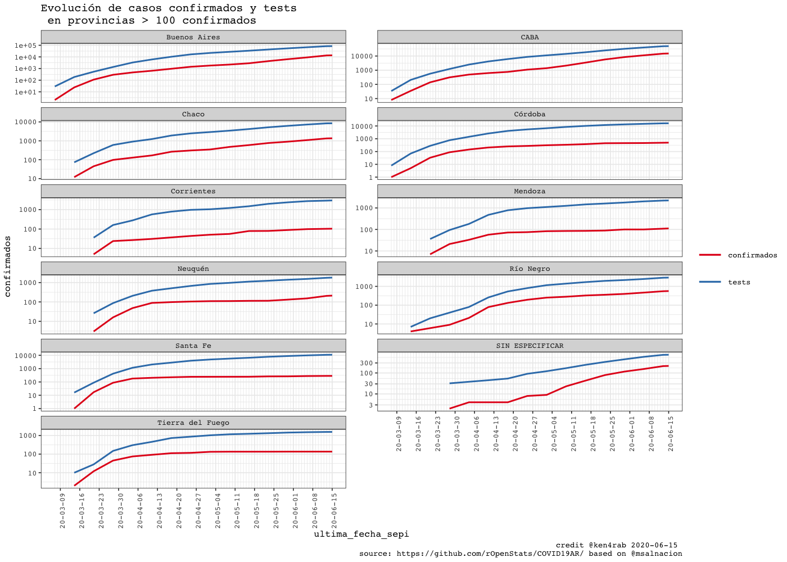

<!-- README.md is generated from README.Rmd. Please edit that file -->

# COVID19AR

A package for analysing COVID-19 Argentina’s outbreak

<!-- . -->

# Package

| Release                                                                                                | Usage                                                                                                    | Development                                                                                                                                                                                            |
| :----------------------------------------------------------------------------------------------------- | :------------------------------------------------------------------------------------------------------- | :----------------------------------------------------------------------------------------------------------------------------------------------------------------------------------------------------- |
|                                                                                                        | [](https://cran.r-project.org/) | [](https://travis-ci.org/rOpenStats/COVID19AR)                                                                                  |
| [](https://cran.r-project.org/package=COVID19AR) |                                                                                                          | [](https://codecov.io/gh/rOpenStats/COVID19AR)                                                                     |
|                                                                                                        |                                                                                                          | [](https://www.repostatus.org/#active) |

# How to get started (Development version)

Install the R package using the following commands on the R console:

``` r
# install.packages("devtools")
devtools::install_github("rOpenStats/COVID19AR")
```

# How to use it

First add variable with your prefered data dir configuration in
`~/.Renviron`. You will receive a message if you didn’t.

``` .renviron
COVID19AR_data_dir = "~/.R/COVID19AR"
```

``` r
library(COVID19AR)
#> Loading required package: dplyr
#> 
#> Attaching package: 'dplyr'
#> The following objects are masked from 'package:stats':
#> 
#>     filter, lag
#> The following objects are masked from 'package:base':
#> 
#>     intersect, setdiff, setequal, union
#> Loading required package: knitr
#> Loading required package: magrittr
#> Loading required package: lgr
#> Warning: replacing previous import 'ggplot2::Layout' by 'lgr::Layout' when
#> loading 'COVID19AR'
#> Warning: replacing previous import 'readr::col_factor' by 'scales::col_factor'
#> when loading 'COVID19AR'
#> Warning: replacing previous import 'magrittr::equals' by 'testthat::equals' when
#> loading 'COVID19AR'
#> Warning: replacing previous import 'magrittr::not' by 'testthat::not' when
#> loading 'COVID19AR'
#> Warning: replacing previous import 'magrittr::is_less_than' by
#> 'testthat::is_less_than' when loading 'COVID19AR'
#> Warning: replacing previous import 'dplyr::matches' by 'testthat::matches' when
#> loading 'COVID19AR'
library(ggplot2)
#> 
#> Attaching package: 'ggplot2'
#> The following object is masked from 'package:lgr':
#> 
#>     Layout
```

# COVID19AR datos abiertos del Ministerio de Salud de la Nación

opendata From Ministerio de Salud de la Nación Argentina

``` r
log.dir <- file.path(getEnv("data_dir"), "logs")
dir.create(log.dir, recursive = TRUE, showWarnings = FALSE)
log.file <- file.path(log.dir, "covid19ar.log")
lgr::get_logger("root")$add_appender(AppenderFile$new(log.file))
lgr::threshold("info", lgr::get_logger("root"))
lgr::threshold("info", lgr::get_logger("COVID19ARCurator"))

# Data from
# http://datos.salud.gob.ar/dataset/covid-19-casos-registrados-en-la-republica-argentina
covid19.curator <- COVID19ARCurator$new()

dummy <- covid19.curator$loadData()
#> INFO  [13:41:58.758] Exists dest path? {dest.path: ~/.R/COVID19AR/Covid19Casos.utf8.csv, exists.dest.path: TRUE}
dummy <- covid19.curator$curateData()
#> INFO  [13:41:59.799] Normalize 
#> INFO  [13:42:00.103] checkSoundness 
#> INFO  [13:42:00.294] Mutating data
# Dates of current processed file
max(covid19.curator$data$fecha_apertura, na.rm = TRUE)
#> [1] "2020-06-12"
# Inicio de síntomas

max(covid19.curator$data$fecha_inicio_sintomas,  na.rm = TRUE)
#> [1] "2020-06-12"

# Ultima muerte
max(covid19.curator$data$fecha_fallecimiento,  na.rm = TRUE)
#> [1] "2020-06-12"

report.date <- max(covid19.curator$data$fecha_inicio_sintomas,  na.rm = TRUE)

covid19.ar.provincia.summary <- covid19.curator$makeSummary(group.vars = c("residencia_provincia_nombre"))
covid19.ar.provincia.summary.100.confirmed <- covid19.ar.provincia.summary %>% filter(confirmados >= 100)
# Provinces with > 100 confirmed cases
covid19.ar.provincia.summary.100.confirmed$residencia_provincia_nombre
#>  [1] "Buenos Aires"     "CABA"             "Chaco"            "Córdoba"         
#>  [5] "Corrientes"       "Mendoza"          "Neuquén"          "Río Negro"       
#>  [9] "Santa Fe"         "SIN ESPECIFICAR"  "Tierra del Fuego"
```

``` r
covid19.ar.summary <- covid19.curator$makeSummary(group.vars = c("residencia_provincia_nombre"))
nrow(covid19.ar.summary)
#> [1] 25
porc.cols <- names(covid19.ar.summary)[grep("porc", names(covid19.ar.summary))]
kable((covid19.ar.summary %>% filter(confirmados > 0) %>% arrange(desc(confirmados))) %>% 
        select_at(c("residencia_provincia_nombre", "confirmados", "tests", "fallecidos", "dias.fallecimiento",porc.cols)))
```

| residencia\_provincia\_nombre | confirmados | tests | fallecidos | dias.fallecimiento | letalidad.min.porc | letalidad.max.porc | positividad.porc | internados.porc | cuidado.intensivo.porc | respirador.porc |
| :---------------------------- | ----------: | ----: | ---------: | -----------------: | -----------------: | -----------------: | ---------------: | --------------: | ---------------------: | --------------: |
| CABA                          |       13438 | 45778 |        281 |               13.8 |              0.016 |              0.021 |            0.294 |           0.303 |                  0.026 |           0.013 |
| Buenos Aires                  |       11677 | 77411 |        343 |               12.2 |              0.017 |              0.029 |            0.151 |           0.275 |                  0.031 |           0.012 |
| Chaco                         |        1250 |  7945 |         69 |               13.7 |              0.035 |              0.055 |            0.157 |           0.154 |                  0.063 |           0.036 |
| Río Negro                     |         533 |  2774 |         25 |               15.6 |              0.041 |              0.047 |            0.192 |           0.585 |                  0.032 |           0.015 |
| Córdoba                       |         483 | 15682 |         33 |               21.5 |              0.030 |              0.068 |            0.031 |           0.244 |                  0.062 |           0.025 |
| Santa Fe                      |         284 | 10653 |          3 |               25.0 |              0.006 |              0.011 |            0.027 |           0.194 |                  0.042 |           0.018 |
| SIN ESPECIFICAR               |         192 |   681 |          2 |                9.5 |              0.007 |              0.010 |            0.282 |           0.250 |                  0.026 |           0.016 |
| Neuquén                       |         186 |  1688 |          5 |                9.4 |              0.021 |              0.027 |            0.110 |           0.640 |                  0.016 |           0.016 |
| Tierra del Fuego              |         136 |  1537 |          0 |                NaN |              0.000 |              0.000 |            0.088 |           0.051 |                  0.015 |           0.015 |
| Mendoza                       |         105 |  2147 |          9 |               13.3 |              0.044 |              0.086 |            0.049 |           0.943 |                  0.105 |           0.048 |
| Corrientes                    |         100 |  2874 |          0 |                NaN |              0.000 |              0.000 |            0.035 |           0.020 |                  0.010 |           0.000 |
| Entre Ríos                    |          69 |  1525 |          0 |                NaN |              0.000 |              0.000 |            0.045 |           0.377 |                  0.000 |           0.000 |
| La Rioja                      |          64 |  1408 |          8 |               12.0 |              0.078 |              0.125 |            0.045 |           0.172 |                  0.062 |           0.016 |
| Santa Cruz                    |          49 |   533 |          0 |                NaN |              0.000 |              0.000 |            0.092 |           0.429 |                  0.082 |           0.041 |
| Tucumán                       |          48 |  5539 |          4 |               14.2 |              0.011 |              0.083 |            0.009 |           0.188 |                  0.083 |           0.042 |
| Misiones                      |          37 |  1189 |          2 |                6.5 |              0.035 |              0.054 |            0.031 |           0.730 |                  0.108 |           0.054 |
| Chubut                        |          30 |   564 |          1 |               19.0 |              0.011 |              0.033 |            0.053 |           0.100 |                  0.033 |           0.033 |
| Santiago del Estero           |          22 |  2076 |          0 |                NaN |              0.000 |              0.000 |            0.011 |           0.045 |                  0.045 |           0.000 |
| Salta                         |          18 |   718 |          0 |                NaN |              0.000 |              0.000 |            0.025 |           0.722 |                  0.000 |           0.000 |
| San Luis                      |          11 |   407 |          0 |                NaN |              0.000 |              0.000 |            0.027 |           0.727 |                  0.091 |           0.000 |
| Jujuy                         |           7 |  2157 |          0 |                NaN |              0.000 |              0.000 |            0.003 |           0.286 |                  0.143 |           0.143 |
| San Juan                      |           6 |   679 |          0 |                NaN |              0.000 |              0.000 |            0.009 |           0.833 |                  0.167 |           0.000 |
| La Pampa                      |           5 |   277 |          0 |                NaN |              0.000 |              0.000 |            0.018 |           0.200 |                  0.000 |           0.000 |
| Formosa                       |           1 |   710 |          0 |                NaN |              0.000 |              0.000 |            0.001 |           0.000 |                  0.000 |           0.000 |

``` r
covid19.ar.summary <- covid19.curator$makeSummary(group.vars = c("sepi_apertura"))
#> INFO  [13:42:20.431] Processing {current.group: }
nrow(covid19.ar.summary)
#> [1] 20
porc.cols <- names(covid19.ar.summary)[grep("porc", names(covid19.ar.summary))]
kable(covid19.ar.summary %>% filter(confirmados > 0) %>% arrange(sepi_apertura, desc(confirmados)) %>% select_at(c("sepi_apertura", "sepi_apertura", "confirmados", "tests", "internados", "fallecidos",  porc.cols)))
```

| sepi\_apertura | confirmados |  tests | internados | fallecidos | letalidad.min.porc | letalidad.max.porc | positividad.porc | internados.porc | cuidado.intensivo.porc | respirador.porc |
| -------------: | ----------: | -----: | ---------: | ---------: | -----------------: | -----------------: | ---------------: | --------------: | ---------------------: | --------------: |
|             10 |          15 |     85 |          9 |          1 |              0.045 |              0.067 |            0.176 |           0.600 |                  0.133 |           0.133 |
|             11 |          92 |    666 |         63 |          8 |              0.060 |              0.087 |            0.138 |           0.685 |                  0.130 |           0.065 |
|             12 |         406 |   2048 |        251 |         16 |              0.031 |              0.039 |            0.198 |           0.618 |                  0.094 |           0.054 |
|             13 |        1066 |   5509 |        591 |         60 |              0.046 |              0.056 |            0.194 |           0.554 |                  0.096 |           0.057 |
|             14 |        1726 |  11519 |        949 |        109 |              0.051 |              0.063 |            0.150 |           0.550 |                  0.096 |           0.056 |
|             15 |        2355 |  20221 |       1276 |        168 |              0.056 |              0.071 |            0.116 |           0.542 |                  0.092 |           0.051 |
|             16 |        3082 |  31782 |       1600 |        220 |              0.054 |              0.071 |            0.097 |           0.519 |                  0.083 |           0.044 |
|             17 |        4087 |  45805 |       2080 |        313 |              0.058 |              0.077 |            0.089 |           0.509 |                  0.076 |           0.039 |
|             18 |        4971 |  58976 |       2451 |        368 |              0.056 |              0.074 |            0.084 |           0.493 |                  0.069 |           0.036 |
|             19 |        6295 |  73088 |       2979 |        428 |              0.053 |              0.068 |            0.086 |           0.473 |                  0.063 |           0.032 |
|             20 |        8513 |  90391 |       3740 |        491 |              0.045 |              0.058 |            0.094 |           0.439 |                  0.056 |           0.028 |
|             21 |       12627 | 113725 |       4935 |        594 |              0.037 |              0.047 |            0.111 |           0.391 |                  0.048 |           0.024 |
|             22 |       17554 | 138925 |       6204 |        694 |              0.032 |              0.040 |            0.126 |           0.353 |                  0.041 |           0.020 |
|             23 |       23442 | 166763 |       7412 |        765 |              0.026 |              0.033 |            0.141 |           0.316 |                  0.036 |           0.017 |
|             24 |       28751 | 187421 |       8364 |        785 |              0.018 |              0.027 |            0.153 |           0.291 |                  0.031 |           0.014 |

```` 

```r
covid19.ar.summary <- covid19.curator$makeSummary(group.vars = c("residencia_provincia_nombre", "sepi_apertura"))
#> INFO  [13:42:23.887] Processing {current.group: residencia_provincia_nombre = Buenos Aires}
#> INFO  [13:42:26.014] Processing {current.group: residencia_provincia_nombre = CABA}
#> INFO  [13:42:27.793] Processing {current.group: residencia_provincia_nombre = Catamarca}
#> INFO  [13:42:28.907] Processing {current.group: residencia_provincia_nombre = Chaco}
#> INFO  [13:42:30.164] Processing {current.group: residencia_provincia_nombre = Chubut}
#> INFO  [13:42:31.329] Processing {current.group: residencia_provincia_nombre = Córdoba}
#> INFO  [13:42:32.828] Processing {current.group: residencia_provincia_nombre = Corrientes}
#> INFO  [13:42:34.126] Processing {current.group: residencia_provincia_nombre = Entre Ríos}
#> INFO  [13:42:35.314] Processing {current.group: residencia_provincia_nombre = Formosa}
#> INFO  [13:42:36.565] Processing {current.group: residencia_provincia_nombre = Jujuy}
#> INFO  [13:42:37.706] Processing {current.group: residencia_provincia_nombre = La Pampa}
#> INFO  [13:42:38.837] Processing {current.group: residencia_provincia_nombre = La Rioja}
#> INFO  [13:42:40.044] Processing {current.group: residencia_provincia_nombre = Mendoza}
#> INFO  [13:42:41.399] Processing {current.group: residencia_provincia_nombre = Misiones}
#> INFO  [13:42:42.510] Processing {current.group: residencia_provincia_nombre = Neuquén}
#> INFO  [13:42:43.667] Processing {current.group: residencia_provincia_nombre = Río Negro}
#> INFO  [13:42:44.975] Processing {current.group: residencia_provincia_nombre = Salta}
#> INFO  [13:42:46.608] Processing {current.group: residencia_provincia_nombre = San Juan}
#> INFO  [13:42:48.052] Processing {current.group: residencia_provincia_nombre = San Luis}
#> INFO  [13:42:49.284] Processing {current.group: residencia_provincia_nombre = Santa Cruz}
#> INFO  [13:42:50.428] Processing {current.group: residencia_provincia_nombre = Santa Fe}
#> INFO  [13:42:51.782] Processing {current.group: residencia_provincia_nombre = Santiago del Estero}
#> INFO  [13:42:52.969] Processing {current.group: residencia_provincia_nombre = SIN ESPECIFICAR}
#> INFO  [13:42:54.295] Processing {current.group: residencia_provincia_nombre = Tierra del Fuego}
#> INFO  [13:42:55.796] Processing {current.group: residencia_provincia_nombre = Tucumán}
nrow(covid19.ar.summary)
#> [1] 376
porc.cols <- names(covid19.ar.summary)[grep("porc", names(covid19.ar.summary))]
````

``` r
sepi.fechas <- covid19.curator$data %>% 
  group_by(sepi_apertura) %>% 
  summarize(ultima_fecha_sepi = max(fecha_apertura), .groups = "keep")


data2plot <- covid19.ar.summary %>%
                filter(residencia_provincia_nombre %in% covid19.ar.provincia.summary.100.confirmed$residencia_provincia_nombre) %>%
                filter(confirmados > 0 )
                
data2plot %<>% inner_join(sepi.fechas, by = "sepi_apertura")
dates <- sort(unique(data2plot$ultima_fecha_sepi))

covplot <- data2plot %>%
 ggplot(aes(x = ultima_fecha_sepi, y = confirmados, color = "confirmados")) +
 geom_line() +
 facet_wrap(~residencia_provincia_nombre, ncol = 2, scales = "free_y") +
 labs(title = "Evolución de casos confirmados y tests\n en provincias > 100 confirmados")
covplot <- covplot +
 geom_line(aes(x = ultima_fecha_sepi, y = tests, color = "tests")) +
 facet_wrap(~residencia_provincia_nombre, ncol = 2, scales = "free_y")
covplot <- setupTheme(covplot, report.date = report.date, x.values = dates, x.type = "dates",
                     total.colors = 2,
                     data.provider.abv = "@msalnacion", base.size = 6)
covplot <- covplot + scale_y_log10()
#> Scale for 'y' is already present. Adding another scale for 'y', which will
#> replace the existing scale.
covplot
```



``` r

covplot <- data2plot %>%
 ggplot(aes(x = ultima_fecha_sepi, y = positividad.porc, color = "positividad.porc")) +
 geom_line() +
 facet_wrap(~residencia_provincia_nombre, ncol = 2, scales = "free_y") +
 labs(title = "Porcentajes de positividad, uso de UCI, respirador y letalidad\n en provincias > 100 confirmados")
covplot <- covplot +
 geom_line(aes(x = ultima_fecha_sepi, y = cuidado.intensivo.porc, color = "cuidado.intensivo.porc")) +
 facet_wrap(~residencia_provincia_nombre, ncol = 2, scales = "free_y")
covplot <- covplot  +
 geom_line(aes(x = ultima_fecha_sepi, y = respirador.porc, color = "respirador.porc"))+
 facet_wrap(~residencia_provincia_nombre, ncol = 2, scales = "free_y")
covplot <- covplot +
 geom_line(aes(x = ultima_fecha_sepi, y = letalidad.min.porc, color = "letalidad.min.porc")) +
 facet_wrap(~residencia_provincia_nombre, ncol = 2, scales = "free_y")

covplot <- setupTheme(covplot, report.date = report.date, x.values = dates, x.type = "dates",
                     total.colors = 4,
                     data.provider.abv = "@msalnacion", base.size = 6)
covplot
```


``` r

covid19.ar.summary <- covid19.curator$makeSummary(group.vars = c("residencia_provincia_nombre", "sexo"))
nrow(covid19.ar.summary)
#> [1] 70
porc.cols <- names(covid19.ar.summary)[grep("porc", names(covid19.ar.summary))]
kable((covid19.ar.summary %>% filter(confirmados >= 10) %>% arrange(desc(confirmados))) %>% select_at(c("residencia_provincia_nombre", "sexo", "confirmados", "internados", "fallecidos",  porc.cols)))
```

| residencia\_provincia\_nombre | sexo | confirmados | internados | fallecidos | letalidad.min.porc | letalidad.max.porc | positividad.porc | internados.porc | cuidado.intensivo.porc | respirador.porc |
| :---------------------------- | :--- | ----------: | ---------: | ---------: | -----------------: | -----------------: | ---------------: | --------------: | ---------------------: | --------------: |
| CABA                          | F    |        6794 |       2055 |        120 |              0.013 |              0.018 |            0.284 |           0.302 |                  0.018 |           0.008 |
| CABA                          | M    |        6583 |       2008 |        157 |              0.018 |              0.024 |            0.305 |           0.305 |                  0.035 |           0.019 |
| Buenos Aires                  | M    |        5967 |       1692 |        198 |              0.020 |              0.033 |            0.160 |           0.284 |                  0.037 |           0.015 |
| Buenos Aires                  | F    |        5655 |       1504 |        144 |              0.015 |              0.025 |            0.142 |           0.266 |                  0.025 |           0.010 |
| Chaco                         | M    |         626 |         98 |         42 |              0.043 |              0.067 |            0.160 |           0.157 |                  0.073 |           0.051 |
| Chaco                         | F    |         622 |         95 |         27 |              0.027 |              0.043 |            0.154 |           0.153 |                  0.053 |           0.021 |
| Río Negro                     | F    |         267 |        156 |         11 |              0.035 |              0.041 |            0.184 |           0.584 |                  0.030 |           0.015 |
| Río Negro                     | M    |         266 |        156 |         14 |              0.046 |              0.053 |            0.202 |           0.586 |                  0.034 |           0.015 |
| Córdoba                       | F    |         244 |         69 |         18 |              0.033 |              0.074 |            0.030 |           0.283 |                  0.057 |           0.016 |
| Córdoba                       | M    |         237 |         48 |         15 |              0.028 |              0.063 |            0.031 |           0.203 |                  0.068 |           0.034 |
| Santa Fe                      | M    |         148 |         34 |          3 |              0.011 |              0.020 |            0.028 |           0.230 |                  0.061 |           0.034 |
| Santa Fe                      | F    |         136 |         21 |          0 |              0.000 |              0.000 |            0.025 |           0.154 |                  0.022 |           0.000 |
| SIN ESPECIFICAR               | F    |         105 |         22 |          0 |              0.000 |              0.000 |            0.265 |           0.210 |                  0.019 |           0.000 |
| Neuquén                       | F    |          93 |         57 |          2 |              0.017 |              0.022 |            0.115 |           0.613 |                  0.022 |           0.022 |
| Neuquén                       | M    |          93 |         62 |          3 |              0.024 |              0.032 |            0.106 |           0.667 |                  0.011 |           0.011 |
| SIN ESPECIFICAR               | M    |          86 |         25 |          1 |              0.008 |              0.012 |            0.313 |           0.291 |                  0.023 |           0.023 |
| Tierra del Fuego              | M    |          77 |          4 |          0 |              0.000 |              0.000 |            0.094 |           0.052 |                  0.026 |           0.026 |
| Corrientes                    | M    |          63 |          1 |          0 |              0.000 |              0.000 |            0.039 |           0.016 |                  0.000 |           0.000 |
| CABA                          | NR   |          61 |         15 |          4 |              0.032 |              0.066 |            0.292 |           0.246 |                  0.033 |           0.033 |
| Tierra del Fuego              | F    |          58 |          3 |          0 |              0.000 |              0.000 |            0.081 |           0.052 |                  0.000 |           0.000 |
| Mendoza                       | M    |          56 |         52 |          9 |              0.082 |              0.161 |            0.050 |           0.929 |                  0.161 |           0.071 |
| Buenos Aires                  | NR   |          55 |         10 |          1 |              0.010 |              0.018 |            0.253 |           0.182 |                  0.036 |           0.000 |
| Mendoza                       | F    |          49 |         47 |          0 |              0.000 |              0.000 |            0.048 |           0.959 |                  0.041 |           0.020 |
| Entre Ríos                    | M    |          47 |         21 |          0 |              0.000 |              0.000 |            0.059 |           0.447 |                  0.000 |           0.000 |
| Corrientes                    | F    |          37 |          1 |          0 |              0.000 |              0.000 |            0.030 |           0.027 |                  0.027 |           0.000 |
| La Rioja                      | F    |          36 |          8 |          6 |              0.109 |              0.167 |            0.052 |           0.222 |                  0.083 |           0.028 |
| Santa Cruz                    | M    |          30 |         12 |          0 |              0.000 |              0.000 |            0.097 |           0.400 |                  0.100 |           0.033 |
| La Rioja                      | M    |          28 |          3 |          2 |              0.043 |              0.071 |            0.039 |           0.107 |                  0.036 |           0.000 |
| Tucumán                       | M    |          28 |          5 |          2 |              0.008 |              0.071 |            0.008 |           0.179 |                  0.036 |           0.000 |
| Entre Ríos                    | F    |          22 |          5 |          0 |              0.000 |              0.000 |            0.030 |           0.227 |                  0.000 |           0.000 |
| Chubut                        | M    |          20 |          2 |          1 |              0.018 |              0.050 |            0.064 |           0.100 |                  0.050 |           0.050 |
| Misiones                      | M    |          20 |         15 |          1 |              0.033 |              0.050 |            0.030 |           0.750 |                  0.150 |           0.100 |
| Tucumán                       | F    |          20 |          4 |          2 |              0.016 |              0.100 |            0.009 |           0.200 |                  0.150 |           0.100 |
| Santa Cruz                    | F    |          19 |          9 |          0 |              0.000 |              0.000 |            0.084 |           0.474 |                  0.053 |           0.053 |
| Misiones                      | F    |          17 |         12 |          1 |              0.037 |              0.059 |            0.032 |           0.706 |                  0.059 |           0.000 |
| Santiago del Estero           | M    |          15 |          1 |          0 |              0.000 |              0.000 |            0.011 |           0.067 |                  0.067 |           0.000 |
| Chubut                        | F    |          10 |          1 |          0 |              0.000 |              0.000 |            0.040 |           0.100 |                  0.000 |           0.000 |
| Salta                         | M    |          10 |          8 |          0 |              0.000 |              0.000 |            0.020 |           0.800 |                  0.000 |           0.000 |

``` r

covid19.ar.summary <- covid19.curator$makeSummary(group.vars = c("residencia_provincia_nombre", "edad.rango"))

 # Share per province
 provinces.deaths <-covid19.ar.summary %>%
    group_by(residencia_provincia_nombre) %>%
    summarise(fallecidos.total.provincia = sum(fallecidos), .groups = "keep")
 covid19.ar.summary %<>% inner_join(provinces.deaths, by = "residencia_provincia_nombre")
 covid19.ar.summary %<>% mutate(fallecidos.prop = fallecidos/fallecidos.total.provincia)

 # Data 2 plot
 data2plot <- covid19.ar.summary %>% filter(residencia_provincia_nombre %in% covid19.ar.provincia.summary.100.confirmed$residencia_provincia_nombre)

 #Plot of deaths share
 covidplot <-
    data2plot %>%
    ggplot(aes(x = edad.rango, y = fallecidos.prop, fill = edad.rango)) +
    geom_bar(stat = "identity") + facet_wrap(~residencia_provincia_nombre, ncol = 2, scales = "free_y") +
    labs(title = "Proporción de muertos por rango etario\n en provincias > 100 confirmados")
 covidplot <- setupTheme(covidplot, report.date = report.date, x.values = NULL, x.type = NULL,
                      total.colors = length(unique(data2plot$edad.rango)),
                      data.provider.abv = "@msalnacion", base.size = 6)
 # Proporción de muertos por rango etario
 covidplot
#> Warning: Removed 35 rows containing missing values (position_stack).
```


``` r


 # UCI rate
 covidplot <- data2plot %>%
   ggplot(aes(x = edad.rango, y = cuidado.intensivo.porc, fill = edad.rango)) +
   geom_bar(stat = "identity") + facet_wrap(~residencia_provincia_nombre, ncol = 2, scales = "free_y") +
    labs(title = "Porcentaje de pacientes en Unidades de Cuidados Intensivos por rango etario\n en provincias > 100 confirmados")
 covidplot <- setupTheme(covidplot, report.date = report.date, x.values = NULL, x.type = NULL,
                      total.colors = length(unique(data2plot$edad.rango)),
                      data.provider.abv = "@msalnacion", base.size = 6)
 covidplot
#> Warning: Removed 12 rows containing missing values (position_stack).
```


``` r

 # ventilator rate
 covidplot <- data2plot %>%
   ggplot(aes(x = edad.rango, y = respirador.porc, fill = edad.rango)) +
   geom_bar(stat = "identity") +
   facet_wrap(~residencia_provincia_nombre, ncol = 2, scales = "free_y") +
   labs(title = "Porcentaje de pacientes con requerimientos de respirador mecánico por rango etario\n en provincias > 100 confirmados")
 covidplot <- setupTheme(covidplot, report.date = report.date, x.values = NULL, x.type = NULL,
                      total.colors = length(unique(data2plot$edad.rango)),
                      data.provider.abv = "@msalnacion", base.size = 6)
 covidplot
#> Warning: Removed 12 rows containing missing values (position_stack).
```


``` r

 # fatality rate

 covidplot <- data2plot %>%
  ggplot(aes(x = edad.rango, y = letalidad.min.porc, fill = edad.rango)) +
  geom_bar(stat = "identity") +
  facet_wrap(~residencia_provincia_nombre, ncol = 2, scales = "free_y") +
  labs(title = "Porcentaje de letalidad por rango etario\n en provincias > 100 confirmados")
 covidplot <- setupTheme(covidplot, report.date = report.date, x.values = NULL, x.type = NULL,
                      total.colors = length(unique(data2plot$edad.rango)),
                      data.provider.abv = "@msalnacion", base.size = 6)
 covidplot
#> Warning: Removed 5 rows containing missing values (position_stack).
```


# Generar diferentes agregaciones y guardar csv / Generate different aggregations

``` r
output.dir <- "~/.R/COVID19AR/"
dir.create(output.dir, showWarnings = FALSE, recursive = TRUE)
exportAggregatedTables(covid19.curator, output.dir = output.dir,
                       aggrupation.criteria = list(provincia_residencia = c("residencia_provincia_nombre"),
                                                   provincia_localidad_residencia = c("residencia_provincia_nombre", "residencia_departamento_nombre"),
                                                   provincia_residencia_sexo = c("residencia_provincia_nombre", "sexo"),
                                                   edad_rango_sexo = c("edad.rango", "sexo"),
                                                   provincia_residencia_edad_rango = c("residencia_provincia_nombre", "edad.rango"),
                                                   provincia_residencia_sepi_apertura = c("residencia_provincia_nombre", "sepi_apertura"),
                                                   provincia_residencia = c("residencia_provincia_nombre", "residencia_departamento_nombre", "sepi_apertura"),
                                                   provincia_residencia_fecha_apertura = c("residencia_provincia_nombre", "fecha_apertura")))
                                                   
                                                  
```

All this tables are accesible at
[COVID19ARdata](https://github.com/rOpenStats/COVID19ARdata/tree/master/curated)

# How to Cite This Work

Citation

    Alejandro Baranek, COVID19AR, 2020. URL: https://github.com/rOpenStats/COVID19AR

``` bibtex
BibTex
@techreport{baranek2020Covid19AR,
Author = {Alejandro Baranek},
Institution = {rOpenStats},
Title = {COVID19AR: a package for analysing Argentina COVID-19 outbreak},
Url = {https://github.com/rOpenStats/COVID19AR},
Year = {2020}}
```
