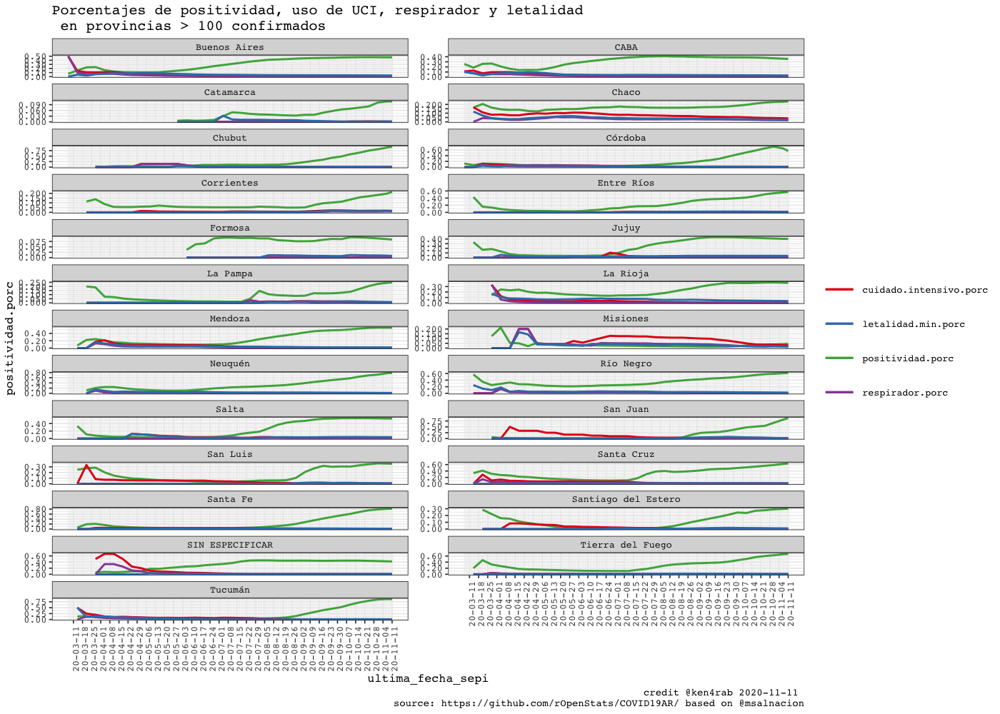

<!-- README.md is generated from README.Rmd. Please edit that file -->


COVID19AR
=========

A package for analysing COVID-19 Argentina’s outbreak

<!-- . -->

Package
=======

| Release                                                                                                | Usage                                                                                                    | Development                                                                                                                                                                                            |
|:-------------------------------------------------------------------------------------------------------|:---------------------------------------------------------------------------------------------------------|:-------------------------------------------------------------------------------------------------------------------------------------------------------------------------------------------------------|
|                                                                                                        | [](https://cran.r-project.org/) | [](https://travis-ci.org/rOpenStats/COVID19AR)                                                                                  |
| [](https://cran.r-project.org/package=COVID19AR) |                                                                                                          | [](https://codecov.io/gh/rOpenStats/COVID19AR)                                                                     |
|                                                                                                        |                                                                                                          | [](https://www.repostatus.org/#active) |

Argentina COVID19 open data
===========================

-   [Casos daily
    file](https://sisa.msal.gov.ar/datos/descargas/covid-19/files/Covid19Casos.csv)
-   [Determinaciones daily
    file](https://sisa.msal.gov.ar/datos/descargas/covid-19/files/Covid19Determinaciones.csv)

How to get started (Development version)
========================================

Install the R package using the following commands on the R console:

    # install.packages("devtools")
    devtools::install_github("rOpenStats/COVID19AR")

How to use it
=============

First add variable with your preferred configurations in `~/.Renviron`.
COVID19AR\_data\_dir is mandatory while COVID19AR\_credits can be
configured if you want to publish your own research.

    COVID19AR_data_dir = "~/.R/COVID19AR"
    COVID19AR_credits = "@youralias"

    library(COVID19AR)
    #> Loading required package: dplyr
    #> 
    #> Attaching package: 'dplyr'
    #> The following objects are masked from 'package:stats':
    #> 
    #>     filter, lag
    #> The following objects are masked from 'package:base':
    #> 
    #>     intersect, setdiff, setequal, union
    #> Loading required package: knitr
    #> Loading required package: magrittr
    #> Loading required package: lgr
    #> Warning: replacing previous import 'ggplot2::Layout' by 'lgr::Layout' when
    #> loading 'COVID19AR'
    #> Warning: replacing previous import 'readr::col_factor' by 'scales::col_factor'
    #> when loading 'COVID19AR'
    #> Warning: replacing previous import 'magrittr::equals' by 'testthat::equals' when
    #> loading 'COVID19AR'
    #> Warning: replacing previous import 'magrittr::not' by 'testthat::not' when
    #> loading 'COVID19AR'
    #> Warning: replacing previous import 'magrittr::is_less_than' by
    #> 'testthat::is_less_than' when loading 'COVID19AR'
    #> Warning: replacing previous import 'dplyr::matches' by 'testthat::matches' when
    #> loading 'COVID19AR'
    library(ggplot2)
    #> 
    #> Attaching package: 'ggplot2'
    #> The following object is masked from 'package:lgr':
    #> 
    #>     Layout

COVID19AR datos abiertos del Ministerio de Salud de la Nación
=============================================================

opendata From Ministerio de Salud de la Nación Argentina

    log.dir <- file.path(getEnv("data_dir"), "logs")
    dir.create(log.dir, recursive = TRUE, showWarnings = FALSE)
    log.file <- file.path(log.dir, "covid19ar.log")
    lgr::get_logger("root")$add_appender(AppenderFile$new(log.file))
    lgr::threshold("info", lgr::get_logger("root"))
    lgr::threshold("info", lgr::get_logger("COVID19ARCurator"))

    # Data from
    # http://datos.salud.gob.ar/dataset/covid-19-casos-registrados-en-la-republica-argentina
    covid19.curator <- COVID19ARCurator$new(download.new.data = FALSE)

    dummy <- covid19.curator$loadData()
    #> INFO  [09:59:17.650] Exists dest path? {dest.path: ~/.R/COVID19AR/Covid19Casos.csv, exists.dest.path: TRUE}
    dummy <- covid19.curator$curateData()
    #> INFO  [09:59:22.529] Normalize 
    #> INFO  [09:59:23.663] checkSoundness 
    #> INFO  [09:59:24.585] Mutating data
    # Dates of current processed file
    max(covid19.curator$data$fecha_apertura, na.rm = TRUE)
    #> [1] "2020-08-03"
    # Inicio de síntomas

    max(covid19.curator$data$fecha_inicio_sintomas,  na.rm = TRUE)
    #> [1] "2020-08-03"

    # Ultima muerte
    max(covid19.curator$data$fecha_fallecimiento,  na.rm = TRUE)
    #> [1] "2020-08-03"

    report.date <- max(covid19.curator$data$fecha_inicio_sintomas,  na.rm = TRUE)
    covid19.ar.summary <- covid19.curator$makeSummary(group.vars = NULL)

    kable(covid19.ar.summary %>% select(max_fecha_diagnostico, confirmados, fallecidos, letalidad.min.porc, letalidad.max.porc, count_fecha_diagnostico, tests, positividad.porc))

| max\_fecha\_diagnostico | confirmados | fallecidos | letalidad.min.porc | letalidad.max.porc | count\_fecha\_diagnostico |  tests | positividad.porc |
|:------------------------|------------:|-----------:|-------------------:|-------------------:|--------------------------:|-------:|-----------------:|
| 2020-08-03              |      206730 |       3813 |              0.014 |              0.018 |                       161 | 640610 |            0.323 |


    covid19.ar.provincia.summary <- covid19.curator$makeSummary(group.vars = c("residencia_provincia_nombre"))
    covid19.ar.provincia.summary.100.confirmed <- covid19.ar.provincia.summary %>% 
      filter(confirmados >= 100) %>%
      arrange(desc(confirmados))
    # Provinces with > 100 confirmed cases
    kable(covid19.ar.provincia.summary.100.confirmed %>% select(residencia_provincia_nombre, confirmados, fallecidos, confirmados, fallecidos, letalidad.min.porc, letalidad.max.porc, count_fecha_diagnostico, tests, positividad.porc))

| residencia\_provincia\_nombre | confirmados | fallecidos | letalidad.min.porc | letalidad.max.porc | count\_fecha\_diagnostico |  tests | positividad.porc |
|:------------------------------|------------:|-----------:|-------------------:|-------------------:|--------------------------:|-------:|-----------------:|
| Buenos Aires                  |      124402 |       2077 |              0.012 |              0.017 |                       159 | 328855 |            0.378 |
| CABA                          |       62193 |       1301 |              0.017 |              0.021 |                       157 | 154807 |            0.402 |
| Chaco                         |        3702 |        149 |              0.030 |              0.040 |                       145 |  22882 |            0.162 |
| Córdoba                       |        2566 |         49 |              0.012 |              0.019 |                       147 |  32327 |            0.079 |
| Jujuy                         |        2482 |         31 |              0.005 |              0.012 |                       136 |   9915 |            0.250 |
| Río Negro                     |        2126 |         74 |              0.030 |              0.035 |                       140 |   7672 |            0.277 |
| Mendoza                       |        1470 |         44 |              0.022 |              0.030 |                       146 |   7585 |            0.194 |
| Santa Fe                      |        1435 |         16 |              0.007 |              0.011 |                       143 |  21232 |            0.068 |
| Neuquén                       |        1224 |         25 |              0.017 |              0.020 |                       142 |   4697 |            0.261 |
| SIN ESPECIFICAR               |        1223 |          3 |              0.002 |              0.002 |                       133 |   2729 |            0.448 |
| Entre Ríos                    |         876 |          9 |              0.008 |              0.010 |                       140 |   5020 |            0.175 |
| Tierra del Fuego              |         633 |          2 |              0.002 |              0.003 |                       139 |   3073 |            0.206 |
| Santa Cruz                    |         548 |          3 |              0.005 |              0.005 |                       132 |   1429 |            0.383 |
| La Rioja                      |         353 |         18 |              0.043 |              0.051 |                       131 |   3927 |            0.090 |
| Salta                         |         293 |          2 |              0.004 |              0.007 |                       135 |   1942 |            0.151 |
| Chubut                        |         291 |          3 |              0.005 |              0.010 |                       126 |   3012 |            0.097 |
| Tucumán                       |         266 |          4 |              0.003 |              0.015 |                       138 |  11983 |            0.022 |
| Corrientes                    |         195 |          1 |              0.002 |              0.005 |                       137 |   4300 |            0.045 |
| La Pampa                      |         158 |          0 |              0.000 |              0.000 |                       119 |   1068 |            0.148 |

    covid19.ar.summary <- covid19.curator$makeSummary(group.vars = c("residencia_provincia_nombre"))
    nrow(covid19.ar.summary)
    #> [1] 25
    porc.cols <- names(covid19.ar.summary)[grep("porc", names(covid19.ar.summary))]
    kable((covid19.ar.summary %>% filter(confirmados > 0) %>% arrange(desc(confirmados))) %>% 
            select_at(c("residencia_provincia_nombre", "confirmados", "tests", "fallecidos", "dias.fallecimiento",porc.cols)))

| residencia\_provincia\_nombre | confirmados |  tests | fallecidos | dias.fallecimiento | letalidad.min.porc | letalidad.max.porc | positividad.porc | internados.porc | cuidado.intensivo.porc | respirador.porc |
|:------------------------------|------------:|-------:|-----------:|-------------------:|-------------------:|-------------------:|-----------------:|----------------:|-----------------------:|----------------:|
| Buenos Aires                  |      124402 | 328855 |       2077 |               13.5 |              0.012 |              0.017 |            0.378 |           0.111 |                  0.014 |           0.006 |
| CABA                          |       62193 | 154807 |       1301 |               14.9 |              0.017 |              0.021 |            0.402 |           0.199 |                  0.019 |           0.008 |
| Chaco                         |        3702 |  22882 |        149 |               14.5 |              0.030 |              0.040 |            0.162 |           0.116 |                  0.070 |           0.027 |
| Córdoba                       |        2566 |  32327 |         49 |               22.6 |              0.012 |              0.019 |            0.079 |           0.060 |                  0.016 |           0.008 |
| Jujuy                         |        2482 |   9915 |         31 |               12.6 |              0.005 |              0.012 |            0.250 |           0.006 |                  0.002 |           0.002 |
| Río Negro                     |        2126 |   7672 |         74 |               13.6 |              0.030 |              0.035 |            0.277 |           0.327 |                  0.022 |           0.015 |
| Mendoza                       |        1470 |   7585 |         44 |               12.9 |              0.022 |              0.030 |            0.194 |           0.407 |                  0.025 |           0.006 |
| Santa Fe                      |        1435 |  21232 |         16 |               13.7 |              0.007 |              0.011 |            0.068 |           0.101 |                  0.023 |           0.008 |
| Neuquén                       |        1224 |   4697 |         25 |               19.4 |              0.017 |              0.020 |            0.261 |           0.694 |                  0.020 |           0.011 |
| SIN ESPECIFICAR               |        1223 |   2729 |          3 |               26.7 |              0.002 |              0.002 |            0.448 |           0.072 |                  0.008 |           0.005 |
| Entre Ríos                    |         876 |   5020 |          9 |               13.9 |              0.008 |              0.010 |            0.175 |           0.217 |                  0.013 |           0.002 |
| Tierra del Fuego              |         633 |   3073 |          2 |               19.0 |              0.002 |              0.003 |            0.206 |           0.021 |                  0.005 |           0.005 |
| Santa Cruz                    |         548 |   1429 |          3 |               13.7 |              0.005 |              0.005 |            0.383 |           0.064 |                  0.016 |           0.011 |
| La Rioja                      |         353 |   3927 |         18 |               13.2 |              0.043 |              0.051 |            0.090 |           0.076 |                  0.017 |           0.006 |
| Salta                         |         293 |   1942 |          2 |                2.5 |              0.004 |              0.007 |            0.151 |           0.358 |                  0.020 |           0.007 |
| Chubut                        |         291 |   3012 |          3 |               20.7 |              0.005 |              0.010 |            0.097 |           0.048 |                  0.014 |           0.010 |
| Tucumán                       |         266 |  11983 |          4 |               14.2 |              0.003 |              0.015 |            0.022 |           0.128 |                  0.034 |           0.008 |
| Corrientes                    |         195 |   4300 |          1 |               12.0 |              0.002 |              0.005 |            0.045 |           0.021 |                  0.010 |           0.005 |
| La Pampa                      |         158 |   1068 |          0 |                NaN |              0.000 |              0.000 |            0.148 |           0.038 |                  0.006 |           0.000 |
| Formosa                       |          81 |    840 |          0 |                NaN |              0.000 |              0.000 |            0.096 |           0.012 |                  0.000 |           0.000 |
| Catamarca                     |          64 |   2063 |          0 |                NaN |              0.000 |              0.000 |            0.031 |           0.000 |                  0.000 |           0.000 |
| Misiones                      |          52 |   2191 |          2 |                6.5 |              0.016 |              0.038 |            0.024 |           0.577 |                  0.115 |           0.058 |
| Santiago del Estero           |          49 |   5210 |          0 |                NaN |              0.000 |              0.000 |            0.009 |           0.041 |                  0.020 |           0.000 |
| San Luis                      |          26 |    834 |          0 |                NaN |              0.000 |              0.000 |            0.031 |           0.346 |                  0.038 |           0.000 |
| San Juan                      |          22 |   1017 |          0 |                NaN |              0.000 |              0.000 |            0.022 |           0.227 |                  0.045 |           0.000 |

    rg <- ReportGeneratorCOVID19AR$new(covid19ar.curator = covid19.curator)
    rg$preprocess()
    #> Parsed with column specification:
    #> cols(
    #>   .default = col_double(),
    #>   residencia_provincia_nombre = col_character(),
    #>   residencia_departamento_nombre = col_character(),
    #>   fecha_apertura = col_date(format = ""),
    #>   max_fecha_diagnostico = col_date(format = ""),
    #>   max_fecha_inicio_sintomas = col_date(format = ""),
    #>   confirmados.inc = col_logical(),
    #>   confirmados.rate = col_logical(),
    #>   fallecidos.inc = col_logical(),
    #>   tests.inc = col_logical(),
    #>   tests.rate = col_logical(),
    #>   sospechosos.inc = col_logical()
    #> )
    #> See spec(...) for full column specifications.
    rg$getDepartamentosExponentialGrowthPlot()
    #> Scale for 'y' is already present. Adding another scale for 'y', which will
    #> replace the existing scale.


    rg$getDepartamentosCrossSectionConfirmedPostivityPlot()


    covid19.ar.summary <- covid19.curator$makeSummary(group.vars = c("sepi_apertura"))
    #> INFO  [10:01:29.383] Processing {current.group: }
    nrow(covid19.ar.summary)
    #> [1] 23
    porc.cols <- names(covid19.ar.summary)[grep("porc", names(covid19.ar.summary))]
    kable(covid19.ar.summary %>% 
            filter(confirmados > 0) %>% 
            arrange(sepi_apertura, desc(confirmados)) %>% 
            select_at(c("sepi_apertura", "max_fecha_diagnostico", "count_fecha_diagnostico", "confirmados", "tests", "internados", "fallecidos",  porc.cols)))

| sepi\_apertura | max\_fecha\_diagnostico | count\_fecha\_diagnostico | confirmados |  tests | internados | fallecidos | letalidad.min.porc | letalidad.max.porc | positividad.porc | internados.porc | cuidado.intensivo.porc | respirador.porc |
|---------------:|:------------------------|--------------------------:|------------:|-------:|-----------:|-----------:|-------------------:|-------------------:|-----------------:|----------------:|-----------------------:|----------------:|
|             10 | 2020-05-29              |                        19 |          15 |     85 |          9 |          1 |              0.045 |              0.067 |            0.176 |           0.600 |                  0.133 |           0.133 |
|             11 | 2020-08-01              |                        38 |          97 |    666 |         66 |          9 |              0.065 |              0.093 |            0.146 |           0.680 |                  0.124 |           0.062 |
|             12 | 2020-08-01              |                        61 |         413 |   2049 |        255 |         17 |              0.033 |              0.041 |            0.202 |           0.617 |                  0.092 |           0.053 |
|             13 | 2020-08-01              |                        94 |        1085 |   5517 |        600 |         63 |              0.049 |              0.058 |            0.197 |           0.553 |                  0.094 |           0.056 |
|             14 | 2020-08-01              |                       123 |        1771 |  11537 |        969 |        114 |              0.053 |              0.064 |            0.154 |           0.547 |                  0.095 |           0.056 |
|             15 | 2020-08-01              |                       145 |        2432 |  20256 |       1315 |        179 |              0.059 |              0.074 |            0.120 |           0.541 |                  0.090 |           0.051 |
|             16 | 2020-08-03              |                       156 |        3227 |  31858 |       1663 |        236 |              0.057 |              0.073 |            0.101 |           0.515 |                  0.080 |           0.044 |
|             17 | 2020-08-03              |                       159 |        4336 |  45909 |       2181 |        341 |              0.062 |              0.079 |            0.094 |           0.503 |                  0.072 |           0.038 |
|             18 | 2020-08-03              |                       159 |        5335 |  59102 |       2576 |        411 |              0.061 |              0.077 |            0.090 |           0.483 |                  0.065 |           0.034 |
|             19 | 2020-08-03              |                       159 |        6771 |  73234 |       3163 |        491 |              0.058 |              0.073 |            0.092 |           0.467 |                  0.061 |           0.031 |
|             20 | 2020-08-03              |                       159 |        9158 |  90599 |       4004 |        586 |              0.052 |              0.064 |            0.101 |           0.437 |                  0.056 |           0.029 |
|             21 | 2020-08-03              |                       159 |       13508 | 114031 |       5317 |        737 |              0.045 |              0.055 |            0.118 |           0.394 |                  0.049 |           0.025 |
|             22 | 2020-08-03              |                       159 |       18730 | 139391 |       6754 |        914 |              0.041 |              0.049 |            0.134 |           0.361 |                  0.044 |           0.022 |
|             23 | 2020-08-03              |                       159 |       25149 | 167653 |       8282 |       1127 |              0.038 |              0.045 |            0.150 |           0.329 |                  0.041 |           0.019 |
|             24 | 2020-08-03              |                       159 |       34720 | 202736 |      10407 |       1363 |              0.033 |              0.039 |            0.171 |           0.300 |                  0.036 |           0.017 |
|             25 | 2020-08-03              |                       159 |       47504 | 244096 |      12723 |       1661 |              0.030 |              0.035 |            0.195 |           0.268 |                  0.031 |           0.014 |
|             26 | 2020-08-03              |                       159 |       65146 | 295971 |      15744 |       2036 |              0.027 |              0.031 |            0.220 |           0.242 |                  0.028 |           0.012 |
|             27 | 2020-08-03              |                       159 |       83704 | 346460 |      18447 |       2446 |              0.025 |              0.029 |            0.242 |           0.220 |                  0.025 |           0.011 |
|             28 | 2020-08-03              |                       160 |      106784 | 404856 |      21586 |       2909 |              0.023 |              0.027 |            0.264 |           0.202 |                  0.023 |           0.010 |
|             29 | 2020-08-03              |                       161 |      135013 | 475014 |      24839 |       3361 |              0.021 |              0.025 |            0.284 |           0.184 |                  0.021 |           0.009 |
|             30 | 2020-08-03              |                       161 |      170914 | 557337 |      27756 |       3693 |              0.018 |              0.022 |            0.307 |           0.162 |                  0.018 |           0.008 |
|             31 | 2020-08-03              |                       161 |      203565 | 633129 |      29557 |       3809 |              0.015 |              0.019 |            0.322 |           0.145 |                  0.016 |           0.007 |
|             32 | 2020-08-03              |                       161 |      206730 | 640610 |      29674 |       3813 |              0.014 |              0.018 |            0.323 |           0.144 |                  0.016 |           0.007 |


    ```r
    covid19.ar.summary <- covid19.curator$makeSummary(group.vars = c("residencia_provincia_nombre", "sepi_apertura"))
    #> INFO  [10:02:19.801] Processing {current.group: residencia_provincia_nombre = Buenos Aires}
    #> INFO  [10:02:45.825] Processing {current.group: residencia_provincia_nombre = CABA}
    #> INFO  [10:03:01.060] Processing {current.group: residencia_provincia_nombre = Catamarca}
    #> INFO  [10:03:02.918] Processing {current.group: residencia_provincia_nombre = Chaco}
    #> INFO  [10:03:07.743] Processing {current.group: residencia_provincia_nombre = Chubut}
    #> INFO  [10:03:10.284] Processing {current.group: residencia_provincia_nombre = Córdoba}
    #> INFO  [10:03:16.518] Processing {current.group: residencia_provincia_nombre = Corrientes}
    #> INFO  [10:03:19.428] Processing {current.group: residencia_provincia_nombre = Entre Ríos}
    #> INFO  [10:03:22.196] Processing {current.group: residencia_provincia_nombre = Formosa}
    #> INFO  [10:03:24.083] Processing {current.group: residencia_provincia_nombre = Jujuy}
    #> INFO  [10:03:27.046] Processing {current.group: residencia_provincia_nombre = La Pampa}
    #> INFO  [10:03:29.342] Processing {current.group: residencia_provincia_nombre = La Rioja}
    #> INFO  [10:03:32.090] Processing {current.group: residencia_provincia_nombre = Mendoza}
    #> INFO  [10:03:35.111] Processing {current.group: residencia_provincia_nombre = Misiones}
    #> INFO  [10:03:37.526] Processing {current.group: residencia_provincia_nombre = Neuquén}
    #> INFO  [10:03:40.092] Processing {current.group: residencia_provincia_nombre = Río Negro}
    #> INFO  [10:03:43.071] Processing {current.group: residencia_provincia_nombre = Salta}
    #> INFO  [10:03:45.678] Processing {current.group: residencia_provincia_nombre = San Juan}
    #> INFO  [10:03:48.432] Processing {current.group: residencia_provincia_nombre = San Luis}
    #> INFO  [10:03:50.858] Processing {current.group: residencia_provincia_nombre = Santa Cruz}
    #> INFO  [10:03:53.335] Processing {current.group: residencia_provincia_nombre = Santa Fe}
    #> INFO  [10:03:57.754] Processing {current.group: residencia_provincia_nombre = Santiago del Estero}
    #> INFO  [10:04:00.625] Processing {current.group: residencia_provincia_nombre = SIN ESPECIFICAR}
    #> INFO  [10:04:03.331] Processing {current.group: residencia_provincia_nombre = Tierra del Fuego}
    #> INFO  [10:04:06.509] Processing {current.group: residencia_provincia_nombre = Tucumán}
    nrow(covid19.ar.summary)
    #> [1] 511
    porc.cols <- names(covid19.ar.summary)[grep("porc", names(covid19.ar.summary))]
    sepi.fechas <- covid19.curator$data %>% 
      group_by(sepi_apertura) %>% 
      summarize(ultima_fecha_sepi = max(fecha_apertura), .groups = "keep")


    data2plot <- covid19.ar.summary %>%
                    filter(residencia_provincia_nombre %in% covid19.ar.provincia.summary.100.confirmed$residencia_provincia_nombre) %>%
                    filter(confirmados > 0 ) %>%
                    filter(positividad.porc <=0.6 | confirmados >= 20)

                    
    data2plot %<>% inner_join(sepi.fechas, by = "sepi_apertura")
    dates <- sort(unique(data2plot$ultima_fecha_sepi))

    covplot <- data2plot %>%
     ggplot(aes(x = ultima_fecha_sepi, y = confirmados, color = "confirmados")) +
     geom_line() +
     facet_wrap(~residencia_provincia_nombre, ncol = 2, scales = "free_y") +
     labs(title = "Evolución de casos confirmados y tests\n en provincias > 100 confirmados")
    covplot <- covplot +
     geom_line(aes(x = ultima_fecha_sepi, y = tests, color = "tests")) +
     facet_wrap(~residencia_provincia_nombre, ncol = 2, scales = "free_y")
    covplot <- setupTheme(covplot, report.date = report.date, x.values = dates, x.type = "dates",
                         total.colors = 2,
                         data.provider.abv = "@msalnacion", base.size = 6)
    covplot <- covplot + scale_y_log10()
    #> Scale for 'y' is already present. Adding another scale for 'y', which will
    #> replace the existing scale.
    covplot


    covplot <- data2plot %>%
     ggplot(aes(x = ultima_fecha_sepi, y = positividad.porc, color = "positividad.porc")) +
     geom_line() +
     facet_wrap(~residencia_provincia_nombre, ncol = 2, scales = "free_y") +
     labs(title = "Porcentajes de positividad, uso de UCI, respirador y letalidad\n en provincias > 100 confirmados")
    covplot <- covplot +
     geom_line(aes(x = ultima_fecha_sepi, y = cuidado.intensivo.porc, color = "cuidado.intensivo.porc")) +
     facet_wrap(~residencia_provincia_nombre, ncol = 2, scales = "free_y")
    covplot <- covplot  +
     geom_line(aes(x = ultima_fecha_sepi, y = respirador.porc, color = "respirador.porc"))+
     facet_wrap(~residencia_provincia_nombre, ncol = 2, scales = "free_y")
    covplot <- covplot +
     geom_line(aes(x = ultima_fecha_sepi, y = letalidad.min.porc, color = "letalidad.min.porc")) +
     facet_wrap(~residencia_provincia_nombre, ncol = 2, scales = "free_y")

    covplot <- setupTheme(covplot, report.date = report.date, x.values = dates, x.type = "dates",
                         total.colors = 4,
                         data.provider.abv = "@msalnacion", base.size = 6)
    covplot




    covid19.ar.summary <- covid19.curator$makeSummary(group.vars = c("residencia_provincia_nombre", "sexo"))
    nrow(covid19.ar.summary)
    #> [1] 64
    porc.cols <- names(covid19.ar.summary)[grep("porc", names(covid19.ar.summary))]
    kable((covid19.ar.summary %>% filter(confirmados >= 10) %>% arrange(desc(confirmados))) %>% select_at(c("residencia_provincia_nombre", "sexo", "confirmados", "internados", "fallecidos",  porc.cols)))

| residencia\_provincia\_nombre | sexo | confirmados | internados | fallecidos | letalidad.min.porc | letalidad.max.porc | positividad.porc | internados.porc | cuidado.intensivo.porc | respirador.porc |
|:------------------------------|:-----|------------:|-----------:|-----------:|-------------------:|-------------------:|-----------------:|----------------:|-----------------------:|----------------:|
| Buenos Aires                  | M    |       63671 |       7498 |       1169 |              0.013 |              0.018 |            0.397 |           0.118 |                  0.016 |           0.007 |
| Buenos Aires                  | F    |       60276 |       6288 |        898 |              0.011 |              0.015 |            0.360 |           0.104 |                  0.011 |           0.004 |
| CABA                          | F    |       31365 |       6093 |        574 |              0.015 |              0.018 |            0.384 |           0.194 |                  0.014 |           0.006 |
| CABA                          | M    |       30579 |       6229 |        712 |              0.020 |              0.023 |            0.422 |           0.204 |                  0.023 |           0.011 |
| Chaco                         | F    |        1853 |        214 |         56 |              0.023 |              0.030 |            0.162 |           0.115 |                  0.062 |           0.021 |
| Chaco                         | M    |        1847 |        215 |         93 |              0.038 |              0.050 |            0.162 |           0.116 |                  0.079 |           0.034 |
| Jujuy                         | M    |        1554 |         12 |         18 |              0.005 |              0.012 |            0.283 |           0.008 |                  0.002 |           0.002 |
| Córdoba                       | M    |        1289 |         72 |         25 |              0.012 |              0.019 |            0.081 |           0.056 |                  0.016 |           0.009 |
| Córdoba                       | F    |        1274 |         80 |         24 |              0.011 |              0.019 |            0.078 |           0.063 |                  0.016 |           0.007 |
| Río Negro                     | F    |        1109 |        355 |         27 |              0.021 |              0.024 |            0.269 |           0.320 |                  0.013 |           0.006 |
| Río Negro                     | M    |        1016 |        340 |         47 |              0.039 |              0.046 |            0.287 |           0.335 |                  0.031 |           0.025 |
| Jujuy                         | F    |         923 |          4 |         13 |              0.005 |              0.014 |            0.210 |           0.004 |                  0.001 |           0.001 |
| Mendoza                       | F    |         751 |        298 |         13 |              0.013 |              0.017 |            0.195 |           0.397 |                  0.012 |           0.001 |
| SIN ESPECIFICAR               | F    |         731 |         45 |          0 |              0.000 |              0.000 |            0.444 |           0.062 |                  0.004 |           0.000 |
| Santa Fe                      | F    |         725 |         55 |          6 |              0.005 |              0.008 |            0.066 |           0.076 |                  0.017 |           0.003 |
| Mendoza                       | M    |         710 |        297 |         29 |              0.029 |              0.041 |            0.192 |           0.418 |                  0.039 |           0.011 |
| Santa Fe                      | M    |         710 |         90 |         10 |              0.010 |              0.014 |            0.070 |           0.127 |                  0.030 |           0.014 |
| Neuquén                       | M    |         625 |        409 |         12 |              0.016 |              0.019 |            0.265 |           0.654 |                  0.018 |           0.011 |
| Neuquén                       | F    |         599 |        440 |         13 |              0.018 |              0.022 |            0.256 |           0.735 |                  0.022 |           0.012 |
| SIN ESPECIFICAR               | M    |         488 |         42 |          2 |              0.003 |              0.004 |            0.456 |           0.086 |                  0.012 |           0.010 |
| Buenos Aires                  | NR   |         455 |         44 |         10 |              0.013 |              0.022 |            0.391 |           0.097 |                  0.026 |           0.013 |
| Entre Ríos                    | M    |         447 |        105 |          5 |              0.009 |              0.011 |            0.185 |           0.235 |                  0.011 |           0.002 |
| Entre Ríos                    | F    |         428 |         85 |          4 |              0.007 |              0.009 |            0.165 |           0.199 |                  0.014 |           0.002 |
| Tierra del Fuego              | M    |         381 |          8 |          2 |              0.004 |              0.005 |            0.232 |           0.021 |                  0.008 |           0.008 |
| Santa Cruz                    | M    |         279 |         18 |          2 |              0.006 |              0.007 |            0.363 |           0.065 |                  0.018 |           0.011 |
| Santa Cruz                    | F    |         268 |         17 |          1 |              0.003 |              0.004 |            0.407 |           0.063 |                  0.015 |           0.011 |
| Tierra del Fuego              | F    |         251 |          5 |          0 |              0.000 |              0.000 |            0.176 |           0.020 |                  0.000 |           0.000 |
| CABA                          | NR   |         249 |         73 |         15 |              0.036 |              0.060 |            0.377 |           0.293 |                  0.052 |           0.036 |
| La Rioja                      | F    |         188 |         15 |          7 |              0.032 |              0.037 |            0.099 |           0.080 |                  0.027 |           0.011 |
| Salta                         | M    |         177 |         61 |          2 |              0.006 |              0.011 |            0.142 |           0.345 |                  0.023 |           0.011 |
| La Rioja                      | M    |         163 |         12 |         11 |              0.056 |              0.067 |            0.081 |           0.074 |                  0.006 |           0.000 |
| Tucumán                       | M    |         157 |         19 |          2 |              0.003 |              0.013 |            0.021 |           0.121 |                  0.019 |           0.000 |
| Chubut                        | M    |         156 |         10 |          1 |              0.003 |              0.006 |            0.101 |           0.064 |                  0.013 |           0.013 |
| Chubut                        | F    |         131 |          4 |          2 |              0.008 |              0.015 |            0.092 |           0.031 |                  0.015 |           0.008 |
| Salta                         | F    |         116 |         44 |          0 |              0.000 |              0.000 |            0.169 |           0.379 |                  0.017 |           0.000 |
| Corrientes                    | M    |         108 |          4 |          1 |              0.004 |              0.009 |            0.045 |           0.037 |                  0.009 |           0.009 |
| Tucumán                       | F    |         108 |         15 |          2 |              0.004 |              0.019 |            0.024 |           0.139 |                  0.056 |           0.019 |
| La Pampa                      | F    |          92 |          4 |          0 |              0.000 |              0.000 |            0.161 |           0.043 |                  0.000 |           0.000 |
| Corrientes                    | F    |          87 |          0 |          0 |              0.000 |              0.000 |            0.046 |           0.000 |                  0.011 |           0.000 |
| Formosa                       | M    |          66 |          0 |          0 |              0.000 |              0.000 |            0.133 |           0.000 |                  0.000 |           0.000 |
| La Pampa                      | M    |          66 |          2 |          0 |              0.000 |              0.000 |            0.133 |           0.030 |                  0.015 |           0.000 |
| Catamarca                     | M    |          39 |          0 |          0 |              0.000 |              0.000 |            0.030 |           0.000 |                  0.000 |           0.000 |
| Santiago del Estero           | M    |          35 |          2 |          0 |              0.000 |              0.000 |            0.010 |           0.057 |                  0.029 |           0.000 |
| Misiones                      | M    |          31 |         16 |          1 |              0.014 |              0.032 |            0.027 |           0.516 |                  0.129 |           0.065 |
| Catamarca                     | F    |          25 |          0 |          0 |              0.000 |              0.000 |            0.033 |           0.000 |                  0.000 |           0.000 |
| Misiones                      | F    |          21 |         14 |          1 |              0.019 |              0.048 |            0.020 |           0.667 |                  0.095 |           0.048 |
| San Luis                      | M    |          20 |          7 |          0 |              0.000 |              0.000 |            0.043 |           0.350 |                  0.050 |           0.000 |
| San Juan                      | M    |          16 |          2 |          0 |              0.000 |              0.000 |            0.028 |           0.125 |                  0.000 |           0.000 |
| Formosa                       | F    |          15 |          1 |          0 |              0.000 |              0.000 |            0.044 |           0.067 |                  0.000 |           0.000 |
| Santiago del Estero           | F    |          14 |          0 |          0 |              0.000 |              0.000 |            0.010 |           0.000 |                  0.000 |           0.000 |


    covid19.ar.summary <- covid19.curator$makeSummary(group.vars = c("residencia_provincia_nombre", "edad.rango"))

     # Share per province
      provinces.cases <-covid19.ar.summary %>%
        group_by(residencia_provincia_nombre) %>%
        summarise(fallecidos.total.provincia = sum(fallecidos),
                  confirmados.total.provincia = sum(confirmados),
                  .groups = "keep")
     covid19.ar.summary %<>% inner_join(provinces.cases, by = "residencia_provincia_nombre")
     covid19.ar.summary %<>% mutate(fallecidos.prop = fallecidos/fallecidos.total.provincia)
     covid19.ar.summary %<>% mutate(confirmados.prop = confirmados/confirmados.total.provincia)

     # Data 2 plot
     data2plot <- covid19.ar.summary %>% filter(residencia_provincia_nombre %in%
     # Proporción de confirmados por rango etario
     covid19.ar.provincia.summary.100.confirmed$residencia_provincia_nombre)

     
     covidplot <-
       data2plot %>%
       ggplot(aes(x = edad.rango, y = confirmados.prop, fill = edad.rango)) +
       geom_bar(stat = "identity") + facet_wrap(~residencia_provincia_nombre, ncol = 2, scales = "free_y") +
       labs(title = "Proporción de confirmados por rango etario\n en provincias > 100 confirmados")

     covidplot <- setupTheme(covidplot, report.date = report.date, x.values = NULL, x.type = NULL,
                             total.colors = length(unique(data2plot$edad.rango)),
                             data.provider.abv = "@msalnacion", base.size = 6)
     # Proporción de muertos por rango etario
     covidplot


     #Plot of deaths share
     covidplot <-
        data2plot %>%
        ggplot(aes(x = edad.rango, y = fallecidos.prop, fill = edad.rango)) +
        geom_bar(stat = "identity") + facet_wrap(~residencia_provincia_nombre, ncol = 2, scales = "free_y") +
        labs(title = "Proporción de muertos por rango etario\n en provincias > 100 confirmados")
     covidplot <- setupTheme(covidplot, report.date = report.date, x.values = NULL, x.type = NULL,
                          total.colors = length(unique(data2plot$edad.rango)),
                          data.provider.abv = "@msalnacion", base.size = 6)
     # Proporción de muertos por rango etario
     covidplot
    #> Warning: Removed 16 rows containing missing values (position_stack).


     # UCI rate
     covidplot <- data2plot %>%
       ggplot(aes(x = edad.rango, y = cuidado.intensivo.porc, fill = edad.rango)) +
       geom_bar(stat = "identity") + facet_wrap(~residencia_provincia_nombre, ncol = 2, scales = "free_y") +
        labs(title = "Porcentaje de pacientes en Unidades de Cuidados Intensivos por rango etario\n en provincias > 100 confirmados")
     covidplot <- setupTheme(covidplot, report.date = report.date, x.values = NULL, x.type = NULL,
                          total.colors = length(unique(data2plot$edad.rango)),
                          data.provider.abv = "@msalnacion", base.size = 6)
     covidplot


     # ventilator rate
     covidplot <- data2plot %>%
       ggplot(aes(x = edad.rango, y = respirador.porc, fill = edad.rango)) +
       geom_bar(stat = "identity") +
       facet_wrap(~residencia_provincia_nombre, ncol = 2, scales = "free_y") +
       labs(title = "Porcentaje de pacientes que utilizaron respirador mecánico por rango etario\n en provincias > 100 confirmados")
     covidplot <- setupTheme(covidplot, report.date = report.date, x.values = NULL, x.type = NULL,
                          total.colors = length(unique(data2plot$edad.rango)),
                          data.provider.abv = "@msalnacion", base.size = 6)
     covidplot


     # fatality rate

     covidplot <- data2plot %>%
      ggplot(aes(x = edad.rango, y = letalidad.min.porc, fill = edad.rango)) +
      geom_bar(stat = "identity") +
      facet_wrap(~residencia_provincia_nombre, ncol = 2, scales = "free_y") +
      labs(title = "Porcentaje de letalidad por rango etario\n en provincias > 100 confirmados")
     covidplot <- setupTheme(covidplot, report.date = report.date, x.values = NULL, x.type = NULL,
                          total.colors = length(unique(data2plot$edad.rango)),
                          data.provider.abv = "@msalnacion", base.size = 6)
     covidplot


Generar diferentes agregaciones y guardar csv / Generate different aggregations
===============================================================================

    output.dir <- "~/.R/COVID19AR/"
    dir.create(output.dir, showWarnings = FALSE, recursive = TRUE)
    exportAggregatedTables(covid19.curator, output.dir = output.dir,
                           aggrupation.criteria = list(provincia_residencia = c("residencia_provincia_nombre"),
                                                       provincia_localidad_residencia = c("residencia_provincia_nombre", "residencia_departamento_nombre"),
                                                       provincia_residencia_sexo = c("residencia_provincia_nombre", "sexo"),
                                                       edad_rango_sexo = c("edad.rango", "sexo"),
                                                       provincia_residencia_edad_rango = c("residencia_provincia_nombre", "edad.rango"),
                                                       provincia_residencia_sepi_apertura = c("residencia_provincia_nombre", "sepi_apertura"),
                                                       provincia_residencia = c("residencia_provincia_nombre", "residencia_departamento_nombre", "sepi_apertura"),
                                                       provincia_residencia_fecha_apertura = c("residencia_provincia_nombre", "fecha_apertura")))
                                                       
                                                      

All this tables are accesible at
[COVID19ARdata](https://github.com/rOpenStats/COVID19ARdata/tree/master/curated)

How to Cite This Work
=====================

Citation

    Alejandro Baranek, COVID19AR, 2020. URL: https://github.com/rOpenStats/COVID19AR

    BibTex
    @techreport{baranek2020Covid19AR,
    Author = {Alejandro Baranek},
    Institution = {rOpenStats},
    Title = {COVID19AR: a package for analysing Argentina COVID-19 outbreak},
    Url = {https://github.com/rOpenStats/COVID19AR},
    Year = {2020}}
