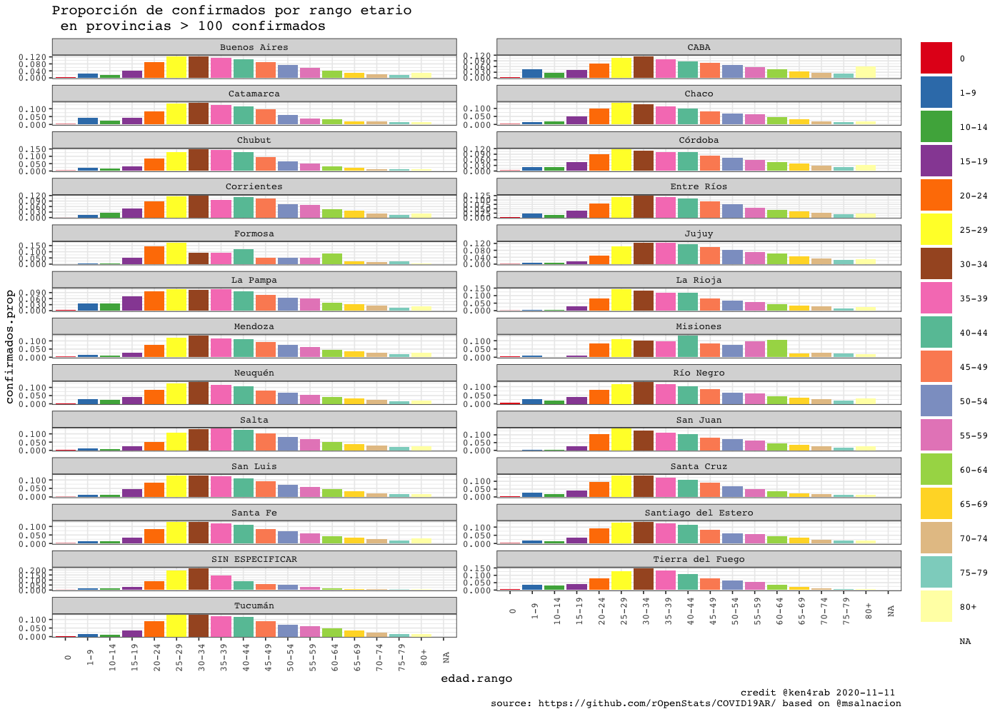

<!-- README.md is generated from README.Rmd. Please edit that file -->


COVID19AR
=========

A package for analysing COVID-19 Argentina’s outbreak

<!-- . -->

Package
=======

| Release                                                                                                | Usage                                                                                                    | Development                                                                                                                                                                                            |
|:-------------------------------------------------------------------------------------------------------|:---------------------------------------------------------------------------------------------------------|:-------------------------------------------------------------------------------------------------------------------------------------------------------------------------------------------------------|
|                                                                                                        | [](https://cran.r-project.org/) | [](https://travis-ci.org/rOpenStats/COVID19AR)                                                                                  |
| [](https://cran.r-project.org/package=COVID19AR) |                                                                                                          | [](https://codecov.io/gh/rOpenStats/COVID19AR)                                                                     |
|                                                                                                        |                                                                                                          | [](https://www.repostatus.org/#active) |

Argentina COVID19 open data
===========================

-   [Casos daily
    file](https://sisa.msal.gov.ar/datos/descargas/covid-19/files/Covid19Casos.csv)
-   [Determinaciones daily
    file](https://sisa.msal.gov.ar/datos/descargas/covid-19/files/Covid19Determinaciones.csv)

How to get started (Development version)
========================================

Install the R package using the following commands on the R console:

    # install.packages("devtools")
    devtools::install_github("rOpenStats/COVID19AR")

How to use it
=============

First add variable with your preferred configurations in `~/.Renviron`.
COVID19AR\_data\_dir is mandatory while COVID19AR\_credits can be
configured if you want to publish your own research.

    COVID19AR_data_dir = "~/.R/COVID19AR"
    COVID19AR_credits = "@youralias"

    library(COVID19AR)
    #> Loading required package: dplyr
    #> 
    #> Attaching package: 'dplyr'
    #> The following objects are masked from 'package:stats':
    #> 
    #>     filter, lag
    #> The following objects are masked from 'package:base':
    #> 
    #>     intersect, setdiff, setequal, union
    #> Loading required package: knitr
    #> Loading required package: magrittr
    #> Loading required package: lgr
    #> Warning: replacing previous import 'ggplot2::Layout' by 'lgr::Layout' when
    #> loading 'COVID19AR'
    #> Warning: replacing previous import 'readr::col_factor' by 'scales::col_factor'
    #> when loading 'COVID19AR'
    #> Warning: replacing previous import 'magrittr::equals' by 'testthat::equals' when
    #> loading 'COVID19AR'
    #> Warning: replacing previous import 'magrittr::not' by 'testthat::not' when
    #> loading 'COVID19AR'
    #> Warning: replacing previous import 'magrittr::is_less_than' by
    #> 'testthat::is_less_than' when loading 'COVID19AR'
    #> Warning: replacing previous import 'dplyr::matches' by 'testthat::matches' when
    #> loading 'COVID19AR'
    library(ggplot2)
    #> 
    #> Attaching package: 'ggplot2'
    #> The following object is masked from 'package:lgr':
    #> 
    #>     Layout

COVID19AR datos abiertos del Ministerio de Salud de la Nación
=============================================================

opendata From Ministerio de Salud de la Nación Argentina

    log.dir <- file.path(getEnv("data_dir"), "logs")
    dir.create(log.dir, recursive = TRUE, showWarnings = FALSE)
    log.file <- file.path(log.dir, "covid19ar.log")
    lgr::get_logger("root")$add_appender(AppenderFile$new(log.file))
    lgr::threshold("info", lgr::get_logger("root"))
    lgr::threshold("info", lgr::get_logger("COVID19ARCurator"))

    # Data from
    # http://datos.salud.gob.ar/dataset/covid-19-casos-registrados-en-la-republica-argentina
    covid19.curator <- COVID19ARCurator$new(report.date = Sys.Date() -1 , 
                                            download.new.data = FALSE)

    dummy <- covid19.curator$loadData()
    #> INFO  [08:48:57.168] Exists dest path? {dest.path: ~/.R/COVID19AR/Covid19Casos.csv, exists.dest.path: TRUE}
    dummy <- covid19.curator$curateData()
    #> INFO  [08:49:10.644] Normalize 
    #> INFO  [08:49:13.403] checkSoundness 
    #> INFO  [08:49:14.557] Mutating data 
    #> INFO  [08:54:42.955] Last days rows {date: 2020-08-08, n: 15914}
    #> INFO  [08:54:42.962] Last days rows {date: 2020-08-09, n: 8873}
    #> INFO  [08:54:42.965] Future rows {date: 2020-08-29, n: 1}
    # Dates of current processed file
    max(covid19.curator$data$fecha_apertura, na.rm = TRUE)
    #> [1] "2020-08-09"
    # Inicio de síntomas

    max(covid19.curator$data$fecha_inicio_sintomas,  na.rm = TRUE)
    #> [1] "2020-08-09"

    # Ultima muerte
    max(covid19.curator$data$fecha_fallecimiento,  na.rm = TRUE)
    #> [1] "2020-08-09"

    report.date <- max(covid19.curator$data$fecha_inicio_sintomas,  na.rm = TRUE)
    covid19.ar.summary <- covid19.curator$makeSummary(group.vars = NULL)

    kable(covid19.ar.summary %>% select(max_fecha_diagnostico, confirmados, fallecidos, letalidad.min.porc, letalidad.max.porc, count_fecha_diagnostico, tests, positividad.porc))

| max\_fecha\_diagnostico | confirmados | fallecidos | letalidad.min.porc | letalidad.max.porc | count\_fecha\_diagnostico |  tests | positividad.porc |
|:------------------------|------------:|-----------:|-------------------:|-------------------:|--------------------------:|-------:|-----------------:|
| 2020-08-29              |      246470 |       4606 |              0.014 |              0.019 |                       168 | 725776 |             0.34 |


    covid19.ar.provincia.summary <- covid19.curator$makeSummary(group.vars = c("residencia_provincia_nombre"))
    covid19.ar.provincia.summary.100.confirmed <- covid19.ar.provincia.summary %>% 
      filter(confirmados >= 100) %>%
      arrange(desc(confirmados))
    # Provinces with > 100 confirmed cases
    kable(covid19.ar.provincia.summary.100.confirmed %>% select(residencia_provincia_nombre, confirmados, fallecidos, confirmados, fallecidos, letalidad.min.porc, letalidad.max.porc, count_fecha_diagnostico, tests, positividad.porc))

| residencia\_provincia\_nombre | confirmados | fallecidos | letalidad.min.porc | letalidad.max.porc | count\_fecha\_diagnostico |  tests | positividad.porc |
|:------------------------------|------------:|-----------:|-------------------:|-------------------:|--------------------------:|-------:|-----------------:|
| Buenos Aires                  |      150443 |       2610 |              0.012 |              0.017 |                       166 | 377144 |            0.399 |
| CABA                          |       69502 |       1479 |              0.018 |              0.021 |                       163 | 171285 |            0.406 |
| Chaco                         |        4069 |        164 |              0.031 |              0.040 |                       151 |  24986 |            0.163 |
| Córdoba                       |        3511 |         67 |              0.014 |              0.019 |                       153 |  35651 |            0.098 |
| Jujuy                         |        3428 |         32 |              0.004 |              0.009 |                       142 |  11744 |            0.292 |
| Río Negro                     |        2903 |         85 |              0.026 |              0.029 |                       146 |   9137 |            0.318 |
| Mendoza                       |        2147 |         53 |              0.019 |              0.025 |                       152 |   9254 |            0.232 |
| Santa Fe                      |        2136 |         22 |              0.007 |              0.010 |                       149 |  23887 |            0.089 |
| Neuquén                       |        1465 |         29 |              0.017 |              0.020 |                       148 |   5280 |            0.277 |
| SIN ESPECIFICAR               |        1366 |          4 |              0.002 |              0.003 |                       139 |   3050 |            0.448 |
| Entre Ríos                    |        1164 |         12 |              0.008 |              0.010 |                       146 |   5896 |            0.197 |
| Tierra del Fuego              |         975 |          6 |              0.005 |              0.006 |                       145 |   3744 |            0.260 |
| Santa Cruz                    |         748 |          4 |              0.005 |              0.005 |                       138 |   1957 |            0.382 |
| Salta                         |         579 |          6 |              0.007 |              0.010 |                       141 |   2359 |            0.245 |
| La Rioja                      |         517 |         21 |              0.036 |              0.041 |                       137 |   4532 |            0.114 |
| Tucumán                       |         392 |          5 |              0.002 |              0.013 |                       144 |  13021 |            0.030 |
| Chubut                        |         347 |          3 |              0.005 |              0.009 |                       132 |   3302 |            0.105 |
| Corrientes                    |         213 |          2 |              0.004 |              0.009 |                       143 |   4723 |            0.045 |
| La Pampa                      |         178 |          0 |              0.000 |              0.000 |                       126 |   1662 |            0.107 |
| Santiago del Estero           |         136 |          0 |              0.000 |              0.000 |                       132 |   5745 |            0.024 |

    covid19.ar.summary <- covid19.curator$makeSummary(group.vars = c("residencia_provincia_nombre"))
    nrow(covid19.ar.summary)
    #> [1] 25
    porc.cols <- names(covid19.ar.summary)[grep("porc", names(covid19.ar.summary))]
    kable((covid19.ar.summary %>% filter(confirmados > 0) %>% arrange(desc(confirmados))) %>% 
            select_at(c("residencia_provincia_nombre", "confirmados", "tests", "fallecidos", "dias.fallecimiento",porc.cols)))

| residencia\_provincia\_nombre | confirmados |  tests | fallecidos | dias.fallecimiento | letalidad.min.porc | letalidad.max.porc | positividad.porc | internados.porc | cuidado.intensivo.porc | respirador.porc |
|:------------------------------|------------:|-------:|-----------:|-------------------:|-------------------:|-------------------:|-----------------:|----------------:|-----------------------:|----------------:|
| Buenos Aires                  |      150443 | 377144 |       2610 |               13.8 |              0.012 |              0.017 |            0.399 |           0.103 |                  0.013 |           0.005 |
| CABA                          |       69502 | 171285 |       1479 |               15.0 |              0.018 |              0.021 |            0.406 |           0.190 |                  0.018 |           0.008 |
| Chaco                         |        4069 |  24986 |        164 |               14.5 |              0.031 |              0.040 |            0.163 |           0.112 |                  0.067 |           0.027 |
| Córdoba                       |        3511 |  35651 |         67 |               19.5 |              0.014 |              0.019 |            0.098 |           0.050 |                  0.014 |           0.007 |
| Jujuy                         |        3428 |  11744 |         32 |               12.6 |              0.004 |              0.009 |            0.292 |           0.006 |                  0.001 |           0.001 |
| Río Negro                     |        2903 |   9137 |         85 |               13.9 |              0.026 |              0.029 |            0.318 |           0.281 |                  0.016 |           0.011 |
| Mendoza                       |        2147 |   9254 |         53 |               12.1 |              0.019 |              0.025 |            0.232 |           0.332 |                  0.020 |           0.006 |
| Santa Fe                      |        2136 |  23887 |         22 |               12.8 |              0.007 |              0.010 |            0.089 |           0.083 |                  0.017 |           0.007 |
| Neuquén                       |        1465 |   5280 |         29 |               17.1 |              0.017 |              0.020 |            0.277 |           0.644 |                  0.018 |           0.011 |
| SIN ESPECIFICAR               |        1366 |   3050 |          4 |               23.0 |              0.002 |              0.003 |            0.448 |           0.070 |                  0.007 |           0.004 |
| Entre Ríos                    |        1164 |   5896 |         12 |               13.3 |              0.008 |              0.010 |            0.197 |           0.180 |                  0.009 |           0.003 |
| Tierra del Fuego              |         975 |   3744 |          6 |               11.5 |              0.005 |              0.006 |            0.260 |           0.015 |                  0.005 |           0.005 |
| Santa Cruz                    |         748 |   1957 |          4 |               11.2 |              0.005 |              0.005 |            0.382 |           0.068 |                  0.020 |           0.012 |
| Salta                         |         579 |   2359 |          6 |                8.2 |              0.007 |              0.010 |            0.245 |           0.273 |                  0.022 |           0.010 |
| La Rioja                      |         517 |   4532 |         21 |               13.0 |              0.036 |              0.041 |            0.114 |           0.052 |                  0.012 |           0.004 |
| Tucumán                       |         392 |  13021 |          5 |               12.8 |              0.002 |              0.013 |            0.030 |           0.112 |                  0.026 |           0.008 |
| Chubut                        |         347 |   3302 |          3 |               20.7 |              0.005 |              0.009 |            0.105 |           0.055 |                  0.014 |           0.012 |
| Corrientes                    |         213 |   4723 |          2 |               12.0 |              0.004 |              0.009 |            0.045 |           0.028 |                  0.014 |           0.009 |
| La Pampa                      |         178 |   1662 |          0 |                NaN |              0.000 |              0.000 |            0.107 |           0.079 |                  0.011 |           0.000 |
| Santiago del Estero           |         136 |   5745 |          0 |                NaN |              0.000 |              0.000 |            0.024 |           0.015 |                  0.007 |           0.000 |
| Formosa                       |          83 |    868 |          0 |                NaN |              0.000 |              0.000 |            0.096 |           0.012 |                  0.000 |           0.000 |
| Catamarca                     |          61 |   2238 |          0 |                NaN |              0.000 |              0.000 |            0.027 |           0.000 |                  0.000 |           0.000 |
| Misiones                      |          52 |   2382 |          2 |                6.5 |              0.020 |              0.038 |            0.022 |           0.577 |                  0.115 |           0.058 |
| San Luis                      |          34 |    877 |          0 |                NaN |              0.000 |              0.000 |            0.039 |           0.324 |                  0.029 |           0.000 |
| San Juan                      |          21 |   1052 |          0 |                NaN |              0.000 |              0.000 |            0.020 |           0.238 |                  0.048 |           0.000 |

    rg <- ReportGeneratorCOVID19AR$new(covid19ar.curator = covid19.curator)
    rg$preprocess()
    #> Parsed with column specification:
    #> cols(
    #>   .default = col_double(),
    #>   residencia_provincia_nombre = col_character(),
    #>   residencia_departamento_nombre = col_character(),
    #>   fecha_apertura = col_date(format = ""),
    #>   max_fecha_diagnostico = col_date(format = ""),
    #>   max_fecha_inicio_sintomas = col_date(format = ""),
    #>   confirmados.inc = col_logical(),
    #>   confirmados.rate = col_logical(),
    #>   fallecidos.inc = col_logical(),
    #>   tests.inc = col_logical(),
    #>   tests.rate = col_logical(),
    #>   sospechosos.inc = col_logical()
    #> )
    #> See spec(...) for full column specifications.
    rg$getDepartamentosExponentialGrowthPlot()
    #> Scale for 'y' is already present. Adding another scale for 'y', which will
    #> replace the existing scale.


    rg$getDepartamentosCrossSectionConfirmedPostivityPlot()


    covid19.ar.summary <- covid19.curator$makeSummary(group.vars = c("sepi_apertura"))
    #> INFO  [08:55:29.395] Processing {current.group: }
    nrow(covid19.ar.summary)
    #> [1] 24
    porc.cols <- names(covid19.ar.summary)[grep("porc", names(covid19.ar.summary))]
    kable(covid19.ar.summary %>% 
            filter(confirmados > 0) %>% 
            arrange(sepi_apertura, desc(confirmados)) %>% 
            select_at(c("sepi_apertura", "max_fecha_diagnostico", "count_fecha_diagnostico", "confirmados", "tests", "internados", "fallecidos",  porc.cols)))

| sepi\_apertura | max\_fecha\_diagnostico | count\_fecha\_diagnostico | confirmados |  tests | internados | fallecidos | letalidad.min.porc | letalidad.max.porc | positividad.porc | internados.porc | cuidado.intensivo.porc | respirador.porc |
|---------------:|:------------------------|--------------------------:|------------:|-------:|-----------:|-----------:|-------------------:|-------------------:|-----------------:|----------------:|-----------------------:|----------------:|
|             10 | 2020-05-29              |                        19 |          15 |     85 |          9 |          1 |              0.048 |              0.067 |            0.176 |           0.600 |                  0.133 |           0.133 |
|             11 | 2020-08-01              |                        38 |          97 |    666 |         66 |          9 |              0.066 |              0.093 |            0.146 |           0.680 |                  0.124 |           0.062 |
|             12 | 2020-08-07              |                        62 |         414 |   2049 |        256 |         17 |              0.034 |              0.041 |            0.202 |           0.618 |                  0.092 |           0.053 |
|             13 | 2020-08-08              |                        96 |        1088 |   5517 |        601 |         63 |              0.049 |              0.058 |            0.197 |           0.552 |                  0.094 |           0.056 |
|             14 | 2020-08-08              |                       128 |        1782 |  11538 |        976 |        114 |              0.053 |              0.064 |            0.154 |           0.548 |                  0.094 |           0.056 |
|             15 | 2020-08-08              |                       151 |        2448 |  20257 |       1326 |        179 |              0.060 |              0.073 |            0.121 |           0.542 |                  0.090 |           0.051 |
|             16 | 2020-08-08              |                       161 |        3253 |  31862 |       1678 |        236 |              0.058 |              0.073 |            0.102 |           0.516 |                  0.080 |           0.044 |
|             17 | 2020-08-09              |                       165 |        4378 |  45915 |       2203 |        341 |              0.063 |              0.078 |            0.095 |           0.503 |                  0.072 |           0.038 |
|             18 | 2020-08-09              |                       165 |        5390 |  59108 |       2604 |        418 |              0.062 |              0.078 |            0.091 |           0.483 |                  0.065 |           0.035 |
|             19 | 2020-08-09              |                       165 |        6842 |  73241 |       3193 |        499 |              0.059 |              0.073 |            0.093 |           0.467 |                  0.061 |           0.031 |
|             20 | 2020-08-09              |                       165 |        9248 |  90606 |       4037 |        597 |              0.053 |              0.065 |            0.102 |           0.437 |                  0.055 |           0.029 |
|             21 | 2020-08-09              |                       165 |       13634 | 114042 |       5364 |        749 |              0.046 |              0.055 |            0.120 |           0.393 |                  0.049 |           0.025 |
|             22 | 2020-08-09              |                       165 |       18878 | 139405 |       6805 |        935 |              0.042 |              0.050 |            0.135 |           0.360 |                  0.044 |           0.022 |
|             23 | 2020-08-09              |                       165 |       25329 | 167673 |       8338 |       1156 |              0.038 |              0.046 |            0.151 |           0.329 |                  0.041 |           0.019 |
|             24 | 2020-08-09              |                       165 |       34963 | 202770 |      10475 |       1415 |              0.034 |              0.040 |            0.172 |           0.300 |                  0.036 |           0.017 |
|             25 | 2020-08-09              |                       165 |       47805 | 244149 |      12818 |       1738 |              0.031 |              0.036 |            0.196 |           0.268 |                  0.031 |           0.014 |
|             26 | 2020-08-09              |                       165 |       65520 | 296053 |      15870 |       2158 |              0.028 |              0.033 |            0.221 |           0.242 |                  0.028 |           0.012 |
|             27 | 2020-08-09              |                       165 |       84155 | 346620 |      18618 |       2623 |              0.026 |              0.031 |            0.243 |           0.221 |                  0.025 |           0.011 |
|             28 | 2020-08-09              |                       166 |      107391 | 405198 |      21836 |       3178 |              0.025 |              0.030 |            0.265 |           0.203 |                  0.023 |           0.010 |
|             29 | 2020-08-09              |                       167 |      135885 | 475648 |      25215 |       3730 |              0.023 |              0.027 |            0.286 |           0.186 |                  0.021 |           0.009 |
|             30 | 2020-08-09              |                       167 |      172412 | 559009 |      28485 |       4210 |              0.020 |              0.024 |            0.308 |           0.165 |                  0.019 |           0.008 |
|             31 | 2020-08-29              |                       168 |      209699 | 643467 |      30896 |       4484 |              0.017 |              0.021 |            0.326 |           0.147 |                  0.017 |           0.007 |
|             32 | 2020-08-29              |                       168 |      245534 | 723843 |      32620 |       4606 |              0.014 |              0.019 |            0.339 |           0.133 |                  0.015 |           0.007 |
|             33 | 2020-08-29              |                       168 |      246470 | 725776 |      32644 |       4606 |              0.014 |              0.019 |            0.340 |           0.132 |                  0.015 |           0.007 |


    ```r
    covid19.ar.summary <- covid19.curator$makeSummary(group.vars = c("residencia_provincia_nombre", "sepi_apertura"))
    #> INFO  [08:56:33.717] Processing {current.group: residencia_provincia_nombre = Buenos Aires}
    #> INFO  [08:57:05.195] Processing {current.group: residencia_provincia_nombre = CABA}
    #> INFO  [08:57:22.100] Processing {current.group: residencia_provincia_nombre = Catamarca}
    #> INFO  [08:57:23.958] Processing {current.group: residencia_provincia_nombre = Chaco}
    #> INFO  [08:57:29.004] Processing {current.group: residencia_provincia_nombre = Chubut}
    #> INFO  [08:57:31.978] Processing {current.group: residencia_provincia_nombre = Córdoba}
    #> INFO  [08:57:39.709] Processing {current.group: residencia_provincia_nombre = Corrientes}
    #> INFO  [08:57:42.755] Processing {current.group: residencia_provincia_nombre = Entre Ríos}
    #> INFO  [08:57:45.635] Processing {current.group: residencia_provincia_nombre = Formosa}
    #> INFO  [08:57:47.615] Processing {current.group: residencia_provincia_nombre = Jujuy}
    #> INFO  [08:57:50.799] Processing {current.group: residencia_provincia_nombre = La Pampa}
    #> INFO  [08:57:53.149] Processing {current.group: residencia_provincia_nombre = La Rioja}
    #> INFO  [08:57:55.628] Processing {current.group: residencia_provincia_nombre = Mendoza}
    #> INFO  [08:57:58.546] Processing {current.group: residencia_provincia_nombre = Misiones}
    #> INFO  [08:58:01.052] Processing {current.group: residencia_provincia_nombre = Neuquén}
    #> INFO  [08:58:03.635] Processing {current.group: residencia_provincia_nombre = Río Negro}
    #> INFO  [08:58:06.628] Processing {current.group: residencia_provincia_nombre = Salta}
    #> INFO  [08:58:09.019] Processing {current.group: residencia_provincia_nombre = San Juan}
    #> INFO  [08:58:11.401] Processing {current.group: residencia_provincia_nombre = San Luis}
    #> INFO  [08:58:13.778] Processing {current.group: residencia_provincia_nombre = Santa Cruz}
    #> INFO  [08:58:16.164] Processing {current.group: residencia_provincia_nombre = Santa Fe}
    #> INFO  [08:58:20.877] Processing {current.group: residencia_provincia_nombre = Santiago del Estero}
    #> INFO  [08:58:23.573] Processing {current.group: residencia_provincia_nombre = SIN ESPECIFICAR}
    #> INFO  [08:58:26.391] Processing {current.group: residencia_provincia_nombre = Tierra del Fuego}
    #> INFO  [08:58:29.079] Processing {current.group: residencia_provincia_nombre = Tucumán}
    nrow(covid19.ar.summary)
    #> [1] 536
    porc.cols <- names(covid19.ar.summary)[grep("porc", names(covid19.ar.summary))]
    sepi.fechas <- covid19.curator$data %>% 
      group_by(sepi_apertura) %>% 
      summarize(ultima_fecha_sepi = max(fecha_apertura), .groups = "keep")


    data2plot <- covid19.ar.summary %>%
                    filter(residencia_provincia_nombre %in% covid19.ar.provincia.summary.100.confirmed$residencia_provincia_nombre) %>%
                    filter(confirmados > 0 ) %>%
                    filter(positividad.porc <=0.6 | confirmados >= 20)

                    
    data2plot %<>% inner_join(sepi.fechas, by = "sepi_apertura")
    dates <- sort(unique(data2plot$ultima_fecha_sepi))

    covplot <- data2plot %>%
     ggplot(aes(x = ultima_fecha_sepi, y = confirmados, color = "confirmados")) +
     geom_line() +
     facet_wrap(~residencia_provincia_nombre, ncol = 2, scales = "free_y") +
     labs(title = "Evolución de casos confirmados y tests\n en provincias > 100 confirmados")
    covplot <- covplot +
     geom_line(aes(x = ultima_fecha_sepi, y = tests, color = "tests")) +
     facet_wrap(~residencia_provincia_nombre, ncol = 2, scales = "free_y")
    covplot <- setupTheme(covplot, report.date = report.date, x.values = dates, x.type = "dates",
                         total.colors = 2,
                         data.provider.abv = "@msalnacion", base.size = 6)
    covplot <- covplot + scale_y_log10()
    #> Scale for 'y' is already present. Adding another scale for 'y', which will
    #> replace the existing scale.
    covplot


    covplot <- data2plot %>%
     ggplot(aes(x = ultima_fecha_sepi, y = positividad.porc, color = "positividad.porc")) +
     geom_line() +
     facet_wrap(~residencia_provincia_nombre, ncol = 2, scales = "free_y") +
     labs(title = "Porcentajes de positividad, uso de UCI, respirador y letalidad\n en provincias > 100 confirmados")
    covplot <- covplot +
     geom_line(aes(x = ultima_fecha_sepi, y = cuidado.intensivo.porc, color = "cuidado.intensivo.porc")) +
     facet_wrap(~residencia_provincia_nombre, ncol = 2, scales = "free_y")
    covplot <- covplot  +
     geom_line(aes(x = ultima_fecha_sepi, y = respirador.porc, color = "respirador.porc"))+
     facet_wrap(~residencia_provincia_nombre, ncol = 2, scales = "free_y")
    covplot <- covplot +
     geom_line(aes(x = ultima_fecha_sepi, y = letalidad.min.porc, color = "letalidad.min.porc")) +
     facet_wrap(~residencia_provincia_nombre, ncol = 2, scales = "free_y")

    covplot <- setupTheme(covplot, report.date = report.date, x.values = dates, x.type = "dates",
                         total.colors = 4,
                         data.provider.abv = "@msalnacion", base.size = 6)
    covplot


    covid19.ar.summary <- covid19.curator$makeSummary(group.vars = c("residencia_provincia_nombre", "sexo"))
    nrow(covid19.ar.summary)
    #> [1] 64
    porc.cols <- names(covid19.ar.summary)[grep("porc", names(covid19.ar.summary))]
    kable((covid19.ar.summary %>% filter(confirmados >= 10) %>% arrange(desc(confirmados))) %>% select_at(c("residencia_provincia_nombre", "sexo", "confirmados", "internados", "fallecidos",  porc.cols)))

| residencia\_provincia\_nombre | sexo | confirmados | internados | fallecidos | letalidad.min.porc | letalidad.max.porc | positividad.porc | internados.porc | cuidado.intensivo.porc | respirador.porc |
|:------------------------------|:-----|------------:|-----------:|-----------:|-------------------:|-------------------:|-----------------:|----------------:|-----------------------:|----------------:|
| Buenos Aires                  | M    |       76996 |       8400 |       1482 |              0.014 |              0.019 |            0.417 |           0.109 |                  0.015 |           0.007 |
| Buenos Aires                  | F    |       72902 |       6981 |       1112 |              0.011 |              0.015 |            0.381 |           0.096 |                  0.010 |           0.004 |
| CABA                          | F    |       35094 |       6492 |        654 |              0.015 |              0.019 |            0.387 |           0.185 |                  0.013 |           0.006 |
| CABA                          | M    |       34137 |       6651 |        808 |              0.020 |              0.024 |            0.427 |           0.195 |                  0.023 |           0.011 |
| Jujuy                         | M    |        2127 |         16 |         18 |              0.004 |              0.008 |            0.328 |           0.008 |                  0.001 |           0.001 |
| Chaco                         | F    |        2034 |        229 |         62 |              0.023 |              0.030 |            0.162 |           0.113 |                  0.060 |           0.022 |
| Chaco                         | M    |        2033 |        228 |        102 |              0.039 |              0.050 |            0.163 |           0.112 |                  0.075 |           0.032 |
| Córdoba                       | M    |        1758 |         87 |         34 |              0.014 |              0.019 |            0.101 |           0.049 |                  0.015 |           0.009 |
| Córdoba                       | F    |        1750 |         88 |         33 |              0.014 |              0.019 |            0.096 |           0.050 |                  0.013 |           0.006 |
| Río Negro                     | F    |        1517 |        407 |         31 |              0.018 |              0.020 |            0.310 |           0.268 |                  0.009 |           0.005 |
| Río Negro                     | M    |        1385 |        407 |         54 |              0.034 |              0.039 |            0.327 |           0.294 |                  0.023 |           0.018 |
| Jujuy                         | F    |        1296 |          5 |         14 |              0.004 |              0.011 |            0.248 |           0.004 |                  0.001 |           0.001 |
| Santa Fe                      | F    |        1086 |         72 |          8 |              0.005 |              0.007 |            0.087 |           0.066 |                  0.013 |           0.003 |
| Mendoza                       | F    |        1081 |        364 |         16 |              0.012 |              0.015 |            0.230 |           0.337 |                  0.011 |           0.002 |
| Mendoza                       | M    |        1054 |        345 |         35 |              0.024 |              0.033 |            0.234 |           0.327 |                  0.030 |           0.009 |
| Santa Fe                      | M    |        1050 |        106 |         14 |              0.010 |              0.013 |            0.092 |           0.101 |                  0.022 |           0.010 |
| SIN ESPECIFICAR               | F    |         817 |         49 |          1 |              0.001 |              0.001 |            0.442 |           0.060 |                  0.004 |           0.000 |
| Neuquén                       | M    |         734 |        461 |         13 |              0.015 |              0.018 |            0.279 |           0.628 |                  0.015 |           0.010 |
| Neuquén                       | F    |         731 |        482 |         16 |              0.018 |              0.022 |            0.277 |           0.659 |                  0.022 |           0.012 |
| Entre Ríos                    | M    |         592 |        113 |          7 |              0.009 |              0.012 |            0.207 |           0.191 |                  0.008 |           0.003 |
| Tierra del Fuego              | M    |         576 |          9 |          4 |              0.006 |              0.007 |            0.289 |           0.016 |                  0.007 |           0.007 |
| Entre Ríos                    | F    |         571 |         96 |          5 |              0.007 |              0.009 |            0.189 |           0.168 |                  0.011 |           0.002 |
| Buenos Aires                  | NR   |         545 |         51 |         16 |              0.018 |              0.029 |            0.414 |           0.094 |                  0.024 |           0.013 |
| SIN ESPECIFICAR               | M    |         545 |         46 |          2 |              0.003 |              0.004 |            0.460 |           0.084 |                  0.011 |           0.009 |
| Tierra del Fuego              | F    |         398 |          6 |          2 |              0.004 |              0.005 |            0.228 |           0.015 |                  0.003 |           0.003 |
| Santa Cruz                    | M    |         393 |         25 |          2 |              0.005 |              0.005 |            0.379 |           0.064 |                  0.020 |           0.010 |
| Santa Cruz                    | F    |         354 |         26 |          2 |              0.005 |              0.006 |            0.385 |           0.073 |                  0.020 |           0.014 |
| Salta                         | M    |         344 |         88 |          6 |              0.012 |              0.017 |            0.232 |           0.256 |                  0.029 |           0.017 |
| CABA                          | NR   |         271 |         78 |         17 |              0.037 |              0.063 |            0.384 |           0.288 |                  0.048 |           0.033 |
| La Rioja                      | F    |         267 |         15 |          8 |              0.027 |              0.030 |            0.122 |           0.056 |                  0.019 |           0.007 |
| La Rioja                      | M    |         247 |         12 |         13 |              0.046 |              0.053 |            0.106 |           0.049 |                  0.004 |           0.000 |
| Salta                         | F    |         235 |         70 |          0 |              0.000 |              0.000 |            0.270 |           0.298 |                  0.013 |           0.000 |
| Tucumán                       | M    |         213 |         26 |          3 |              0.002 |              0.014 |            0.026 |           0.122 |                  0.019 |           0.005 |
| Chubut                        | M    |         198 |         15 |          1 |              0.003 |              0.005 |            0.115 |           0.076 |                  0.015 |           0.015 |
| Tucumán                       | F    |         178 |         18 |          2 |              0.002 |              0.011 |            0.036 |           0.101 |                  0.034 |           0.011 |
| Chubut                        | F    |         145 |          4 |          2 |              0.007 |              0.014 |            0.094 |           0.028 |                  0.014 |           0.007 |
| Corrientes                    | M    |         119 |          6 |          2 |              0.008 |              0.017 |            0.045 |           0.050 |                  0.017 |           0.017 |
| La Pampa                      | F    |         103 |          9 |          0 |              0.000 |              0.000 |            0.113 |           0.087 |                  0.010 |           0.000 |
| Corrientes                    | F    |          94 |          0 |          0 |              0.000 |              0.000 |            0.046 |           0.000 |                  0.011 |           0.000 |
| Santiago del Estero           | M    |          81 |          2 |          0 |              0.000 |              0.000 |            0.020 |           0.025 |                  0.012 |           0.000 |
| La Pampa                      | M    |          75 |          5 |          0 |              0.000 |              0.000 |            0.101 |           0.067 |                  0.013 |           0.000 |
| Formosa                       | M    |          67 |          0 |          0 |              0.000 |              0.000 |            0.131 |           0.000 |                  0.000 |           0.000 |
| Santiago del Estero           | F    |          55 |          0 |          0 |              0.000 |              0.000 |            0.035 |           0.000 |                  0.000 |           0.000 |
| Catamarca                     | M    |          39 |          0 |          0 |              0.000 |              0.000 |            0.028 |           0.000 |                  0.000 |           0.000 |
| Misiones                      | M    |          32 |         16 |          1 |              0.017 |              0.031 |            0.025 |           0.500 |                  0.125 |           0.062 |
| San Luis                      | M    |          24 |          7 |          0 |              0.000 |              0.000 |            0.049 |           0.292 |                  0.042 |           0.000 |
| Catamarca                     | F    |          22 |          0 |          0 |              0.000 |              0.000 |            0.027 |           0.000 |                  0.000 |           0.000 |
| Misiones                      | F    |          20 |         14 |          1 |              0.026 |              0.050 |            0.018 |           0.700 |                  0.100 |           0.050 |
| Formosa                       | F    |          16 |          1 |          0 |              0.000 |              0.000 |            0.045 |           0.062 |                  0.000 |           0.000 |
| San Juan                      | M    |          15 |          2 |          0 |              0.000 |              0.000 |            0.025 |           0.133 |                  0.000 |           0.000 |
| Mendoza                       | NR   |          12 |          4 |          2 |              0.095 |              0.167 |            0.194 |           0.333 |                  0.000 |           0.000 |
| San Luis                      | F    |          10 |          4 |          0 |              0.000 |              0.000 |            0.026 |           0.400 |                  0.000 |           0.000 |


    covid19.ar.summary <- covid19.curator$makeSummary(group.vars = c("residencia_provincia_nombre", "edad.rango"))

     # Share per province
      provinces.cases <-covid19.ar.summary %>%
        group_by(residencia_provincia_nombre) %>%
        summarise(fallecidos.total.provincia = sum(fallecidos),
                  confirmados.total.provincia = sum(confirmados),
                  .groups = "keep")
     covid19.ar.summary %<>% inner_join(provinces.cases, by = "residencia_provincia_nombre")
     covid19.ar.summary %<>% mutate(fallecidos.prop = fallecidos/fallecidos.total.provincia)
     covid19.ar.summary %<>% mutate(confirmados.prop = confirmados/confirmados.total.provincia)

     # Data 2 plot
     data2plot <- covid19.ar.summary %>% filter(residencia_provincia_nombre %in%
     # Proporción de confirmados por rango etario
     covid19.ar.provincia.summary.100.confirmed$residencia_provincia_nombre)

     
     covidplot <-
       data2plot %>%
       ggplot(aes(x = edad.rango, y = confirmados.prop, fill = edad.rango)) +
       geom_bar(stat = "identity") + facet_wrap(~residencia_provincia_nombre, ncol = 2, scales = "free_y") +
       labs(title = "Proporción de confirmados por rango etario\n en provincias > 100 confirmados")

     covidplot <- setupTheme(covidplot, report.date = report.date, x.values = NULL, x.type = NULL,
                             total.colors = length(unique(data2plot$edad.rango)),
                             data.provider.abv = "@msalnacion", base.size = 6)
     # Proporción de muertos por rango etario
     covidplot




     #Plot of deaths share
     covidplot <-
        data2plot %>%
        ggplot(aes(x = edad.rango, y = fallecidos.prop, fill = edad.rango)) +
        geom_bar(stat = "identity") + facet_wrap(~residencia_provincia_nombre, ncol = 2, scales = "free_y") +
        labs(title = "Proporción de muertos por rango etario\n en provincias > 100 confirmados")
     covidplot <- setupTheme(covidplot, report.date = report.date, x.values = NULL, x.type = NULL,
                          total.colors = length(unique(data2plot$edad.rango)),
                          data.provider.abv = "@msalnacion", base.size = 6)
     # Proporción de muertos por rango etario
     covidplot
    #> Warning: Removed 32 rows containing missing values (position_stack).


     # UCI rate
     covidplot <- data2plot %>%
       ggplot(aes(x = edad.rango, y = cuidado.intensivo.porc, fill = edad.rango)) +
       geom_bar(stat = "identity") + facet_wrap(~residencia_provincia_nombre, ncol = 2, scales = "free_y") +
        labs(title = "Porcentaje de pacientes en Unidades de Cuidados Intensivos por rango etario\n en provincias > 100 confirmados")
     covidplot <- setupTheme(covidplot, report.date = report.date, x.values = NULL, x.type = NULL,
                          total.colors = length(unique(data2plot$edad.rango)),
                          data.provider.abv = "@msalnacion", base.size = 6)
     covidplot


     # ventilator rate
     covidplot <- data2plot %>%
       ggplot(aes(x = edad.rango, y = respirador.porc, fill = edad.rango)) +
       geom_bar(stat = "identity") +
       facet_wrap(~residencia_provincia_nombre, ncol = 2, scales = "free_y") +
       labs(title = "Porcentaje de pacientes que utilizaron respirador mecánico por rango etario\n en provincias > 100 confirmados")
     covidplot <- setupTheme(covidplot, report.date = report.date, x.values = NULL, x.type = NULL,
                          total.colors = length(unique(data2plot$edad.rango)),
                          data.provider.abv = "@msalnacion", base.size = 6)
     covidplot


     # fatality rate

     covidplot <- data2plot %>%
      ggplot(aes(x = edad.rango, y = letalidad.min.porc, fill = edad.rango)) +
      geom_bar(stat = "identity") +
      facet_wrap(~residencia_provincia_nombre, ncol = 2, scales = "free_y") +
      labs(title = "Porcentaje de letalidad por rango etario\n en provincias > 100 confirmados")
     covidplot <- setupTheme(covidplot, report.date = report.date, x.values = NULL, x.type = NULL,
                          total.colors = length(unique(data2plot$edad.rango)),
                          data.provider.abv = "@msalnacion", base.size = 6)
     covidplot


Generar diferentes agregaciones y guardar csv / Generate different aggregations
===============================================================================

    output.dir <- "~/.R/COVID19AR/"
    dir.create(output.dir, showWarnings = FALSE, recursive = TRUE)
    exportAggregatedTables(covid19.curator, output.dir = output.dir,
                           aggrupation.criteria = list(provincia_residencia = c("residencia_provincia_nombre"),
                                                       provincia_localidad_residencia = c("residencia_provincia_nombre", "residencia_departamento_nombre"),
                                                       provincia_residencia_sexo = c("residencia_provincia_nombre", "sexo"),
                                                       edad_rango_sexo = c("edad.rango", "sexo"),
                                                       provincia_residencia_edad_rango = c("residencia_provincia_nombre", "edad.rango"),
                                                       provincia_residencia_sepi_apertura = c("residencia_provincia_nombre", "sepi_apertura"),
                                                       provincia_residencia = c("residencia_provincia_nombre", "residencia_departamento_nombre", "sepi_apertura"),
                                                       provincia_residencia_fecha_apertura = c("residencia_provincia_nombre", "fecha_apertura")))
                                                       
                                                      

All this tables are accesible at
[COVID19ARdata](https://github.com/rOpenStats/COVID19ARdata/tree/master/curated)

How to Cite This Work
=====================

Citation

    Alejandro Baranek, COVID19AR, 2020. URL: https://github.com/rOpenStats/COVID19AR

    BibTex
    @techreport{baranek2020Covid19AR,
    Author = {Alejandro Baranek},
    Institution = {rOpenStats},
    Title = {COVID19AR: a package for analysing Argentina COVID-19 outbreak},
    Url = {https://github.com/rOpenStats/COVID19AR},
    Year = {2020}}
