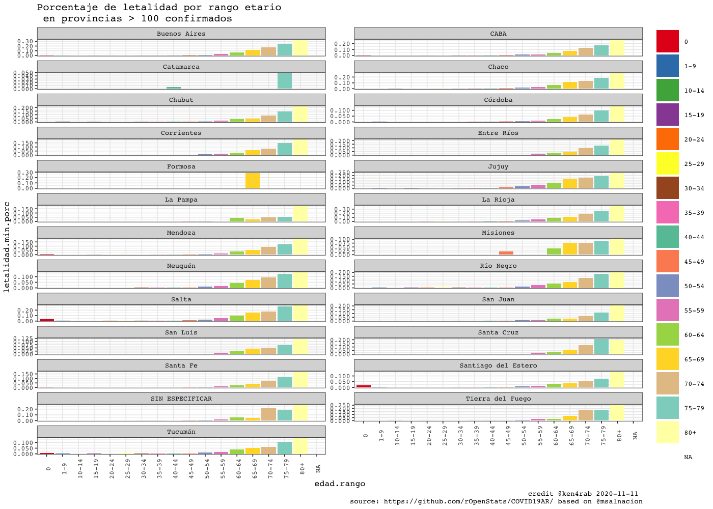

<!-- README.md is generated from README.Rmd. Please edit that file -->


COVID19AR
=========

A package for analysing COVID-19 Argentina’s outbreak

<!-- . -->

Package
=======

| Release                                                                                                | Usage                                                                                                    | Development                                                                                                                                                                                            |
|:-------------------------------------------------------------------------------------------------------|:---------------------------------------------------------------------------------------------------------|:-------------------------------------------------------------------------------------------------------------------------------------------------------------------------------------------------------|
|                                                                                                        | [](https://cran.r-project.org/) | [](https://travis-ci.org/rOpenStats/COVID19AR)                                                                                  |
| [](https://cran.r-project.org/package=COVID19AR) |                                                                                                          | [](https://codecov.io/gh/rOpenStats/COVID19AR)                                                                     |
|                                                                                                        |                                                                                                          | [](https://www.repostatus.org/#active) |

Argentina COVID19 open data
===========================

-   [Casos daily
    file](https://sisa.msal.gov.ar/datos/descargas/covid-19/files/Covid19Casos.csv)
-   [Determinaciones daily
    file](https://sisa.msal.gov.ar/datos/descargas/covid-19/files/Covid19Determinaciones.csv)

How to get started (Development version)
========================================

Install the R package using the following commands on the R console:

    # install.packages("devtools")
    devtools::install_github("rOpenStats/COVID19AR")

How to use it
=============

First add variable with your preferred configurations in `~/.Renviron`.
COVID19AR\_data\_dir is mandatory while COVID19AR\_credits can be
configured if you want to publish your own research.

    COVID19AR_data_dir = "~/.R/COVID19AR"
    COVID19AR_credits = "@youralias"

    library(COVID19AR)
    #> Loading required package: dplyr
    #> 
    #> Attaching package: 'dplyr'
    #> The following objects are masked from 'package:stats':
    #> 
    #>     filter, lag
    #> The following objects are masked from 'package:base':
    #> 
    #>     intersect, setdiff, setequal, union
    #> Loading required package: knitr
    #> Loading required package: magrittr
    #> Loading required package: lgr
    #> Warning: replacing previous import 'ggplot2::Layout' by 'lgr::Layout' when
    #> loading 'COVID19AR'
    #> Warning: replacing previous import 'readr::col_factor' by 'scales::col_factor'
    #> when loading 'COVID19AR'
    #> Warning: replacing previous import 'magrittr::equals' by 'testthat::equals' when
    #> loading 'COVID19AR'
    #> Warning: replacing previous import 'magrittr::not' by 'testthat::not' when
    #> loading 'COVID19AR'
    #> Warning: replacing previous import 'magrittr::is_less_than' by
    #> 'testthat::is_less_than' when loading 'COVID19AR'
    #> Warning: replacing previous import 'dplyr::matches' by 'testthat::matches' when
    #> loading 'COVID19AR'
    library(ggplot2)
    #> 
    #> Attaching package: 'ggplot2'
    #> The following object is masked from 'package:lgr':
    #> 
    #>     Layout

COVID19AR datos abiertos del Ministerio de Salud de la Nación
=============================================================

opendata From Ministerio de Salud de la Nación Argentina

    log.dir <- file.path(getEnv("data_dir"), "logs")
    dir.create(log.dir, recursive = TRUE, showWarnings = FALSE)
    log.file <- file.path(log.dir, "covid19ar.log")
    lgr::get_logger("root")$add_appender(AppenderFile$new(log.file))
    lgr::threshold("info", lgr::get_logger("root"))
    lgr::threshold("info", lgr::get_logger("COVID19ARCurator"))

    # Data from
    # http://datos.salud.gob.ar/dataset/covid-19-casos-registrados-en-la-republica-argentina
    covid19.curator <- COVID19ARCurator$new(report.date = Sys.Date() -1 , 
                                            download.new.data = FALSE)

    dummy <- covid19.curator$loadData()
    #> INFO  [09:02:04.340] Exists dest path? {dest.path: ~/.R/COVID19AR/Covid19Casos.csv, exists.dest.path: TRUE}
    dummy <- covid19.curator$curateData()
    #> INFO  [09:02:12.985] Normalize 
    #> INFO  [09:02:15.779] checkSoundness 
    #> INFO  [09:02:16.880] Mutating data
    # Dates of current processed file
    max(covid19.curator$data$fecha_apertura, na.rm = TRUE)
    #> [1] "2020-09-10"
    # Inicio de síntomas

    max(covid19.curator$data$fecha_inicio_sintomas,  na.rm = TRUE)
    #> [1] "2020-09-10"

    # Ultima muerte
    max(covid19.curator$data$fecha_fallecimiento,  na.rm = TRUE)
    #> [1] "2020-09-10"

    report.date <- max(covid19.curator$data$fecha_inicio_sintomas,  na.rm = TRUE)
    covid19.ar.summary <- covid19.curator$makeSummary(group.vars = NULL)

    kable(covid19.ar.summary %>% select(max_fecha_diagnostico, confirmados, fallecidos, letalidad.min.porc, letalidad.max.porc, count_fecha_diagnostico, tests, positividad.porc))

| max\_fecha\_diagnostico | confirmados | fallecidos | letalidad.min.porc | letalidad.max.porc | count\_fecha\_diagnostico |   tests | positividad.porc |
|:------------------------|------------:|-----------:|-------------------:|-------------------:|--------------------------:|--------:|-----------------:|
| 2020-09-10              |      524194 |      10907 |              0.017 |              0.021 |                       200 | 1315184 |            0.399 |


    covid19.ar.provincia.summary <- covid19.curator$makeSummary(group.vars = c("residencia_provincia_nombre"))
    covid19.ar.provincia.summary.100.confirmed <- covid19.ar.provincia.summary %>% 
      filter(confirmados >= 100) %>%
      arrange(desc(confirmados))
    # Provinces with > 100 confirmed cases
    kable(covid19.ar.provincia.summary.100.confirmed %>% select(residencia_provincia_nombre, confirmados, fallecidos, confirmados, fallecidos, letalidad.min.porc, letalidad.max.porc, count_fecha_diagnostico, tests, positividad.porc))

| residencia\_provincia\_nombre | confirmados | fallecidos | letalidad.min.porc | letalidad.max.porc | count\_fecha\_diagnostico |  tests | positividad.porc |
|:------------------------------|------------:|-----------:|-------------------:|-------------------:|--------------------------:|-------:|-----------------:|
| Buenos Aires                  |      315413 |       6576 |              0.017 |              0.021 |                       197 | 700699 |            0.450 |
| CABA                          |      107042 |       2601 |              0.021 |              0.024 |                       195 | 272062 |            0.393 |
| Santa Fe                      |       15743 |        177 |              0.009 |              0.011 |                       181 |  49228 |            0.320 |
| Córdoba                       |       13002 |        183 |              0.011 |              0.014 |                       185 |  57628 |            0.226 |
| Mendoza                       |       12361 |        190 |              0.011 |              0.015 |                       184 |  29401 |            0.420 |
| Jujuy                         |       11394 |        276 |              0.016 |              0.024 |                       175 |  26374 |            0.432 |
| Río Negro                     |        8042 |        228 |              0.025 |              0.028 |                       178 |  18789 |            0.428 |
| Chaco                         |        6418 |        234 |              0.028 |              0.036 |                       183 |  38025 |            0.169 |
| Salta                         |        5831 |         80 |              0.009 |              0.014 |                       173 |  11775 |            0.495 |
| Tucumán                       |        5413 |         17 |              0.001 |              0.003 |                       176 |  21190 |            0.255 |
| Entre Ríos                    |        4844 |         77 |              0.012 |              0.016 |                       178 |  13089 |            0.370 |
| Neuquén                       |        4298 |         73 |              0.011 |              0.017 |                       180 |  10050 |            0.428 |
| Santa Cruz                    |        2619 |         22 |              0.007 |              0.008 |                       170 |   6224 |            0.421 |
| Tierra del Fuego              |        2591 |         41 |              0.014 |              0.016 |                       177 |   7026 |            0.369 |
| La Rioja                      |        2503 |         76 |              0.028 |              0.030 |                       169 |   8878 |            0.282 |
| SIN ESPECIFICAR               |        1943 |         10 |              0.004 |              0.005 |                       171 |   4389 |            0.443 |
| Santiago del Estero           |        1558 |         23 |              0.008 |              0.015 |                       164 |  10613 |            0.147 |
| Chubut                        |        1389 |          8 |              0.003 |              0.006 |                       164 |   6399 |            0.217 |
| Corrientes                    |         491 |          2 |              0.002 |              0.004 |                       175 |   8649 |            0.057 |
| San Juan                      |         384 |          7 |              0.013 |              0.018 |                       167 |   1570 |            0.245 |
| San Luis                      |         356 |          0 |              0.000 |              0.000 |                       157 |   1454 |            0.245 |
| La Pampa                      |         294 |          3 |              0.007 |              0.010 |                       158 |   3046 |            0.097 |
| Catamarca                     |         110 |          0 |              0.000 |              0.000 |                       149 |   3943 |            0.028 |

    covid19.ar.summary <- covid19.curator$makeSummary(group.vars = c("residencia_provincia_nombre"))
    nrow(covid19.ar.summary)
    #> [1] 25
    porc.cols <- names(covid19.ar.summary)[grep("porc", names(covid19.ar.summary))]
    kable((covid19.ar.summary %>% filter(confirmados > 0) %>% arrange(desc(confirmados))) %>% 
            select_at(c("residencia_provincia_nombre", "confirmados", "tests", "fallecidos", "dias.fallecimiento",porc.cols)))

| residencia\_provincia\_nombre | confirmados |  tests | fallecidos | dias.fallecimiento | letalidad.min.porc | letalidad.max.porc | positividad.porc | internados.porc | cuidado.intensivo.porc | respirador.porc |
|:------------------------------|------------:|-------:|-----------:|-------------------:|-------------------:|-------------------:|-----------------:|----------------:|-----------------------:|----------------:|
| Buenos Aires                  |      315413 | 700699 |       6576 |               15.0 |              0.017 |              0.021 |            0.450 |           0.078 |                  0.011 |           0.005 |
| CABA                          |      107042 | 272062 |       2601 |               16.1 |              0.021 |              0.024 |            0.393 |           0.162 |                  0.017 |           0.009 |
| Santa Fe                      |       15743 |  49228 |        177 |               12.8 |              0.009 |              0.011 |            0.320 |           0.040 |                  0.011 |           0.006 |
| Córdoba                       |       13002 |  57628 |        183 |               14.5 |              0.011 |              0.014 |            0.226 |           0.023 |                  0.006 |           0.003 |
| Mendoza                       |       12361 |  29401 |        190 |               11.2 |              0.011 |              0.015 |            0.420 |           0.117 |                  0.008 |           0.003 |
| Jujuy                         |       11394 |  26374 |        276 |               14.0 |              0.016 |              0.024 |            0.432 |           0.009 |                  0.001 |           0.001 |
| Río Negro                     |        8042 |  18789 |        228 |               13.0 |              0.025 |              0.028 |            0.428 |           0.245 |                  0.012 |           0.008 |
| Chaco                         |        6418 |  38025 |        234 |               14.3 |              0.028 |              0.036 |            0.169 |           0.102 |                  0.056 |           0.026 |
| Salta                         |        5831 |  11775 |         80 |                9.8 |              0.009 |              0.014 |            0.495 |           0.112 |                  0.013 |           0.005 |
| Tucumán                       |        5413 |  21190 |         17 |               13.8 |              0.001 |              0.003 |            0.255 |           0.038 |                  0.005 |           0.001 |
| Entre Ríos                    |        4844 |  13089 |         77 |               10.7 |              0.012 |              0.016 |            0.370 |           0.101 |                  0.009 |           0.002 |
| Neuquén                       |        4298 |  10050 |         73 |               16.3 |              0.011 |              0.017 |            0.428 |           0.556 |                  0.013 |           0.009 |
| Santa Cruz                    |        2619 |   6224 |         22 |               15.8 |              0.007 |              0.008 |            0.421 |           0.048 |                  0.011 |           0.007 |
| Tierra del Fuego              |        2591 |   7026 |         41 |               14.9 |              0.014 |              0.016 |            0.369 |           0.025 |                  0.008 |           0.008 |
| La Rioja                      |        2503 |   8878 |         76 |                9.6 |              0.028 |              0.030 |            0.282 |           0.014 |                  0.004 |           0.001 |
| SIN ESPECIFICAR               |        1943 |   4389 |         10 |               19.7 |              0.004 |              0.005 |            0.443 |           0.065 |                  0.008 |           0.004 |
| Santiago del Estero           |        1558 |  10613 |         23 |                9.2 |              0.008 |              0.015 |            0.147 |           0.010 |                  0.002 |           0.001 |
| Chubut                        |        1389 |   6399 |          8 |               17.9 |              0.003 |              0.006 |            0.217 |           0.020 |                  0.006 |           0.006 |
| Corrientes                    |         491 |   8649 |          2 |               12.0 |              0.002 |              0.004 |            0.057 |           0.020 |                  0.006 |           0.002 |
| San Juan                      |         384 |   1570 |          7 |               12.7 |              0.013 |              0.018 |            0.245 |           0.021 |                  0.003 |           0.000 |
| San Luis                      |         356 |   1454 |          0 |                NaN |              0.000 |              0.000 |            0.245 |           0.090 |                  0.003 |           0.000 |
| La Pampa                      |         294 |   3046 |          3 |               29.0 |              0.007 |              0.010 |            0.097 |           0.068 |                  0.014 |           0.003 |
| Catamarca                     |         110 |   3943 |          0 |                NaN |              0.000 |              0.000 |            0.028 |           0.000 |                  0.000 |           0.000 |
| Formosa                       |          90 |   1167 |          1 |               12.0 |              0.008 |              0.011 |            0.077 |           0.022 |                  0.000 |           0.000 |
| Misiones                      |          65 |   3516 |          2 |                6.5 |              0.013 |              0.031 |            0.018 |           0.446 |                  0.077 |           0.031 |

    rg <- ReportGeneratorCOVID19AR$new(covid19ar.curator = covid19.curator)
    rg$preprocess()
    #> Parsed with column specification:
    #> cols(
    #>   .default = col_double(),
    #>   residencia_provincia_nombre = col_character(),
    #>   residencia_departamento_nombre = col_character(),
    #>   fecha_apertura = col_date(format = ""),
    #>   max_fecha_diagnostico = col_date(format = ""),
    #>   max_fecha_inicio_sintomas = col_date(format = ""),
    #>   confirmados.inc = col_logical(),
    #>   confirmados.rate = col_logical(),
    #>   fallecidos.inc = col_logical(),
    #>   tests.inc = col_logical(),
    #>   tests.rate = col_logical(),
    #>   sospechosos.inc = col_logical()
    #> )
    #> See spec(...) for full column specifications.
    rg$getDepartamentosExponentialGrowthPlot()
    #> Scale for 'y' is already present. Adding another scale for 'y', which will
    #> replace the existing scale.


    rg$getDepartamentosCrossSectionConfirmedPostivityPlot()


    covid19.ar.summary <- covid19.curator$makeSummary(group.vars = c("sepi_apertura"))
    #> INFO  [09:07:17.589] Processing {current.group: }
    nrow(covid19.ar.summary)
    #> [1] 28
    porc.cols <- names(covid19.ar.summary)[grep("porc", names(covid19.ar.summary))]
    kable(covid19.ar.summary %>% 
            filter(confirmados > 0) %>% 
            arrange(sepi_apertura, desc(confirmados)) %>% 
            select_at(c("sepi_apertura", "max_fecha_diagnostico", "count_fecha_diagnostico", "confirmados", "tests", "internados", "fallecidos",  porc.cols)))

| sepi\_apertura | max\_fecha\_diagnostico | count\_fecha\_diagnostico | confirmados |   tests | internados | fallecidos | letalidad.min.porc | letalidad.max.porc | positividad.porc | internados.porc | cuidado.intensivo.porc | respirador.porc |
|---------------:|:------------------------|--------------------------:|------------:|--------:|-----------:|-----------:|-------------------:|-------------------:|-----------------:|----------------:|-----------------------:|----------------:|
|             10 | 2020-08-12              |                        20 |          15 |      86 |          9 |          1 |              0.048 |              0.067 |            0.174 |           0.600 |                  0.133 |           0.133 |
|             11 | 2020-09-07              |                        42 |          99 |     668 |         66 |          9 |              0.066 |              0.091 |            0.148 |           0.667 |                  0.121 |           0.061 |
|             12 | 2020-09-07              |                        74 |         423 |    2055 |        259 |         17 |              0.034 |              0.040 |            0.206 |           0.612 |                  0.090 |           0.052 |
|             13 | 2020-09-08              |                       113 |        1103 |    5528 |        606 |         64 |              0.050 |              0.058 |            0.200 |           0.549 |                  0.092 |           0.055 |
|             14 | 2020-09-09              |                       152 |        1818 |   11560 |        991 |        116 |              0.054 |              0.064 |            0.157 |           0.545 |                  0.092 |           0.055 |
|             15 | 2020-09-09              |                       180 |        2519 |   20286 |       1353 |        181 |              0.060 |              0.072 |            0.124 |           0.537 |                  0.087 |           0.049 |
|             16 | 2020-09-09              |                       193 |        3380 |   31906 |       1722 |        242 |              0.059 |              0.072 |            0.106 |           0.509 |                  0.078 |           0.043 |
|             17 | 2020-09-09              |                       196 |        4581 |   45974 |       2267 |        353 |              0.064 |              0.077 |            0.100 |           0.495 |                  0.070 |           0.037 |
|             18 | 2020-09-10              |                       197 |        5659 |   59177 |       2687 |        439 |              0.065 |              0.078 |            0.096 |           0.475 |                  0.063 |           0.033 |
|             19 | 2020-09-10              |                       197 |        7200 |   73321 |       3298 |        527 |              0.062 |              0.073 |            0.098 |           0.458 |                  0.059 |           0.030 |
|             20 | 2020-09-10              |                       197 |        9681 |   90770 |       4168 |        641 |              0.057 |              0.066 |            0.107 |           0.431 |                  0.054 |           0.028 |
|             21 | 2020-09-10              |                       197 |       14193 |  114234 |       5537 |        817 |              0.050 |              0.058 |            0.124 |           0.390 |                  0.048 |           0.024 |
|             22 | 2020-09-10              |                       197 |       19574 |  139675 |       7009 |       1047 |              0.047 |              0.053 |            0.140 |           0.358 |                  0.043 |           0.022 |
|             23 | 2020-09-10              |                       197 |       26229 |  167998 |       8594 |       1318 |              0.044 |              0.050 |            0.156 |           0.328 |                  0.040 |           0.019 |
|             24 | 2020-09-10              |                       197 |       36095 |  203178 |      10788 |       1659 |              0.040 |              0.046 |            0.178 |           0.299 |                  0.036 |           0.017 |
|             25 | 2020-09-10              |                       197 |       49139 |  244685 |      13202 |       2079 |              0.037 |              0.042 |            0.201 |           0.269 |                  0.031 |           0.015 |
|             26 | 2020-09-10              |                       197 |       67204 |  296872 |      16335 |       2650 |              0.035 |              0.039 |            0.226 |           0.243 |                  0.028 |           0.013 |
|             27 | 2020-09-10              |                       197 |       86246 |  348016 |      19196 |       3283 |              0.033 |              0.038 |            0.248 |           0.223 |                  0.026 |           0.011 |
|             28 | 2020-09-10              |                       198 |      109900 |  407132 |      22572 |       4077 |              0.033 |              0.037 |            0.270 |           0.205 |                  0.024 |           0.011 |
|             29 | 2020-09-10              |                       200 |      139060 |  478601 |      26252 |       4994 |              0.031 |              0.036 |            0.291 |           0.189 |                  0.022 |           0.010 |
|             30 | 2020-09-10              |                       200 |      177045 |  564383 |      29980 |       6011 |              0.030 |              0.034 |            0.314 |           0.169 |                  0.020 |           0.009 |
|             31 | 2020-09-10              |                       200 |      216481 |  653760 |      33259 |       6930 |              0.028 |              0.032 |            0.331 |           0.154 |                  0.019 |           0.009 |
|             32 | 2020-09-10              |                       200 |      265347 |  760945 |      36981 |       7984 |              0.026 |              0.030 |            0.349 |           0.139 |                  0.017 |           0.008 |
|             33 | 2020-09-10              |                       200 |      311349 |  873278 |      40507 |       8845 |              0.024 |              0.028 |            0.357 |           0.130 |                  0.016 |           0.008 |
|             34 | 2020-09-10              |                       200 |      359649 |  982602 |      43911 |       9710 |              0.023 |              0.027 |            0.366 |           0.122 |                  0.015 |           0.007 |
|             35 | 2020-09-10              |                       200 |      423864 | 1115564 |      47691 |      10417 |              0.021 |              0.025 |            0.380 |           0.113 |                  0.014 |           0.007 |
|             36 | 2020-09-10              |                       200 |      490069 | 1248614 |      50212 |      10807 |              0.019 |              0.022 |            0.392 |           0.102 |                  0.013 |           0.006 |
|             37 | 2020-09-10              |                       200 |      524194 | 1315184 |      51200 |      10907 |              0.017 |              0.021 |            0.399 |           0.098 |                  0.012 |           0.006 |


    ```r
    covid19.ar.summary <- covid19.curator$makeSummary(group.vars = c("residencia_provincia_nombre", "sepi_apertura"))
    #> INFO  [09:09:20.549] Processing {current.group: residencia_provincia_nombre = Buenos Aires}
    #> INFO  [09:10:26.315] Processing {current.group: residencia_provincia_nombre = CABA}
    #> INFO  [09:11:10.361] Processing {current.group: residencia_provincia_nombre = Catamarca}
    #> INFO  [09:11:14.837] Processing {current.group: residencia_provincia_nombre = Chaco}
    #> INFO  [09:11:21.488] Processing {current.group: residencia_provincia_nombre = Chubut}
    #> INFO  [09:11:24.856] Processing {current.group: residencia_provincia_nombre = Córdoba}
    #> INFO  [09:11:33.685] Processing {current.group: residencia_provincia_nombre = Corrientes}
    #> INFO  [09:11:37.601] Processing {current.group: residencia_provincia_nombre = Entre Ríos}
    #> INFO  [09:11:41.620] Processing {current.group: residencia_provincia_nombre = Formosa}
    #> INFO  [09:11:44.205] Processing {current.group: residencia_provincia_nombre = Jujuy}
    #> INFO  [09:11:49.440] Processing {current.group: residencia_provincia_nombre = La Pampa}
    #> INFO  [09:11:52.806] Processing {current.group: residencia_provincia_nombre = La Rioja}
    #> INFO  [09:11:56.719] Processing {current.group: residencia_provincia_nombre = Mendoza}
    #> INFO  [09:12:01.877] Processing {current.group: residencia_provincia_nombre = Misiones}
    #> INFO  [09:12:07.203] Processing {current.group: residencia_provincia_nombre = Neuquén}
    #> INFO  [09:12:13.429] Processing {current.group: residencia_provincia_nombre = Río Negro}
    #> INFO  [09:12:19.285] Processing {current.group: residencia_provincia_nombre = Salta}
    #> INFO  [09:12:29.264] Processing {current.group: residencia_provincia_nombre = San Juan}
    #> INFO  [09:12:33.987] Processing {current.group: residencia_provincia_nombre = San Luis}
    #> INFO  [09:12:40.927] Processing {current.group: residencia_provincia_nombre = Santa Cruz}
    #> INFO  [09:12:46.359] Processing {current.group: residencia_provincia_nombre = Santa Fe}
    #> INFO  [09:12:58.917] Processing {current.group: residencia_provincia_nombre = Santiago del Estero}
    #> INFO  [09:13:02.757] Processing {current.group: residencia_provincia_nombre = SIN ESPECIFICAR}
    #> INFO  [09:13:06.597] Processing {current.group: residencia_provincia_nombre = Tierra del Fuego}
    #> INFO  [09:13:10.614] Processing {current.group: residencia_provincia_nombre = Tucumán}
    nrow(covid19.ar.summary)
    #> [1] 637
    porc.cols <- names(covid19.ar.summary)[grep("porc", names(covid19.ar.summary))]
    sepi.fechas <- covid19.curator$data %>% 
      group_by(sepi_apertura) %>% 
      summarize(ultima_fecha_sepi = max(fecha_apertura), .groups = "keep")


    data2plot <- covid19.ar.summary %>%
                    filter(residencia_provincia_nombre %in% covid19.ar.provincia.summary.100.confirmed$residencia_provincia_nombre) %>%
                    filter(confirmados > 0 ) %>%
                    filter(positividad.porc <=0.6 | confirmados >= 20)

                    
    data2plot %<>% inner_join(sepi.fechas, by = "sepi_apertura")
    dates <- sort(unique(data2plot$ultima_fecha_sepi))

    covplot <- data2plot %>%
     ggplot(aes(x = ultima_fecha_sepi, y = confirmados, color = "confirmados")) +
     geom_line() +
     facet_wrap(~residencia_provincia_nombre, ncol = 2, scales = "free_y") +
     labs(title = "Evolución de casos confirmados y tests\n en provincias > 100 confirmados")
    covplot <- covplot +
     geom_line(aes(x = ultima_fecha_sepi, y = tests, color = "tests")) +
     facet_wrap(~residencia_provincia_nombre, ncol = 2, scales = "free_y")
    covplot <- setupTheme(covplot, report.date = report.date, x.values = dates, x.type = "dates",
                         total.colors = 2,
                         data.provider.abv = "@msalnacion", base.size = 6)
    covplot <- covplot + scale_y_log10()
    #> Scale for 'y' is already present. Adding another scale for 'y', which will
    #> replace the existing scale.
    covplot


    covplot <- data2plot %>%
     ggplot(aes(x = ultima_fecha_sepi, y = positividad.porc, color = "positividad.porc")) +
     geom_line() +
     facet_wrap(~residencia_provincia_nombre, ncol = 2, scales = "free_y") +
     labs(title = "Porcentajes de positividad, uso de UCI, respirador y letalidad\n en provincias > 100 confirmados")
    covplot <- covplot +
     geom_line(aes(x = ultima_fecha_sepi, y = cuidado.intensivo.porc, color = "cuidado.intensivo.porc")) +
     facet_wrap(~residencia_provincia_nombre, ncol = 2, scales = "free_y")
    covplot <- covplot  +
     geom_line(aes(x = ultima_fecha_sepi, y = respirador.porc, color = "respirador.porc"))+
     facet_wrap(~residencia_provincia_nombre, ncol = 2, scales = "free_y")
    covplot <- covplot +
     geom_line(aes(x = ultima_fecha_sepi, y = letalidad.min.porc, color = "letalidad.min.porc")) +
     facet_wrap(~residencia_provincia_nombre, ncol = 2, scales = "free_y")

    covplot <- setupTheme(covplot, report.date = report.date, x.values = dates, x.type = "dates",
                         total.colors = 4,
                         data.provider.abv = "@msalnacion", base.size = 6)
    covplot


    covid19.ar.summary <- covid19.curator$makeSummary(group.vars = c("residencia_provincia_nombre", "sexo"))
    nrow(covid19.ar.summary)
    #> [1] 68
    porc.cols <- names(covid19.ar.summary)[grep("porc", names(covid19.ar.summary))]
    kable((covid19.ar.summary %>% filter(confirmados >= 10) %>% arrange(desc(confirmados))) %>% select_at(c("residencia_provincia_nombre", "sexo", "confirmados", "internados", "fallecidos",  porc.cols)))

| residencia\_provincia\_nombre | sexo | confirmados | internados | fallecidos | letalidad.min.porc | letalidad.max.porc | positividad.porc | internados.porc | cuidado.intensivo.porc | respirador.porc |
|:------------------------------|:-----|------------:|-----------:|-----------:|-------------------:|-------------------:|-----------------:|----------------:|-----------------------:|----------------:|
| Buenos Aires                  | M    |      161099 |      13341 |       3740 |              0.019 |              0.023 |            0.467 |           0.083 |                  0.013 |           0.006 |
| Buenos Aires                  | F    |      153183 |      11052 |       2789 |              0.015 |              0.018 |            0.433 |           0.072 |                  0.009 |           0.003 |
| CABA                          | F    |       53953 |       8406 |       1203 |              0.019 |              0.022 |            0.371 |           0.156 |                  0.013 |           0.006 |
| CABA                          | M    |       52676 |       8856 |       1371 |              0.023 |              0.026 |            0.419 |           0.168 |                  0.022 |           0.011 |
| Santa Fe                      | F    |        7954 |        290 |         76 |              0.007 |              0.010 |            0.307 |           0.036 |                  0.009 |           0.005 |
| Santa Fe                      | M    |        7781 |        339 |        101 |              0.010 |              0.013 |            0.334 |           0.044 |                  0.012 |           0.007 |
| Jujuy                         | M    |        6561 |         64 |        170 |              0.018 |              0.026 |            0.450 |           0.010 |                  0.001 |           0.000 |
| Córdoba                       | F    |        6493 |        143 |         76 |              0.009 |              0.012 |            0.221 |           0.022 |                  0.006 |           0.003 |
| Córdoba                       | M    |        6482 |        159 |        105 |              0.013 |              0.016 |            0.230 |           0.025 |                  0.007 |           0.004 |
| Mendoza                       | M    |        6182 |        728 |        117 |              0.013 |              0.019 |            0.433 |           0.118 |                  0.011 |           0.004 |
| Mendoza                       | F    |        6144 |        717 |         71 |              0.008 |              0.012 |            0.410 |           0.117 |                  0.004 |           0.001 |
| Jujuy                         | F    |        4817 |         35 |        105 |              0.014 |              0.022 |            0.411 |           0.007 |                  0.001 |           0.001 |
| Río Negro                     | F    |        4159 |       1005 |         88 |              0.019 |              0.021 |            0.414 |           0.242 |                  0.007 |           0.004 |
| Río Negro                     | M    |        3880 |        967 |        140 |              0.032 |              0.036 |            0.445 |           0.249 |                  0.016 |           0.012 |
| Salta                         | M    |        3441 |        378 |         61 |              0.012 |              0.018 |            0.505 |           0.110 |                  0.015 |           0.007 |
| Chaco                         | M    |        3235 |        333 |        147 |              0.035 |              0.045 |            0.172 |           0.103 |                  0.063 |           0.031 |
| Chaco                         | F    |        3180 |        320 |         87 |              0.020 |              0.027 |            0.165 |           0.101 |                  0.050 |           0.021 |
| Tucumán                       | M    |        2841 |        115 |         12 |              0.002 |              0.004 |            0.223 |           0.040 |                  0.005 |           0.001 |
| Tucumán                       | F    |        2571 |         88 |          5 |              0.001 |              0.002 |            0.304 |           0.034 |                  0.005 |           0.001 |
| Entre Ríos                    | F    |        2432 |        235 |         30 |              0.009 |              0.012 |            0.354 |           0.097 |                  0.007 |           0.001 |
| Entre Ríos                    | M    |        2408 |        252 |         46 |              0.015 |              0.019 |            0.388 |           0.105 |                  0.012 |           0.003 |
| Salta                         | F    |        2371 |        275 |         19 |              0.005 |              0.008 |            0.482 |           0.116 |                  0.011 |           0.003 |
| Neuquén                       | M    |        2190 |       1208 |         40 |              0.012 |              0.018 |            0.441 |           0.552 |                  0.015 |           0.011 |
| Neuquén                       | F    |        2107 |       1180 |         32 |              0.010 |              0.015 |            0.414 |           0.560 |                  0.011 |           0.007 |
| Tierra del Fuego              | M    |        1434 |         38 |         27 |              0.016 |              0.019 |            0.391 |           0.026 |                  0.013 |           0.011 |
| Santa Cruz                    | M    |        1339 |         68 |         13 |              0.009 |              0.010 |            0.435 |           0.051 |                  0.013 |           0.008 |
| La Rioja                      | M    |        1329 |         18 |         44 |              0.031 |              0.033 |            0.292 |           0.014 |                  0.003 |           0.001 |
| Santa Cruz                    | F    |        1279 |         57 |          9 |              0.006 |              0.007 |            0.407 |           0.045 |                  0.008 |           0.005 |
| La Rioja                      | F    |        1163 |         16 |         30 |              0.024 |              0.026 |            0.272 |           0.014 |                  0.004 |           0.002 |
| Tierra del Fuego              | F    |        1143 |         26 |         14 |              0.010 |              0.012 |            0.340 |           0.023 |                  0.003 |           0.003 |
| SIN ESPECIFICAR               | F    |        1141 |         67 |          4 |              0.003 |              0.004 |            0.433 |           0.059 |                  0.006 |           0.001 |
| Buenos Aires                  | NR   |        1131 |        100 |         47 |              0.028 |              0.042 |            0.470 |           0.088 |                  0.020 |           0.009 |
| Santiago del Estero           | M    |         839 |         12 |         12 |              0.008 |              0.014 |            0.124 |           0.014 |                  0.002 |           0.000 |
| SIN ESPECIFICAR               | M    |         796 |         58 |          5 |              0.005 |              0.006 |            0.460 |           0.073 |                  0.009 |           0.006 |
| Chubut                        | M    |         748 |         19 |          5 |              0.003 |              0.007 |            0.234 |           0.025 |                  0.009 |           0.009 |
| Santiago del Estero           | F    |         715 |          3 |         11 |              0.008 |              0.015 |            0.203 |           0.004 |                  0.001 |           0.001 |
| Chubut                        | F    |         635 |          8 |          3 |              0.002 |              0.005 |            0.202 |           0.013 |                  0.003 |           0.002 |
| CABA                          | NR   |         413 |        110 |         27 |              0.050 |              0.065 |            0.410 |           0.266 |                  0.036 |           0.022 |
| Corrientes                    | M    |         276 |          8 |          2 |              0.004 |              0.007 |            0.058 |           0.029 |                  0.007 |           0.004 |
| Corrientes                    | F    |         215 |          2 |          0 |              0.000 |              0.000 |            0.055 |           0.009 |                  0.005 |           0.000 |
| San Luis                      | M    |         200 |         15 |          0 |              0.000 |              0.000 |            0.249 |           0.075 |                  0.005 |           0.000 |
| San Juan                      | F    |         193 |          4 |          2 |              0.007 |              0.010 |            0.271 |           0.021 |                  0.005 |           0.000 |
| San Juan                      | M    |         191 |          4 |          5 |              0.019 |              0.026 |            0.223 |           0.021 |                  0.000 |           0.000 |
| La Pampa                      | F    |         161 |         14 |          1 |              0.004 |              0.006 |            0.094 |           0.087 |                  0.019 |           0.006 |
| San Luis                      | F    |         156 |         17 |          0 |              0.000 |              0.000 |            0.240 |           0.109 |                  0.000 |           0.000 |
| La Pampa                      | M    |         133 |          6 |          2 |              0.010 |              0.015 |            0.101 |           0.045 |                  0.008 |           0.000 |
| Catamarca                     | M    |          73 |          0 |          0 |              0.000 |              0.000 |            0.029 |           0.000 |                  0.000 |           0.000 |
| Formosa                       | M    |          69 |          0 |          0 |              0.000 |              0.000 |            0.099 |           0.000 |                  0.000 |           0.000 |
| Misiones                      | M    |          38 |         15 |          1 |              0.011 |              0.026 |            0.020 |           0.395 |                  0.079 |           0.026 |
| Catamarca                     | F    |          37 |          0 |          0 |              0.000 |              0.000 |            0.026 |           0.000 |                  0.000 |           0.000 |
| Mendoza                       | NR   |          35 |          5 |          2 |              0.026 |              0.057 |            0.238 |           0.143 |                  0.000 |           0.000 |
| Córdoba                       | NR   |          27 |          1 |          2 |              0.054 |              0.074 |            0.474 |           0.037 |                  0.000 |           0.000 |
| Misiones                      | F    |          27 |         14 |          1 |              0.015 |              0.037 |            0.017 |           0.519 |                  0.074 |           0.037 |
| Formosa                       | F    |          21 |          2 |          1 |              0.027 |              0.048 |            0.045 |           0.095 |                  0.000 |           0.000 |
| Salta                         | NR   |          19 |          1 |          0 |              0.000 |              0.000 |            0.442 |           0.053 |                  0.000 |           0.000 |
| Jujuy                         | NR   |          16 |          0 |          1 |              0.032 |              0.062 |            0.296 |           0.000 |                  0.000 |           0.000 |
| Tierra del Fuego              | NR   |          14 |          0 |          0 |              0.000 |              0.000 |            2.800 |           0.000 |                  0.000 |           0.000 |
| La Rioja                      | NR   |          11 |          0 |          2 |              0.167 |              0.182 |            0.234 |           0.000 |                  0.000 |           0.000 |


    covid19.ar.summary <- covid19.curator$makeSummary(group.vars = c("residencia_provincia_nombre", "edad.rango"))
    #> Warning in max.default(structure(c(NA_real_, NA_real_, NA_real_, NA_real_, : no
    #> non-missing arguments to max; returning -Inf

    #> Warning in max.default(structure(c(NA_real_, NA_real_, NA_real_, NA_real_, : no
    #> non-missing arguments to max; returning -Inf

     # Share per province
      provinces.cases <-covid19.ar.summary %>%
        group_by(residencia_provincia_nombre) %>%
        summarise(fallecidos.total.provincia = sum(fallecidos),
                  confirmados.total.provincia = sum(confirmados),
                  .groups = "keep")
     covid19.ar.summary %<>% inner_join(provinces.cases, by = "residencia_provincia_nombre")
     covid19.ar.summary %<>% mutate(fallecidos.prop = fallecidos/fallecidos.total.provincia)
     covid19.ar.summary %<>% mutate(confirmados.prop = confirmados/confirmados.total.provincia)

     # Data 2 plot
     data2plot <- covid19.ar.summary %>% filter(residencia_provincia_nombre %in%
     # Proporción de confirmados por rango etario
     covid19.ar.provincia.summary.100.confirmed$residencia_provincia_nombre)

     
     covidplot <-
       data2plot %>%
       ggplot(aes(x = edad.rango, y = confirmados.prop, fill = edad.rango)) +
       geom_bar(stat = "identity") + facet_wrap(~residencia_provincia_nombre, ncol = 2, scales = "free_y") +
       labs(title = "Proporción de confirmados por rango etario\n en provincias > 100 confirmados")

     covidplot <- setupTheme(covidplot, report.date = report.date, x.values = NULL, x.type = NULL,
                             total.colors = length(unique(data2plot$edad.rango)),
                             data.provider.abv = "@msalnacion", base.size = 6)
     # Proporción de muertos por rango etario
     covidplot


     #Plot of deaths share
     covidplot <-
        data2plot %>%
        ggplot(aes(x = edad.rango, y = fallecidos.prop, fill = edad.rango)) +
        geom_bar(stat = "identity") + facet_wrap(~residencia_provincia_nombre, ncol = 2, scales = "free_y") +
        labs(title = "Proporción de muertos por rango etario\n en provincias > 100 confirmados")
     covidplot <- setupTheme(covidplot, report.date = report.date, x.values = NULL, x.type = NULL,
                          total.colors = length(unique(data2plot$edad.rango)),
                          data.provider.abv = "@msalnacion", base.size = 6)
     # Proporción de muertos por rango etario
     covidplot
    #> Warning: Removed 31 rows containing missing values (position_stack).


     # UCI rate
     covidplot <- data2plot %>%
       ggplot(aes(x = edad.rango, y = cuidado.intensivo.porc, fill = edad.rango)) +
       geom_bar(stat = "identity") + facet_wrap(~residencia_provincia_nombre, ncol = 2, scales = "free_y") +
        labs(title = "Porcentaje de pacientes en Unidades de Cuidados Intensivos por rango etario\n en provincias > 100 confirmados")
     covidplot <- setupTheme(covidplot, report.date = report.date, x.values = NULL, x.type = NULL,
                          total.colors = length(unique(data2plot$edad.rango)),
                          data.provider.abv = "@msalnacion", base.size = 6)
     covidplot


     # ventilator rate
     covidplot <- data2plot %>%
       ggplot(aes(x = edad.rango, y = respirador.porc, fill = edad.rango)) +
       geom_bar(stat = "identity") +
       facet_wrap(~residencia_provincia_nombre, ncol = 2, scales = "free_y") +
       labs(title = "Porcentaje de pacientes que utilizaron respirador mecánico por rango etario\n en provincias > 100 confirmados")
     covidplot <- setupTheme(covidplot, report.date = report.date, x.values = NULL, x.type = NULL,
                          total.colors = length(unique(data2plot$edad.rango)),
                          data.provider.abv = "@msalnacion", base.size = 6)
     covidplot


     # fatality rate

     covidplot <- data2plot %>%
      ggplot(aes(x = edad.rango, y = letalidad.min.porc, fill = edad.rango)) +
      geom_bar(stat = "identity") +
      facet_wrap(~residencia_provincia_nombre, ncol = 2, scales = "free_y") +
      labs(title = "Porcentaje de letalidad por rango etario\n en provincias > 100 confirmados")
     covidplot <- setupTheme(covidplot, report.date = report.date, x.values = NULL, x.type = NULL,
                          total.colors = length(unique(data2plot$edad.rango)),
                          data.provider.abv = "@msalnacion", base.size = 6)
     covidplot



Generar diferentes agregaciones y guardar csv / Generate different aggregations
===============================================================================

    output.dir <- "~/.R/COVID19AR/"
    dir.create(output.dir, showWarnings = FALSE, recursive = TRUE)
    exportAggregatedTables(covid19.curator, output.dir = output.dir,
                           aggrupation.criteria = list(provincia_residencia = c("residencia_provincia_nombre"),
                                                       provincia_localidad_residencia = c("residencia_provincia_nombre", "residencia_departamento_nombre"),
                                                       provincia_residencia_sexo = c("residencia_provincia_nombre", "sexo"),
                                                       edad_rango_sexo = c("edad.rango", "sexo"),
                                                       provincia_residencia_edad_rango = c("residencia_provincia_nombre", "edad.rango"),
                                                       provincia_residencia_sepi_apertura = c("residencia_provincia_nombre", "sepi_apertura"),
                                                       provincia_residencia = c("residencia_provincia_nombre", "residencia_departamento_nombre", "sepi_apertura"),
                                                       provincia_residencia_fecha_apertura = c("residencia_provincia_nombre", "fecha_apertura")))
                                                       
                                                      

All this tables are accesible at
[COVID19ARdata](https://github.com/rOpenStats/COVID19ARdata/tree/master/curated)

How to Cite This Work
=====================

Citation

    Alejandro Baranek, COVID19AR, 2020. URL: https://github.com/rOpenStats/COVID19AR

    BibTex
    @techreport{baranek2020Covid19AR,
    Author = {Alejandro Baranek},
    Institution = {rOpenStats},
    Title = {COVID19AR: a package for analysing Argentina COVID-19 outbreak},
    Url = {https://github.com/rOpenStats/COVID19AR},
    Year = {2020}}
