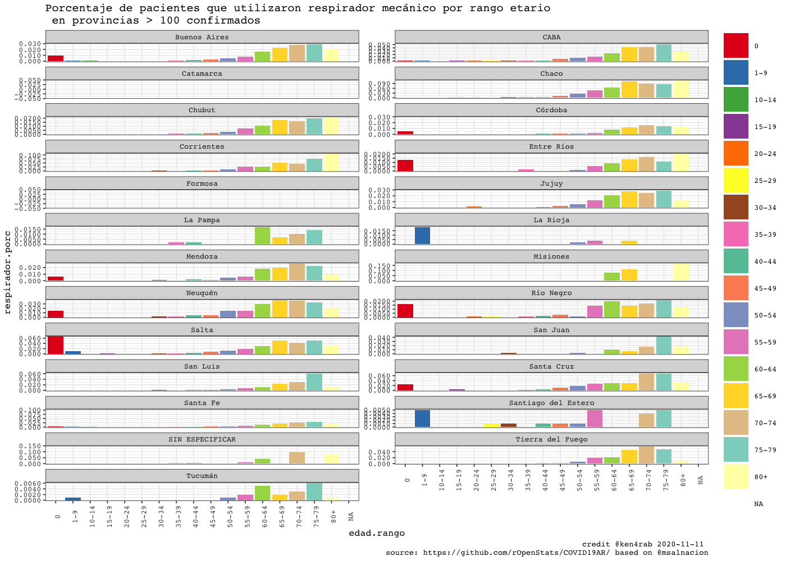

<!-- README.md is generated from README.Rmd. Please edit that file -->


COVID19AR
=========

A package for analysing COVID-19 Argentina’s outbreak

<!-- . -->

Package
=======

| Release                                                                                                | Usage                                                                                                    | Development                                                                                                                                                                                            |
|:-------------------------------------------------------------------------------------------------------|:---------------------------------------------------------------------------------------------------------|:-------------------------------------------------------------------------------------------------------------------------------------------------------------------------------------------------------|
|                                                                                                        | [](https://cran.r-project.org/) | [](https://travis-ci.org/rOpenStats/COVID19AR)                                                                                  |
| [](https://cran.r-project.org/package=COVID19AR) |                                                                                                          | [](https://codecov.io/gh/rOpenStats/COVID19AR)                                                                     |
|                                                                                                        |                                                                                                          | [](https://www.repostatus.org/#active) |

Argentina COVID19 open data
===========================

-   [Casos daily
    file](https://sisa.msal.gov.ar/datos/descargas/covid-19/files/Covid19Casos.csv)
-   [Determinaciones daily
    file](https://sisa.msal.gov.ar/datos/descargas/covid-19/files/Covid19Determinaciones.csv)

How to get started (Development version)
========================================

Install the R package using the following commands on the R console:

    # install.packages("devtools")
    devtools::install_github("rOpenStats/COVID19AR")

How to use it
=============

First add variable with your preferred configurations in `~/.Renviron`.
COVID19AR\_data\_dir is mandatory while COVID19AR\_credits can be
configured if you want to publish your own research.

    COVID19AR_data_dir = "~/.R/COVID19AR"
    COVID19AR_credits = "@youralias"

    library(COVID19AR)
    #> Loading required package: dplyr
    #> 
    #> Attaching package: 'dplyr'
    #> The following objects are masked from 'package:stats':
    #> 
    #>     filter, lag
    #> The following objects are masked from 'package:base':
    #> 
    #>     intersect, setdiff, setequal, union
    #> Loading required package: knitr
    #> Loading required package: magrittr
    #> Loading required package: lgr
    #> Warning: replacing previous import 'ggplot2::Layout' by 'lgr::Layout' when
    #> loading 'COVID19AR'
    #> Warning: replacing previous import 'readr::col_factor' by 'scales::col_factor'
    #> when loading 'COVID19AR'
    #> Warning: replacing previous import 'magrittr::equals' by 'testthat::equals' when
    #> loading 'COVID19AR'
    #> Warning: replacing previous import 'magrittr::not' by 'testthat::not' when
    #> loading 'COVID19AR'
    #> Warning: replacing previous import 'magrittr::is_less_than' by
    #> 'testthat::is_less_than' when loading 'COVID19AR'
    #> Warning: replacing previous import 'dplyr::matches' by 'testthat::matches' when
    #> loading 'COVID19AR'
    library(ggplot2)
    #> 
    #> Attaching package: 'ggplot2'
    #> The following object is masked from 'package:lgr':
    #> 
    #>     Layout

COVID19AR datos abiertos del Ministerio de Salud de la Nación
=============================================================

opendata From Ministerio de Salud de la Nación Argentina

    log.dir <- file.path(getEnv("data_dir"), "logs")
    dir.create(log.dir, recursive = TRUE, showWarnings = FALSE)
    log.file <- file.path(log.dir, "covid19ar.log")
    lgr::get_logger("root")$add_appender(AppenderFile$new(log.file))
    lgr::threshold("info", lgr::get_logger("root"))
    lgr::threshold("info", lgr::get_logger("COVID19ARCurator"))

    # Data from
    # http://datos.salud.gob.ar/dataset/covid-19-casos-registrados-en-la-republica-argentina
    covid19.curator <- COVID19ARCurator$new(report.date = Sys.Date() -1 , 
                                            download.new.data = FALSE)

    dummy <- covid19.curator$loadData()
    #> INFO  [00:39:43.222] Exists dest path? {dest.path: ~/.R/COVID19AR/Covid19Casos.csv, exists.dest.path: TRUE}
    dummy <- covid19.curator$curateData()
    #> INFO  [00:39:50.622] Normalize 
    #> INFO  [00:39:52.738] checkSoundness 
    #> INFO  [00:39:53.392] Mutating data
    # Dates of current processed file
    max(covid19.curator$data$fecha_apertura, na.rm = TRUE)
    #> [1] "2020-09-08"
    # Inicio de síntomas

    max(covid19.curator$data$fecha_inicio_sintomas,  na.rm = TRUE)
    #> [1] "2020-09-08"

    # Ultima muerte
    max(covid19.curator$data$fecha_fallecimiento,  na.rm = TRUE)
    #> [1] "2020-09-08"

    report.date <- max(covid19.curator$data$fecha_inicio_sintomas,  na.rm = TRUE)
    covid19.ar.summary <- covid19.curator$makeSummary(group.vars = NULL)

    kable(covid19.ar.summary %>% select(max_fecha_diagnostico, confirmados, fallecidos, letalidad.min.porc, letalidad.max.porc, count_fecha_diagnostico, tests, positividad.porc))

| max\_fecha\_diagnostico | confirmados | fallecidos | letalidad.min.porc | letalidad.max.porc | count\_fecha\_diagnostico |   tests | positividad.porc |
|:------------------------|------------:|-----------:|-------------------:|-------------------:|--------------------------:|--------:|-----------------:|
| 2020-09-08              |      496926 |      10333 |              0.016 |              0.021 |                       198 | 1261352 |            0.394 |


    covid19.ar.provincia.summary <- covid19.curator$makeSummary(group.vars = c("residencia_provincia_nombre"))
    covid19.ar.provincia.summary.100.confirmed <- covid19.ar.provincia.summary %>% 
      filter(confirmados >= 100) %>%
      arrange(desc(confirmados))
    # Provinces with > 100 confirmed cases
    kable(covid19.ar.provincia.summary.100.confirmed %>% select(residencia_provincia_nombre, confirmados, fallecidos, confirmados, fallecidos, letalidad.min.porc, letalidad.max.porc, count_fecha_diagnostico, tests, positividad.porc))

| residencia\_provincia\_nombre | confirmados | fallecidos | letalidad.min.porc | letalidad.max.porc | count\_fecha\_diagnostico |  tests | positividad.porc |
|:------------------------------|------------:|-----------:|-------------------:|-------------------:|--------------------------:|-------:|-----------------:|
| Buenos Aires                  |      300898 |       6238 |              0.017 |              0.021 |                       195 | 672244 |            0.448 |
| CABA                          |      104270 |       2513 |              0.021 |              0.024 |                       193 | 263994 |            0.395 |
| Santa Fe                      |       13405 |        144 |              0.008 |              0.011 |                       179 |  46284 |            0.290 |
| Córdoba                       |       11874 |        168 |              0.011 |              0.014 |                       183 |  55789 |            0.213 |
| Mendoza                       |       10801 |        163 |              0.010 |              0.015 |                       182 |  26648 |            0.405 |
| Jujuy                         |       10687 |        258 |              0.016 |              0.024 |                       173 |  25245 |            0.423 |
| Río Negro                     |        7347 |        218 |              0.026 |              0.030 |                       176 |  17745 |            0.414 |
| Chaco                         |        6149 |        231 |              0.029 |              0.038 |                       181 |  36742 |            0.167 |
| Salta                         |        5032 |         63 |              0.008 |              0.013 |                       171 |  10417 |            0.483 |
| Tucumán                       |        4667 |         17 |              0.001 |              0.004 |                       174 |  20371 |            0.229 |
| Entre Ríos                    |        4535 |         67 |              0.011 |              0.015 |                       176 |  12388 |            0.366 |
| Neuquén                       |        4036 |         69 |              0.012 |              0.017 |                       178 |   9748 |            0.414 |
| Tierra del Fuego              |        2439 |         39 |              0.013 |              0.016 |                       174 |   6745 |            0.362 |
| Santa Cruz                    |        2380 |         21 |              0.008 |              0.009 |                       168 |   5882 |            0.405 |
| La Rioja                      |        2201 |         73 |              0.031 |              0.033 |                       168 |   8157 |            0.270 |
| SIN ESPECIFICAR               |        1898 |          9 |              0.004 |              0.005 |                       169 |   4276 |            0.444 |
| Santiago del Estero           |        1389 |         19 |              0.007 |              0.014 |                       161 |  10056 |            0.138 |
| Chubut                        |        1312 |          8 |              0.003 |              0.006 |                       162 |   6248 |            0.210 |
| Corrientes                    |         405 |          2 |              0.003 |              0.005 |                       173 |   8304 |            0.049 |
| San Juan                      |         379 |          7 |              0.013 |              0.018 |                       166 |   1552 |            0.244 |
| San Luis                      |         324 |          0 |              0.000 |              0.000 |                       155 |   1406 |            0.230 |
| La Pampa                      |         245 |          3 |              0.008 |              0.012 |                       156 |   2788 |            0.088 |

    covid19.ar.summary <- covid19.curator$makeSummary(group.vars = c("residencia_provincia_nombre"))
    nrow(covid19.ar.summary)
    #> [1] 25
    porc.cols <- names(covid19.ar.summary)[grep("porc", names(covid19.ar.summary))]
    kable((covid19.ar.summary %>% filter(confirmados > 0) %>% arrange(desc(confirmados))) %>% 
            select_at(c("residencia_provincia_nombre", "confirmados", "tests", "fallecidos", "dias.fallecimiento",porc.cols)))

| residencia\_provincia\_nombre | confirmados |  tests | fallecidos | dias.fallecimiento | letalidad.min.porc | letalidad.max.porc | positividad.porc | internados.porc | cuidado.intensivo.porc | respirador.porc |
|:------------------------------|------------:|-------:|-----------:|-------------------:|-------------------:|-------------------:|-----------------:|----------------:|-----------------------:|----------------:|
| Buenos Aires                  |      300898 | 672244 |       6238 |               15.0 |              0.017 |              0.021 |            0.448 |           0.079 |                  0.011 |           0.005 |
| CABA                          |      104270 | 263994 |       2513 |               16.1 |              0.021 |              0.024 |            0.395 |           0.164 |                  0.017 |           0.008 |
| Santa Fe                      |       13405 |  46284 |        144 |               12.8 |              0.008 |              0.011 |            0.290 |           0.041 |                  0.011 |           0.006 |
| Córdoba                       |       11874 |  55789 |        168 |               14.8 |              0.011 |              0.014 |            0.213 |           0.023 |                  0.006 |           0.003 |
| Mendoza                       |       10801 |  26648 |        163 |               11.3 |              0.010 |              0.015 |            0.405 |           0.129 |                  0.008 |           0.003 |
| Jujuy                         |       10687 |  25245 |        258 |               13.7 |              0.016 |              0.024 |            0.423 |           0.008 |                  0.001 |           0.001 |
| Río Negro                     |        7347 |  17745 |        218 |               13.1 |              0.026 |              0.030 |            0.414 |           0.254 |                  0.012 |           0.008 |
| Chaco                         |        6149 |  36742 |        231 |               14.3 |              0.029 |              0.038 |            0.167 |           0.105 |                  0.058 |           0.027 |
| Salta                         |        5032 |  10417 |         63 |                9.4 |              0.008 |              0.013 |            0.483 |           0.120 |                  0.014 |           0.006 |
| Tucumán                       |        4667 |  20371 |         17 |               13.8 |              0.001 |              0.004 |            0.229 |           0.043 |                  0.005 |           0.001 |
| Entre Ríos                    |        4535 |  12388 |         67 |               11.4 |              0.011 |              0.015 |            0.366 |           0.101 |                  0.009 |           0.003 |
| Neuquén                       |        4036 |   9748 |         69 |               16.4 |              0.012 |              0.017 |            0.414 |           0.534 |                  0.013 |           0.009 |
| Tierra del Fuego              |        2439 |   6745 |         39 |               14.6 |              0.013 |              0.016 |            0.362 |           0.025 |                  0.009 |           0.008 |
| Santa Cruz                    |        2380 |   5882 |         21 |               15.6 |              0.008 |              0.009 |            0.405 |           0.040 |                  0.011 |           0.007 |
| La Rioja                      |        2201 |   8157 |         73 |                9.9 |              0.031 |              0.033 |            0.270 |           0.015 |                  0.004 |           0.001 |
| SIN ESPECIFICAR               |        1898 |   4276 |          9 |               20.7 |              0.004 |              0.005 |            0.444 |           0.063 |                  0.007 |           0.004 |
| Santiago del Estero           |        1389 |  10056 |         19 |                9.2 |              0.007 |              0.014 |            0.138 |           0.008 |                  0.002 |           0.001 |
| Chubut                        |        1312 |   6248 |          8 |               17.9 |              0.003 |              0.006 |            0.210 |           0.021 |                  0.007 |           0.006 |
| Corrientes                    |         405 |   8304 |          2 |               12.0 |              0.003 |              0.005 |            0.049 |           0.020 |                  0.007 |           0.002 |
| San Juan                      |         379 |   1552 |          7 |               12.7 |              0.013 |              0.018 |            0.244 |           0.021 |                  0.003 |           0.000 |
| San Luis                      |         324 |   1406 |          0 |                NaN |              0.000 |              0.000 |            0.230 |           0.099 |                  0.003 |           0.000 |
| La Pampa                      |         245 |   2788 |          3 |               29.0 |              0.008 |              0.012 |            0.088 |           0.082 |                  0.016 |           0.004 |
| Catamarca                     |          95 |   3771 |          0 |                NaN |              0.000 |              0.000 |            0.025 |           0.000 |                  0.000 |           0.000 |
| Formosa                       |          88 |   1155 |          1 |               12.0 |              0.008 |              0.011 |            0.076 |           0.023 |                  0.000 |           0.000 |
| Misiones                      |          70 |   3397 |          2 |                6.5 |              0.014 |              0.029 |            0.021 |           0.429 |                  0.086 |           0.043 |

    rg <- ReportGeneratorCOVID19AR$new(covid19ar.curator = covid19.curator)
    rg$preprocess()
    #> Parsed with column specification:
    #> cols(
    #>   .default = col_double(),
    #>   residencia_provincia_nombre = col_character(),
    #>   residencia_departamento_nombre = col_character(),
    #>   fecha_apertura = col_date(format = ""),
    #>   max_fecha_diagnostico = col_date(format = ""),
    #>   max_fecha_inicio_sintomas = col_date(format = ""),
    #>   confirmados.inc = col_logical(),
    #>   confirmados.rate = col_logical(),
    #>   fallecidos.inc = col_logical(),
    #>   tests.inc = col_logical(),
    #>   tests.rate = col_logical(),
    #>   sospechosos.inc = col_logical()
    #> )
    #> See spec(...) for full column specifications.
    rg$getDepartamentosExponentialGrowthPlot()
    #> Scale for 'y' is already present. Adding another scale for 'y', which will
    #> replace the existing scale.


    rg$getDepartamentosCrossSectionConfirmedPostivityPlot()


    covid19.ar.summary <- covid19.curator$makeSummary(group.vars = c("sepi_apertura"))
    #> INFO  [00:44:58.319] Processing {current.group: }
    nrow(covid19.ar.summary)
    #> [1] 28
    porc.cols <- names(covid19.ar.summary)[grep("porc", names(covid19.ar.summary))]
    kable(covid19.ar.summary %>% 
            filter(confirmados > 0) %>% 
            arrange(sepi_apertura, desc(confirmados)) %>% 
            select_at(c("sepi_apertura", "max_fecha_diagnostico", "count_fecha_diagnostico", "confirmados", "tests", "internados", "fallecidos",  porc.cols)))

| sepi\_apertura | max\_fecha\_diagnostico | count\_fecha\_diagnostico | confirmados |   tests | internados | fallecidos | letalidad.min.porc | letalidad.max.porc | positividad.porc | internados.porc | cuidado.intensivo.porc | respirador.porc |
|---------------:|:------------------------|--------------------------:|------------:|--------:|-----------:|-----------:|-------------------:|-------------------:|-----------------:|----------------:|-----------------------:|----------------:|
|             10 | 2020-08-12              |                        20 |          15 |      86 |          9 |          1 |              0.048 |              0.067 |            0.174 |           0.600 |                  0.133 |           0.133 |
|             11 | 2020-09-07              |                        42 |          99 |     668 |         66 |          9 |              0.066 |              0.091 |            0.148 |           0.667 |                  0.121 |           0.061 |
|             12 | 2020-09-07              |                        74 |         423 |    2055 |        259 |         17 |              0.034 |              0.040 |            0.206 |           0.612 |                  0.090 |           0.052 |
|             13 | 2020-09-07              |                       112 |        1102 |    5528 |        606 |         64 |              0.050 |              0.058 |            0.199 |           0.550 |                  0.093 |           0.055 |
|             14 | 2020-09-07              |                       150 |        1815 |   11555 |        991 |        116 |              0.054 |              0.064 |            0.157 |           0.546 |                  0.093 |           0.055 |
|             15 | 2020-09-07              |                       177 |        2514 |   20281 |       1353 |        181 |              0.060 |              0.072 |            0.124 |           0.538 |                  0.088 |           0.049 |
|             16 | 2020-09-07              |                       191 |        3369 |   31900 |       1720 |        242 |              0.059 |              0.072 |            0.106 |           0.511 |                  0.078 |           0.043 |
|             17 | 2020-09-07              |                       194 |        4567 |   45966 |       2264 |        351 |              0.064 |              0.077 |            0.099 |           0.496 |                  0.070 |           0.037 |
|             18 | 2020-09-07              |                       194 |        5641 |   59166 |       2683 |        437 |              0.065 |              0.077 |            0.095 |           0.476 |                  0.063 |           0.034 |
|             19 | 2020-09-07              |                       194 |        7180 |   73310 |       3292 |        525 |              0.061 |              0.073 |            0.098 |           0.458 |                  0.059 |           0.031 |
|             20 | 2020-09-07              |                       194 |        9648 |   90757 |       4160 |        639 |              0.056 |              0.066 |            0.106 |           0.431 |                  0.054 |           0.028 |
|             21 | 2020-09-08              |                       195 |       14151 |  114218 |       5527 |        815 |              0.050 |              0.058 |            0.124 |           0.391 |                  0.048 |           0.024 |
|             22 | 2020-09-08              |                       195 |       19524 |  139657 |       6999 |       1044 |              0.047 |              0.053 |            0.140 |           0.358 |                  0.043 |           0.022 |
|             23 | 2020-09-08              |                       195 |       26165 |  167978 |       8578 |       1313 |              0.044 |              0.050 |            0.156 |           0.328 |                  0.040 |           0.019 |
|             24 | 2020-09-08              |                       195 |       36017 |  203154 |      10771 |       1653 |              0.040 |              0.046 |            0.177 |           0.299 |                  0.036 |           0.017 |
|             25 | 2020-09-08              |                       195 |       49053 |  244654 |      13181 |       2071 |              0.037 |              0.042 |            0.200 |           0.269 |                  0.031 |           0.015 |
|             26 | 2020-09-08              |                       195 |       67092 |  296817 |      16311 |       2629 |              0.034 |              0.039 |            0.226 |           0.243 |                  0.028 |           0.013 |
|             27 | 2020-09-08              |                       195 |       86110 |  347944 |      19167 |       3256 |              0.033 |              0.038 |            0.247 |           0.223 |                  0.026 |           0.011 |
|             28 | 2020-09-08              |                       196 |      109738 |  407024 |      22535 |       4049 |              0.032 |              0.037 |            0.270 |           0.205 |                  0.024 |           0.011 |
|             29 | 2020-09-08              |                       198 |      138848 |  478471 |      26195 |       4950 |              0.031 |              0.036 |            0.290 |           0.189 |                  0.022 |           0.010 |
|             30 | 2020-09-08              |                       198 |      176781 |  564223 |      29908 |       5947 |              0.029 |              0.034 |            0.313 |           0.169 |                  0.020 |           0.009 |
|             31 | 2020-09-08              |                       198 |      216070 |  653352 |      33171 |       6841 |              0.027 |              0.032 |            0.331 |           0.154 |                  0.019 |           0.009 |
|             32 | 2020-09-08              |                       198 |      264866 |  760479 |      36872 |       7869 |              0.026 |              0.030 |            0.348 |           0.139 |                  0.017 |           0.008 |
|             33 | 2020-09-08              |                       198 |      310608 |  872197 |      40352 |       8672 |              0.024 |              0.028 |            0.356 |           0.130 |                  0.016 |           0.008 |
|             34 | 2020-09-08              |                       198 |      358689 |  981078 |      43672 |       9434 |              0.022 |              0.026 |            0.366 |           0.122 |                  0.015 |           0.007 |
|             35 | 2020-09-08              |                       198 |      422460 | 1113421 |      47094 |      10038 |              0.020 |              0.024 |            0.379 |           0.111 |                  0.014 |           0.006 |
|             36 | 2020-09-08              |                       198 |      485254 | 1239475 |      49231 |      10310 |              0.018 |              0.021 |            0.391 |           0.101 |                  0.013 |           0.006 |
|             37 | 2020-09-08              |                       198 |      496926 | 1261352 |      49486 |      10333 |              0.016 |              0.021 |            0.394 |           0.100 |                  0.013 |           0.006 |


    ```r
    covid19.ar.summary <- covid19.curator$makeSummary(group.vars = c("residencia_provincia_nombre", "sepi_apertura"))
    #> INFO  [00:47:09.581] Processing {current.group: residencia_provincia_nombre = Buenos Aires}
    #> INFO  [00:48:16.406] Processing {current.group: residencia_provincia_nombre = CABA}
    #> INFO  [00:48:47.106] Processing {current.group: residencia_provincia_nombre = Catamarca}
    #> INFO  [00:48:50.016] Processing {current.group: residencia_provincia_nombre = Chaco}
    #> INFO  [00:48:57.400] Processing {current.group: residencia_provincia_nombre = Chubut}
    #> INFO  [00:49:01.141] Processing {current.group: residencia_provincia_nombre = Córdoba}
    #> INFO  [00:49:11.049] Processing {current.group: residencia_provincia_nombre = Corrientes}
    #> INFO  [00:49:15.239] Processing {current.group: residencia_provincia_nombre = Entre Ríos}
    #> INFO  [00:49:19.666] Processing {current.group: residencia_provincia_nombre = Formosa}
    #> INFO  [00:49:22.198] Processing {current.group: residencia_provincia_nombre = Jujuy}
    #> INFO  [00:49:27.131] Processing {current.group: residencia_provincia_nombre = La Pampa}
    #> INFO  [00:49:30.153] Processing {current.group: residencia_provincia_nombre = La Rioja}
    #> INFO  [00:49:33.694] Processing {current.group: residencia_provincia_nombre = Mendoza}
    #> INFO  [00:49:38.417] Processing {current.group: residencia_provincia_nombre = Misiones}
    #> INFO  [00:49:42.004] Processing {current.group: residencia_provincia_nombre = Neuquén}
    #> INFO  [00:49:44.973] Processing {current.group: residencia_provincia_nombre = Río Negro}
    #> INFO  [00:49:48.604] Processing {current.group: residencia_provincia_nombre = Salta}
    #> INFO  [00:49:51.586] Processing {current.group: residencia_provincia_nombre = San Juan}
    #> INFO  [00:49:54.018] Processing {current.group: residencia_provincia_nombre = San Luis}
    #> INFO  [00:49:56.788] Processing {current.group: residencia_provincia_nombre = Santa Cruz}
    #> INFO  [00:49:59.527] Processing {current.group: residencia_provincia_nombre = Santa Fe}
    #> INFO  [00:50:05.324] Processing {current.group: residencia_provincia_nombre = Santiago del Estero}
    #> INFO  [00:50:08.431] Processing {current.group: residencia_provincia_nombre = SIN ESPECIFICAR}
    #> INFO  [00:50:11.155] Processing {current.group: residencia_provincia_nombre = Tierra del Fuego}
    #> INFO  [00:50:14.211] Processing {current.group: residencia_provincia_nombre = Tucumán}
    nrow(covid19.ar.summary)
    #> [1] 637
    porc.cols <- names(covid19.ar.summary)[grep("porc", names(covid19.ar.summary))]
    sepi.fechas <- covid19.curator$data %>% 
      group_by(sepi_apertura) %>% 
      summarize(ultima_fecha_sepi = max(fecha_apertura), .groups = "keep")


    data2plot <- covid19.ar.summary %>%
                    filter(residencia_provincia_nombre %in% covid19.ar.provincia.summary.100.confirmed$residencia_provincia_nombre) %>%
                    filter(confirmados > 0 ) %>%
                    filter(positividad.porc <=0.6 | confirmados >= 20)

                    
    data2plot %<>% inner_join(sepi.fechas, by = "sepi_apertura")
    dates <- sort(unique(data2plot$ultima_fecha_sepi))

    covplot <- data2plot %>%
     ggplot(aes(x = ultima_fecha_sepi, y = confirmados, color = "confirmados")) +
     geom_line() +
     facet_wrap(~residencia_provincia_nombre, ncol = 2, scales = "free_y") +
     labs(title = "Evolución de casos confirmados y tests\n en provincias > 100 confirmados")
    covplot <- covplot +
     geom_line(aes(x = ultima_fecha_sepi, y = tests, color = "tests")) +
     facet_wrap(~residencia_provincia_nombre, ncol = 2, scales = "free_y")
    covplot <- setupTheme(covplot, report.date = report.date, x.values = dates, x.type = "dates",
                         total.colors = 2,
                         data.provider.abv = "@msalnacion", base.size = 6)
    covplot <- covplot + scale_y_log10()
    #> Scale for 'y' is already present. Adding another scale for 'y', which will
    #> replace the existing scale.
    covplot


    covplot <- data2plot %>%
     ggplot(aes(x = ultima_fecha_sepi, y = positividad.porc, color = "positividad.porc")) +
     geom_line() +
     facet_wrap(~residencia_provincia_nombre, ncol = 2, scales = "free_y") +
     labs(title = "Porcentajes de positividad, uso de UCI, respirador y letalidad\n en provincias > 100 confirmados")
    covplot <- covplot +
     geom_line(aes(x = ultima_fecha_sepi, y = cuidado.intensivo.porc, color = "cuidado.intensivo.porc")) +
     facet_wrap(~residencia_provincia_nombre, ncol = 2, scales = "free_y")
    covplot <- covplot  +
     geom_line(aes(x = ultima_fecha_sepi, y = respirador.porc, color = "respirador.porc"))+
     facet_wrap(~residencia_provincia_nombre, ncol = 2, scales = "free_y")
    covplot <- covplot +
     geom_line(aes(x = ultima_fecha_sepi, y = letalidad.min.porc, color = "letalidad.min.porc")) +
     facet_wrap(~residencia_provincia_nombre, ncol = 2, scales = "free_y")

    covplot <- setupTheme(covplot, report.date = report.date, x.values = dates, x.type = "dates",
                         total.colors = 4,
                         data.provider.abv = "@msalnacion", base.size = 6)
    covplot


    covid19.ar.summary <- covid19.curator$makeSummary(group.vars = c("residencia_provincia_nombre", "sexo"))
    nrow(covid19.ar.summary)
    #> [1] 67
    porc.cols <- names(covid19.ar.summary)[grep("porc", names(covid19.ar.summary))]
    kable((covid19.ar.summary %>% filter(confirmados >= 10) %>% arrange(desc(confirmados))) %>% select_at(c("residencia_provincia_nombre", "sexo", "confirmados", "internados", "fallecidos",  porc.cols)))

| residencia\_provincia\_nombre | sexo | confirmados | internados | fallecidos | letalidad.min.porc | letalidad.max.porc | positividad.porc | internados.porc | cuidado.intensivo.porc | respirador.porc |
|:------------------------------|:-----|------------:|-----------:|-----------:|-------------------:|-------------------:|-----------------:|----------------:|-----------------------:|----------------:|
| Buenos Aires                  | M    |      153750 |      12961 |       3541 |              0.018 |              0.023 |            0.464 |           0.084 |                  0.013 |           0.006 |
| Buenos Aires                  | F    |      146064 |      10699 |       2654 |              0.014 |              0.018 |            0.431 |           0.073 |                  0.009 |           0.003 |
| CABA                          | F    |       52596 |       8267 |       1164 |              0.019 |              0.022 |            0.373 |           0.157 |                  0.013 |           0.006 |
| CABA                          | M    |       51268 |       8682 |       1322 |              0.023 |              0.026 |            0.420 |           0.169 |                  0.022 |           0.011 |
| Santa Fe                      | F    |        6718 |        246 |         59 |              0.007 |              0.009 |            0.276 |           0.037 |                  0.009 |           0.004 |
| Santa Fe                      | M    |        6681 |        302 |         85 |              0.010 |              0.013 |            0.305 |           0.045 |                  0.012 |           0.007 |
| Jujuy                         | M    |        6204 |         58 |        159 |              0.018 |              0.026 |            0.443 |           0.009 |                  0.001 |           0.000 |
| Córdoba                       | F    |        5974 |        135 |         70 |              0.009 |              0.012 |            0.210 |           0.023 |                  0.006 |           0.003 |
| Córdoba                       | M    |        5873 |        138 |         96 |              0.013 |              0.016 |            0.215 |           0.023 |                  0.007 |           0.004 |
| Mendoza                       | M    |        5409 |        701 |        102 |              0.013 |              0.019 |            0.418 |           0.130 |                  0.012 |           0.004 |
| Mendoza                       | F    |        5365 |        691 |         59 |              0.008 |              0.011 |            0.395 |           0.129 |                  0.004 |           0.001 |
| Jujuy                         | F    |        4466 |         26 |         98 |              0.014 |              0.022 |            0.400 |           0.006 |                  0.001 |           0.001 |
| Río Negro                     | F    |        3806 |        940 |         83 |              0.019 |              0.022 |            0.401 |           0.247 |                  0.007 |           0.003 |
| Río Negro                     | M    |        3538 |        921 |        135 |              0.033 |              0.038 |            0.430 |           0.260 |                  0.017 |           0.012 |
| Chaco                         | M    |        3097 |        330 |        145 |              0.037 |              0.047 |            0.170 |           0.107 |                  0.065 |           0.031 |
| Chaco                         | F    |        3049 |        314 |         86 |              0.022 |              0.028 |            0.164 |           0.103 |                  0.051 |           0.022 |
| Salta                         | M    |        2973 |        347 |         48 |              0.011 |              0.016 |            0.494 |           0.117 |                  0.016 |           0.007 |
| Tucumán                       | M    |        2453 |        112 |         12 |              0.002 |              0.005 |            0.200 |           0.046 |                  0.005 |           0.002 |
| Entre Ríos                    | F    |        2275 |        225 |         26 |              0.009 |              0.011 |            0.351 |           0.099 |                  0.007 |           0.002 |
| Entre Ríos                    | M    |        2256 |        231 |         40 |              0.014 |              0.018 |            0.383 |           0.102 |                  0.012 |           0.004 |
| Tucumán                       | F    |        2214 |         88 |          5 |              0.001 |              0.002 |            0.274 |           0.040 |                  0.005 |           0.001 |
| Salta                         | F    |        2048 |        254 |         15 |              0.005 |              0.007 |            0.468 |           0.124 |                  0.012 |           0.003 |
| Neuquén                       | M    |        2040 |       1091 |         38 |              0.014 |              0.019 |            0.425 |           0.535 |                  0.015 |           0.011 |
| Neuquén                       | F    |        1995 |       1063 |         30 |              0.010 |              0.015 |            0.404 |           0.533 |                  0.011 |           0.007 |
| Tierra del Fuego              | M    |        1343 |         37 |         26 |              0.016 |              0.019 |            0.383 |           0.028 |                  0.013 |           0.011 |
| Santa Cruz                    | M    |        1215 |         51 |         12 |              0.009 |              0.010 |            0.419 |           0.042 |                  0.012 |           0.008 |
| Santa Cruz                    | F    |        1164 |         44 |          9 |              0.007 |              0.008 |            0.390 |           0.038 |                  0.009 |           0.006 |
| La Rioja                      | M    |        1153 |         18 |         43 |              0.035 |              0.037 |            0.276 |           0.016 |                  0.003 |           0.001 |
| SIN ESPECIFICAR               | F    |        1115 |         63 |          3 |              0.002 |              0.003 |            0.433 |           0.057 |                  0.005 |           0.001 |
| Buenos Aires                  | NR   |        1084 |         96 |         43 |              0.027 |              0.040 |            0.469 |           0.089 |                  0.020 |           0.009 |
| Tierra del Fuego              | F    |        1082 |         23 |         13 |              0.010 |              0.012 |            0.335 |           0.021 |                  0.004 |           0.004 |
| La Rioja                      | F    |        1038 |         16 |         29 |              0.026 |              0.028 |            0.263 |           0.015 |                  0.005 |           0.002 |
| SIN ESPECIFICAR               | M    |         777 |         56 |          5 |              0.006 |              0.006 |            0.463 |           0.072 |                  0.009 |           0.006 |
| Santiago del Estero           | M    |         752 |          8 |         10 |              0.007 |              0.013 |            0.117 |           0.011 |                  0.003 |           0.000 |
| Chubut                        | M    |         700 |         19 |          5 |              0.004 |              0.007 |            0.224 |           0.027 |                  0.010 |           0.010 |
| Santiago del Estero           | F    |         633 |          3 |          9 |              0.007 |              0.014 |            0.191 |           0.005 |                  0.002 |           0.002 |
| Chubut                        | F    |         606 |          8 |          3 |              0.003 |              0.005 |            0.197 |           0.013 |                  0.003 |           0.002 |
| CABA                          | NR   |         406 |        109 |         27 |              0.051 |              0.067 |            0.411 |           0.268 |                  0.037 |           0.022 |
| Corrientes                    | M    |         234 |          7 |          2 |              0.005 |              0.009 |            0.051 |           0.030 |                  0.009 |           0.004 |
| San Juan                      | F    |         190 |          4 |          2 |              0.007 |              0.011 |            0.270 |           0.021 |                  0.005 |           0.000 |
| San Juan                      | M    |         189 |          4 |          5 |              0.019 |              0.026 |            0.223 |           0.021 |                  0.000 |           0.000 |
| San Luis                      | M    |         176 |         15 |          0 |              0.000 |              0.000 |            0.229 |           0.085 |                  0.006 |           0.000 |
| Corrientes                    | F    |         171 |          1 |          0 |              0.000 |              0.000 |            0.046 |           0.006 |                  0.006 |           0.000 |
| San Luis                      | F    |         148 |         17 |          0 |              0.000 |              0.000 |            0.233 |           0.115 |                  0.000 |           0.000 |
| La Pampa                      | F    |         134 |         14 |          1 |              0.005 |              0.007 |            0.086 |           0.104 |                  0.022 |           0.007 |
| La Pampa                      | M    |         111 |          6 |          2 |              0.011 |              0.018 |            0.092 |           0.054 |                  0.009 |           0.000 |
| Formosa                       | M    |          69 |          0 |          0 |              0.000 |              0.000 |            0.099 |           0.000 |                  0.000 |           0.000 |
| Catamarca                     | M    |          63 |          0 |          0 |              0.000 |              0.000 |            0.026 |           0.000 |                  0.000 |           0.000 |
| Misiones                      | M    |          42 |         16 |          1 |              0.012 |              0.024 |            0.023 |           0.381 |                  0.095 |           0.048 |
| Catamarca                     | F    |          32 |          0 |          0 |              0.000 |              0.000 |            0.024 |           0.000 |                  0.000 |           0.000 |
| Misiones                      | F    |          28 |         14 |          1 |              0.018 |              0.036 |            0.018 |           0.500 |                  0.071 |           0.036 |
| Córdoba                       | NR   |          27 |          1 |          2 |              0.054 |              0.074 |            0.474 |           0.037 |                  0.000 |           0.000 |
| Mendoza                       | NR   |          27 |          5 |          2 |              0.032 |              0.074 |            0.203 |           0.185 |                  0.000 |           0.000 |
| Formosa                       | F    |          19 |          2 |          1 |              0.028 |              0.053 |            0.041 |           0.105 |                  0.000 |           0.000 |
| Jujuy                         | NR   |          17 |          0 |          1 |              0.031 |              0.059 |            0.315 |           0.000 |                  0.000 |           0.000 |
| Tierra del Fuego              | NR   |          14 |          0 |          0 |              0.000 |              0.000 |            2.800 |           0.000 |                  0.000 |           0.000 |
| Salta                         | NR   |          11 |          1 |          0 |              0.000 |              0.000 |            0.423 |           0.091 |                  0.000 |           0.000 |
| La Rioja                      | NR   |          10 |          0 |          1 |              0.091 |              0.100 |            0.217 |           0.000 |                  0.000 |           0.000 |


    covid19.ar.summary <- covid19.curator$makeSummary(group.vars = c("residencia_provincia_nombre", "edad.rango"))
    #> Warning in max.default(structure(c(NA_real_, NA_real_, NA_real_, NA_real_, : no
    #> non-missing arguments to max; returning -Inf

    #> Warning in max.default(structure(c(NA_real_, NA_real_, NA_real_, NA_real_, : no
    #> non-missing arguments to max; returning -Inf

     # Share per province
      provinces.cases <-covid19.ar.summary %>%
        group_by(residencia_provincia_nombre) %>%
        summarise(fallecidos.total.provincia = sum(fallecidos),
                  confirmados.total.provincia = sum(confirmados),
                  .groups = "keep")
     covid19.ar.summary %<>% inner_join(provinces.cases, by = "residencia_provincia_nombre")
     covid19.ar.summary %<>% mutate(fallecidos.prop = fallecidos/fallecidos.total.provincia)
     covid19.ar.summary %<>% mutate(confirmados.prop = confirmados/confirmados.total.provincia)

     # Data 2 plot
     data2plot <- covid19.ar.summary %>% filter(residencia_provincia_nombre %in%
     # Proporción de confirmados por rango etario
     covid19.ar.provincia.summary.100.confirmed$residencia_provincia_nombre)

     
     covidplot <-
       data2plot %>%
       ggplot(aes(x = edad.rango, y = confirmados.prop, fill = edad.rango)) +
       geom_bar(stat = "identity") + facet_wrap(~residencia_provincia_nombre, ncol = 2, scales = "free_y") +
       labs(title = "Proporción de confirmados por rango etario\n en provincias > 100 confirmados")

     covidplot <- setupTheme(covidplot, report.date = report.date, x.values = NULL, x.type = NULL,
                             total.colors = length(unique(data2plot$edad.rango)),
                             data.provider.abv = "@msalnacion", base.size = 6)
     # Proporción de muertos por rango etario
     covidplot


     #Plot of deaths share
     covidplot <-
        data2plot %>%
        ggplot(aes(x = edad.rango, y = fallecidos.prop, fill = edad.rango)) +
        geom_bar(stat = "identity") + facet_wrap(~residencia_provincia_nombre, ncol = 2, scales = "free_y") +
        labs(title = "Proporción de muertos por rango etario\n en provincias > 100 confirmados")
     covidplot <- setupTheme(covidplot, report.date = report.date, x.values = NULL, x.type = NULL,
                          total.colors = length(unique(data2plot$edad.rango)),
                          data.provider.abv = "@msalnacion", base.size = 6)
     # Proporción de muertos por rango etario
     covidplot
    #> Warning: Removed 16 rows containing missing values (position_stack).


     # UCI rate
     covidplot <- data2plot %>%
       ggplot(aes(x = edad.rango, y = cuidado.intensivo.porc, fill = edad.rango)) +
       geom_bar(stat = "identity") + facet_wrap(~residencia_provincia_nombre, ncol = 2, scales = "free_y") +
        labs(title = "Porcentaje de pacientes en Unidades de Cuidados Intensivos por rango etario\n en provincias > 100 confirmados")
     covidplot <- setupTheme(covidplot, report.date = report.date, x.values = NULL, x.type = NULL,
                          total.colors = length(unique(data2plot$edad.rango)),
                          data.provider.abv = "@msalnacion", base.size = 6)
     covidplot


     # ventilator rate
     covidplot <- data2plot %>%
       ggplot(aes(x = edad.rango, y = respirador.porc, fill = edad.rango)) +
       geom_bar(stat = "identity") +
       facet_wrap(~residencia_provincia_nombre, ncol = 2, scales = "free_y") +
       labs(title = "Porcentaje de pacientes que utilizaron respirador mecánico por rango etario\n en provincias > 100 confirmados")
     covidplot <- setupTheme(covidplot, report.date = report.date, x.values = NULL, x.type = NULL,
                          total.colors = length(unique(data2plot$edad.rango)),
                          data.provider.abv = "@msalnacion", base.size = 6)
     covidplot




     # fatality rate

     covidplot <- data2plot %>%
      ggplot(aes(x = edad.rango, y = letalidad.min.porc, fill = edad.rango)) +
      geom_bar(stat = "identity") +
      facet_wrap(~residencia_provincia_nombre, ncol = 2, scales = "free_y") +
      labs(title = "Porcentaje de letalidad por rango etario\n en provincias > 100 confirmados")
     covidplot <- setupTheme(covidplot, report.date = report.date, x.values = NULL, x.type = NULL,
                          total.colors = length(unique(data2plot$edad.rango)),
                          data.provider.abv = "@msalnacion", base.size = 6)
     covidplot


Generar diferentes agregaciones y guardar csv / Generate different aggregations
===============================================================================

    output.dir <- "~/.R/COVID19AR/"
    dir.create(output.dir, showWarnings = FALSE, recursive = TRUE)
    exportAggregatedTables(covid19.curator, output.dir = output.dir,
                           aggrupation.criteria = list(provincia_residencia = c("residencia_provincia_nombre"),
                                                       provincia_localidad_residencia = c("residencia_provincia_nombre", "residencia_departamento_nombre"),
                                                       provincia_residencia_sexo = c("residencia_provincia_nombre", "sexo"),
                                                       edad_rango_sexo = c("edad.rango", "sexo"),
                                                       provincia_residencia_edad_rango = c("residencia_provincia_nombre", "edad.rango"),
                                                       provincia_residencia_sepi_apertura = c("residencia_provincia_nombre", "sepi_apertura"),
                                                       provincia_residencia = c("residencia_provincia_nombre", "residencia_departamento_nombre", "sepi_apertura"),
                                                       provincia_residencia_fecha_apertura = c("residencia_provincia_nombre", "fecha_apertura")))
                                                       
                                                      

All this tables are accesible at
[COVID19ARdata](https://github.com/rOpenStats/COVID19ARdata/tree/master/curated)

How to Cite This Work
=====================

Citation

    Alejandro Baranek, COVID19AR, 2020. URL: https://github.com/rOpenStats/COVID19AR

    BibTex
    @techreport{baranek2020Covid19AR,
    Author = {Alejandro Baranek},
    Institution = {rOpenStats},
    Title = {COVID19AR: a package for analysing Argentina COVID-19 outbreak},
    Url = {https://github.com/rOpenStats/COVID19AR},
    Year = {2020}}
