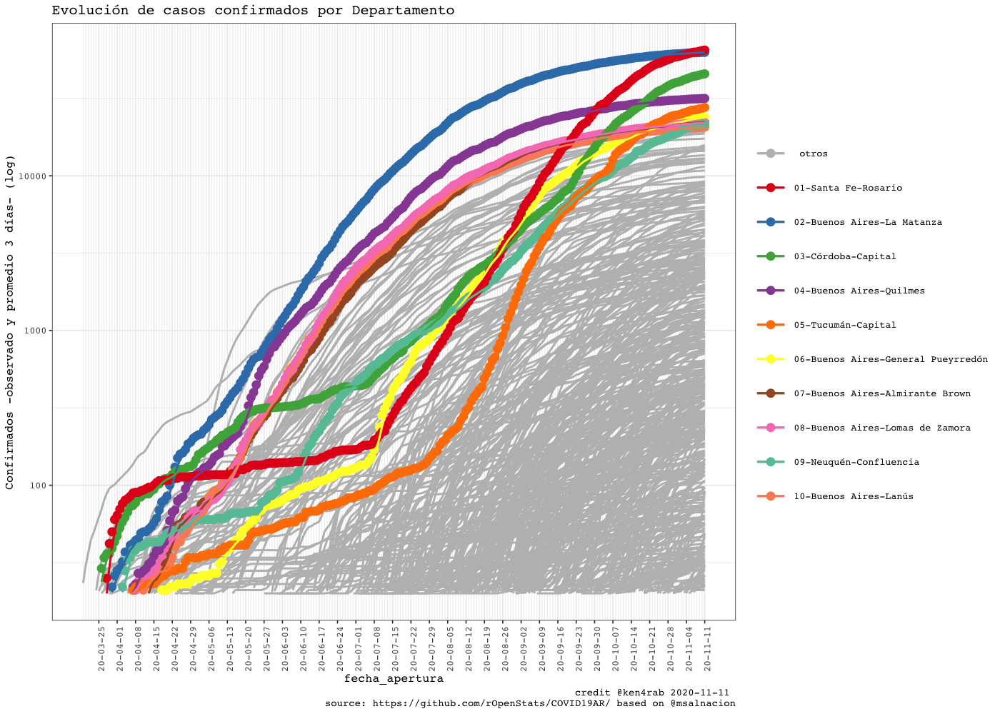

<!-- README.md is generated from README.Rmd. Please edit that file -->


# COVID19AR

A package for analysing COVID-19 Argentina’s outbreak

<!-- . -->

# Package

| Release                                                                                                | Usage                                                                                                    | Development                                                                                                                                                                                            |
|:-------------------------------------------------------------------------------------------------------|:---------------------------------------------------------------------------------------------------------|:-------------------------------------------------------------------------------------------------------------------------------------------------------------------------------------------------------|
|                                                                                                        | [](https://cran.r-project.org/) | [](https://travis-ci.org/rOpenStats/COVID19AR)                                                                                  |
| [](https://cran.r-project.org/package=COVID19AR) |                                                                                                          | [](https://codecov.io/gh/rOpenStats/COVID19AR)                                                                     |
|                                                                                                        |                                                                                                          | [](https://www.repostatus.org/#active) |

# Argentina COVID19 open data

-   [Casos daily
    file](https://sisa.msal.gov.ar/datos/descargas/covid-19/files/Covid19Casos.csv)
-   [Determinaciones daily
    file](https://sisa.msal.gov.ar/datos/descargas/covid-19/files/Covid19Determinaciones.csv)

# How to get started (Development version)

Install the R package using the following commands on the R console:

    # install.packages("devtools")
    devtools::install_github("rOpenStats/COVID19AR")

# How to use it

First add variable with your preferred configurations in `~/.Renviron`.
COVID19AR\_data\_dir is mandatory while COVID19AR\_credits can be
configured if you want to publish your own research.

    COVID19AR_data_dir = "~/.R/COVID19AR"
    COVID19AR_credits = "@youralias"

    library(COVID19AR)
    #> Loading required package: dplyr
    #> 
    #> Attaching package: 'dplyr'
    #> The following objects are masked from 'package:stats':
    #> 
    #>     filter, lag
    #> The following objects are masked from 'package:base':
    #> 
    #>     intersect, setdiff, setequal, union
    #> Loading required package: knitr
    #> Loading required package: magrittr
    #> Loading required package: lgr
    #> Warning: replacing previous import 'ggplot2::Layout' by 'lgr::Layout' when
    #> loading 'COVID19AR'
    #> Warning: replacing previous import 'readr::col_factor' by 'scales::col_factor'
    #> when loading 'COVID19AR'
    #> Warning: replacing previous import 'magrittr::equals' by 'testthat::equals' when
    #> loading 'COVID19AR'
    #> Warning: replacing previous import 'magrittr::not' by 'testthat::not' when
    #> loading 'COVID19AR'
    #> Warning: replacing previous import 'magrittr::is_less_than' by
    #> 'testthat::is_less_than' when loading 'COVID19AR'
    #> Warning: replacing previous import 'dplyr::matches' by 'testthat::matches' when
    #> loading 'COVID19AR'
    library(ggplot2)
    #> 
    #> Attaching package: 'ggplot2'
    #> The following object is masked from 'package:lgr':
    #> 
    #>     Layout

# COVID19AR datos abiertos del Ministerio de Salud de la Nación

opendata From Ministerio de Salud de la Nación Argentina

    log.dir <- file.path(getEnv("data_dir"), "logs")
    dir.create(log.dir, recursive = TRUE, showWarnings = FALSE)
    log.file <- file.path(log.dir, "covid19ar.log")
    lgr::get_logger("root")$add_appender(AppenderFile$new(log.file))
    lgr::threshold("info", lgr::get_logger("root"))
    lgr::threshold("info", lgr::get_logger("COVID19ARCurator"))

    # Data from
    # http://datos.salud.gob.ar/dataset/covid-19-casos-registrados-en-la-republica-argentina
    covid19.curator <- COVID19ARCurator$new(report.date = Sys.Date() -1 , 
                                            download.new.data = FALSE)

    dummy <- covid19.curator$loadData()
    #> INFO  [08:46:48.046] Exists dest path? {dest.path: ~/.R/COVID19AR/Covid19Casos.csv, exists.dest.path: TRUE}
    dummy <- covid19.curator$curateData()
    #> INFO  [08:47:03.721] Normalize 
    #> INFO  [08:47:07.332] checkSoundness 
    #> INFO  [08:47:08.447] Mutating data
    # Dates of current processed file
    max(covid19.curator$data$fecha_apertura, na.rm = TRUE)
    #> [1] "2020-10-25"
    # Inicio de síntomas

    max(covid19.curator$data$fecha_inicio_sintomas,  na.rm = TRUE)
    #> [1] "2020-10-25"

    # Ultima muerte
    max(covid19.curator$data$fecha_fallecimiento,  na.rm = TRUE)
    #> [1] "2020-10-25"

    report.date <- max(covid19.curator$data$fecha_inicio_sintomas,  na.rm = TRUE)
    covid19.ar.summary <- covid19.curator$makeSummary(group.vars = NULL)

    kable(covid19.ar.summary %>% select(max_fecha_diagnostico, confirmados, fallecidos, letalidad.min.porc, letalidad.max.porc, count_fecha_diagnostico, tests, positividad.porc))

| max\_fecha\_diagnostico | confirmados | fallecidos | letalidad.min.porc | letalidad.max.porc | count\_fecha\_diagnostico |   tests | positividad.porc |
|:------------------------|------------:|-----------:|-------------------:|-------------------:|--------------------------:|--------:|-----------------:|
| 2020-10-25              |     1090585 |      28896 |              0.023 |              0.026 |                       249 | 2242680 |            0.486 |


    covid19.ar.provincia.summary <- covid19.curator$makeSummary(group.vars = c("residencia_provincia_nombre"))
    covid19.ar.provincia.summary.100.confirmed <- covid19.ar.provincia.summary %>% 
      filter(confirmados >= 100) %>%
      arrange(desc(confirmados))
    # Provinces with > 100 confirmed cases
    kable(covid19.ar.provincia.summary.100.confirmed %>% select(residencia_provincia_nombre, confirmados, fallecidos, confirmados, fallecidos, letalidad.min.porc, letalidad.max.porc, count_fecha_diagnostico, tests, positividad.porc))

| residencia\_provincia\_nombre | confirmados | fallecidos | letalidad.min.porc | letalidad.max.porc | count\_fecha\_diagnostico |   tests | positividad.porc |
|:------------------------------|------------:|-----------:|-------------------:|-------------------:|--------------------------:|--------:|-----------------:|
| Buenos Aires                  |      525880 |      16679 |              0.027 |              0.032 |                       242 | 1102714 |            0.477 |
| CABA                          |      142942 |       4677 |              0.030 |              0.033 |                       240 |  377416 |            0.379 |
| Santa Fe                      |       94506 |       1076 |              0.010 |              0.011 |                       226 |  124907 |            0.757 |
| Córdoba                       |       75982 |       1130 |              0.012 |              0.015 |                       232 |  115173 |            0.660 |
| Tucumán                       |       43167 |        658 |              0.010 |              0.015 |                       221 |   55013 |            0.785 |
| Mendoza                       |       42939 |        716 |              0.014 |              0.017 |                       231 |   78202 |            0.549 |
| Río Negro                     |       21777 |        564 |              0.023 |              0.026 |                       223 |   37475 |            0.581 |
| Neuquén                       |       19380 |        348 |              0.014 |              0.018 |                       225 |   27136 |            0.714 |
| Salta                         |       17775 |        702 |              0.032 |              0.039 |                       218 |   32860 |            0.541 |
| Jujuy                         |       17608 |        780 |              0.036 |              0.044 |                       220 |   42160 |            0.418 |
| Entre Ríos                    |       13940 |        240 |              0.015 |              0.017 |                       223 |   27233 |            0.512 |
| Chaco                         |       13089 |        400 |              0.023 |              0.031 |                       228 |   59295 |            0.221 |
| Chubut                        |       12435 |        155 |              0.010 |              0.012 |                       209 |   15941 |            0.780 |
| Tierra del Fuego              |       10047 |        127 |              0.011 |              0.013 |                       222 |   16837 |            0.597 |
| Santa Cruz                    |        8462 |        114 |              0.011 |              0.013 |                       215 |   15072 |            0.561 |
| Santiago del Estero           |        8383 |        108 |              0.010 |              0.013 |                       209 |   29153 |            0.288 |
| La Rioja                      |        7120 |        241 |              0.032 |              0.034 |                       215 |   19210 |            0.371 |
| San Luis                      |        5490 |         37 |              0.004 |              0.007 |                       199 |   16401 |            0.335 |
| SIN ESPECIFICAR               |        2566 |         22 |              0.007 |              0.009 |                       216 |    5850 |            0.439 |
| La Pampa                      |        2456 |         25 |              0.007 |              0.010 |                       203 |   11908 |            0.206 |
| Corrientes                    |        2269 |         35 |              0.010 |              0.015 |                       220 |   13685 |            0.166 |
| San Juan                      |        1385 |         56 |              0.020 |              0.040 |                       211 |    2696 |            0.514 |
| Catamarca                     |         630 |          0 |              0.000 |              0.000 |                       193 |    8395 |            0.075 |
| Misiones                      |         217 |          5 |              0.012 |              0.023 |                       200 |    6434 |            0.034 |
| Formosa                       |         140 |          1 |              0.005 |              0.007 |                       193 |    1514 |            0.092 |

    covid19.ar.summary <- covid19.curator$makeSummary(group.vars = c("residencia_provincia_nombre"))
    nrow(covid19.ar.summary)
    #> [1] 25
    porc.cols <- names(covid19.ar.summary)[grep("porc", names(covid19.ar.summary))]
    kable((covid19.ar.summary %>% filter(confirmados > 0) %>% arrange(desc(confirmados))) %>% 
            select_at(c("residencia_provincia_nombre", "confirmados", "tests", "fallecidos", "dias.fallecimiento",porc.cols)))

| residencia\_provincia\_nombre | confirmados |   tests | fallecidos | dias.fallecimiento | letalidad.min.porc | letalidad.max.porc | positividad.porc | internados.porc | cuidado.intensivo.porc | respirador.porc |
|:------------------------------|------------:|--------:|-----------:|-------------------:|-------------------:|-------------------:|-----------------:|----------------:|-----------------------:|----------------:|
| Buenos Aires                  |      525880 | 1102714 |      16679 |               16.6 |              0.027 |              0.032 |            0.477 |           0.066 |                  0.010 |           0.005 |
| CABA                          |      142942 |  377416 |       4677 |               17.0 |              0.030 |              0.033 |            0.379 |           0.145 |                  0.017 |           0.009 |
| Santa Fe                      |       94506 |  124907 |       1076 |               13.1 |              0.010 |              0.011 |            0.757 |           0.023 |                  0.006 |           0.004 |
| Córdoba                       |       75982 |  115173 |       1130 |               12.8 |              0.012 |              0.015 |            0.660 |           0.017 |                  0.008 |           0.002 |
| Tucumán                       |       43167 |   55013 |        658 |               10.9 |              0.010 |              0.015 |            0.785 |           0.009 |                  0.002 |           0.001 |
| Mendoza                       |       42939 |   78202 |        716 |               12.3 |              0.014 |              0.017 |            0.549 |           0.060 |                  0.006 |           0.003 |
| Río Negro                     |       21777 |   37475 |        564 |               14.6 |              0.023 |              0.026 |            0.581 |           0.163 |                  0.007 |           0.005 |
| Neuquén                       |       19380 |   27136 |        348 |               17.7 |              0.014 |              0.018 |            0.714 |           0.414 |                  0.009 |           0.007 |
| Salta                         |       17775 |   32860 |        702 |               13.8 |              0.032 |              0.039 |            0.541 |           0.102 |                  0.019 |           0.010 |
| Jujuy                         |       17608 |   42160 |        780 |               18.5 |              0.036 |              0.044 |            0.418 |           0.018 |                  0.007 |           0.003 |
| Entre Ríos                    |       13940 |   27233 |        240 |               13.4 |              0.015 |              0.017 |            0.512 |           0.069 |                  0.007 |           0.003 |
| Chaco                         |       13089 |   59295 |        400 |               14.6 |              0.023 |              0.031 |            0.221 |           0.081 |                  0.043 |           0.020 |
| Chubut                        |       12435 |   15941 |        155 |               10.6 |              0.010 |              0.012 |            0.780 |           0.009 |                  0.003 |           0.002 |
| Tierra del Fuego              |       10047 |   16837 |        127 |               15.6 |              0.011 |              0.013 |            0.597 |           0.019 |                  0.006 |           0.005 |
| Santa Cruz                    |        8462 |   15072 |        114 |               15.0 |              0.011 |              0.013 |            0.561 |           0.056 |                  0.012 |           0.008 |
| Santiago del Estero           |        8383 |   29153 |        108 |               11.1 |              0.010 |              0.013 |            0.288 |           0.016 |                  0.001 |           0.001 |
| La Rioja                      |        7120 |   19210 |        241 |               15.9 |              0.032 |              0.034 |            0.371 |           0.007 |                  0.002 |           0.001 |
| San Luis                      |        5490 |   16401 |         37 |               13.9 |              0.004 |              0.007 |            0.335 |           0.021 |                  0.003 |           0.001 |
| SIN ESPECIFICAR               |        2566 |    5850 |         22 |               18.9 |              0.007 |              0.009 |            0.439 |           0.065 |                  0.008 |           0.004 |
| La Pampa                      |        2456 |   11908 |         25 |               16.2 |              0.007 |              0.010 |            0.206 |           0.023 |                  0.006 |           0.002 |
| Corrientes                    |        2269 |   13685 |         35 |                9.4 |              0.010 |              0.015 |            0.166 |           0.018 |                  0.014 |           0.008 |
| San Juan                      |        1385 |    2696 |         56 |               11.2 |              0.020 |              0.040 |            0.514 |           0.049 |                  0.022 |           0.007 |
| Catamarca                     |         630 |    8395 |          0 |                NaN |              0.000 |              0.000 |            0.075 |           0.014 |                  0.000 |           0.000 |
| Misiones                      |         217 |    6434 |          5 |                7.0 |              0.012 |              0.023 |            0.034 |           0.295 |                  0.037 |           0.014 |
| Formosa                       |         140 |    1514 |          1 |               12.0 |              0.005 |              0.007 |            0.092 |           0.350 |                  0.000 |           0.000 |

    rg <- ReportGeneratorCOVID19AR$new(covid19ar.curator = covid19.curator)
    rg$preprocess()
    #> 
    #> ── Column specification ────────────────────────────────────────────────────────
    #> cols(
    #>   .default = col_double(),
    #>   residencia_provincia_nombre = col_character(),
    #>   residencia_departamento_nombre = col_character(),
    #>   fecha_apertura = col_date(format = ""),
    #>   max_fecha_diagnostico = col_date(format = ""),
    #>   max_fecha_inicio_sintomas = col_date(format = ""),
    #>   confirmados.inc = col_logical(),
    #>   confirmados.rate = col_logical(),
    #>   fallecidos.inc = col_logical(),
    #>   tests.inc = col_logical(),
    #>   tests.rate = col_logical(),
    #>   sospechosos.inc = col_logical()
    #> )
    #> ℹ Use `spec()` for the full column specifications.
    rg$getDepartamentosExponentialGrowthPlot()
    #> Scale for 'y' is already present. Adding another scale for 'y', which will
    #> replace the existing scale.



    rg$getDepartamentosCrossSectionConfirmedPostivityPlot()


    covid19.ar.summary <- covid19.curator$makeSummary(group.vars = c("sepi_apertura"))
    #> INFO  [08:54:17.649] Processing {current.group: }
    nrow(covid19.ar.summary)
    #> [1] 35
    porc.cols <- names(covid19.ar.summary)[grep("porc", names(covid19.ar.summary))]
    kable(covid19.ar.summary %>% 
            filter(confirmados > 0) %>% 
            arrange(sepi_apertura, desc(confirmados)) %>% 
            select_at(c("sepi_apertura", "max_fecha_diagnostico", "count_fecha_diagnostico", "confirmados", "tests", "internados", "fallecidos",  porc.cols)))

| sepi\_apertura | max\_fecha\_diagnostico | count\_fecha\_diagnostico | confirmados |   tests | internados | fallecidos | letalidad.min.porc | letalidad.max.porc | positividad.porc | internados.porc | cuidado.intensivo.porc | respirador.porc |
|---------------:|:------------------------|--------------------------:|------------:|--------:|-----------:|-----------:|-------------------:|-------------------:|-----------------:|----------------:|-----------------------:|----------------:|
|             10 | 2020-10-17              |                        21 |          16 |      86 |          9 |          1 |              0.045 |              0.062 |            0.186 |           0.562 |                  0.125 |           0.125 |
|             11 | 2020-10-25              |                        47 |         103 |     670 |         69 |          9 |              0.065 |              0.087 |            0.154 |           0.670 |                  0.117 |           0.058 |
|             12 | 2020-10-25              |                        82 |         429 |    2058 |        264 |         17 |              0.033 |              0.040 |            0.208 |           0.615 |                  0.089 |           0.051 |
|             13 | 2020-10-25              |                       135 |        1132 |    5536 |        620 |         65 |              0.050 |              0.057 |            0.204 |           0.548 |                  0.090 |           0.054 |
|             14 | 2020-10-25              |                       187 |        1882 |   11574 |       1016 |        118 |              0.053 |              0.063 |            0.163 |           0.540 |                  0.090 |           0.053 |
|             15 | 2020-10-25              |                       221 |        2640 |   20312 |       1390 |        187 |              0.060 |              0.071 |            0.130 |           0.527 |                  0.084 |           0.048 |
|             16 | 2020-10-25              |                       237 |        3579 |   31946 |       1775 |        255 |              0.059 |              0.071 |            0.112 |           0.496 |                  0.075 |           0.041 |
|             17 | 2020-10-25              |                       242 |        4859 |   46030 |       2342 |        381 |              0.066 |              0.078 |            0.106 |           0.482 |                  0.067 |           0.035 |
|             18 | 2020-10-25              |                       242 |        5999 |   59254 |       2780 |        487 |              0.069 |              0.081 |            0.101 |           0.463 |                  0.061 |           0.032 |
|             19 | 2020-10-25              |                       242 |        7626 |   73419 |       3412 |        600 |              0.067 |              0.079 |            0.104 |           0.447 |                  0.057 |           0.029 |
|             20 | 2020-10-25              |                       242 |       10184 |   90888 |       4306 |        726 |              0.062 |              0.071 |            0.112 |           0.423 |                  0.052 |           0.027 |
|             21 | 2020-10-25              |                       242 |       14853 |  114397 |       5709 |        938 |              0.055 |              0.063 |            0.130 |           0.384 |                  0.047 |           0.023 |
|             22 | 2020-10-25              |                       242 |       20357 |  139895 |       7223 |       1210 |              0.052 |              0.059 |            0.146 |           0.355 |                  0.043 |           0.021 |
|             23 | 2020-10-25              |                       242 |       27154 |  168266 |       8837 |       1539 |              0.050 |              0.057 |            0.161 |           0.325 |                  0.040 |           0.019 |
|             24 | 2020-10-25              |                       242 |       37187 |  203532 |      11076 |       1963 |              0.047 |              0.053 |            0.183 |           0.298 |                  0.036 |           0.017 |
|             25 | 2020-10-25              |                       242 |       50408 |  245131 |      13550 |       2523 |              0.045 |              0.050 |            0.206 |           0.269 |                  0.031 |           0.014 |
|             26 | 2020-10-25              |                       242 |       68783 |  297639 |      16775 |       3282 |              0.043 |              0.048 |            0.231 |           0.244 |                  0.028 |           0.013 |
|             27 | 2020-10-25              |                       242 |       88085 |  349157 |      19701 |       4124 |              0.042 |              0.047 |            0.252 |           0.224 |                  0.026 |           0.012 |
|             28 | 2020-10-25              |                       243 |      112117 |  408629 |      23167 |       5228 |              0.041 |              0.047 |            0.274 |           0.207 |                  0.024 |           0.011 |
|             29 | 2020-10-25              |                       245 |      141861 |  481128 |      26972 |       6547 |              0.041 |              0.046 |            0.295 |           0.190 |                  0.023 |           0.010 |
|             30 | 2020-10-25              |                       245 |      180426 |  567712 |      30817 |       8029 |              0.039 |              0.045 |            0.318 |           0.171 |                  0.021 |           0.010 |
|             31 | 2020-10-25              |                       245 |      220657 |  658565 |      34242 |       9412 |              0.038 |              0.043 |            0.335 |           0.155 |                  0.019 |           0.009 |
|             32 | 2020-10-25              |                       245 |      270765 |  767746 |      38202 |      11101 |              0.036 |              0.041 |            0.353 |           0.141 |                  0.018 |           0.008 |
|             33 | 2020-10-25              |                       245 |      318409 |  882771 |      42040 |      12677 |              0.035 |              0.040 |            0.361 |           0.132 |                  0.017 |           0.008 |
|             34 | 2020-10-25              |                       245 |      367967 |  994183 |      45895 |      14439 |              0.034 |              0.039 |            0.370 |           0.125 |                  0.016 |           0.008 |
|             35 | 2020-10-25              |                       245 |      433777 | 1130640 |      50557 |      16509 |              0.033 |              0.038 |            0.384 |           0.117 |                  0.016 |           0.007 |
|             36 | 2020-10-25              |                       245 |      504075 | 1273004 |      54949 |      18607 |              0.033 |              0.037 |            0.396 |           0.109 |                  0.015 |           0.007 |
|             37 | 2020-10-25              |                       245 |      579737 | 1426077 |      59608 |      20747 |              0.032 |              0.036 |            0.407 |           0.103 |                  0.014 |           0.007 |
|             38 | 2020-10-25              |                       245 |      653371 | 1570570 |      63795 |      22710 |              0.031 |              0.035 |            0.416 |           0.098 |                  0.013 |           0.007 |
|             39 | 2020-10-25              |                       246 |      731569 | 1710684 |      68005 |      24622 |              0.030 |              0.034 |            0.428 |           0.093 |                  0.013 |           0.006 |
|             40 | 2020-10-25              |                       248 |      816414 | 1849726 |      71927 |      26345 |              0.028 |              0.032 |            0.441 |           0.088 |                  0.012 |           0.006 |
|             41 | 2020-10-25              |                       249 |      906818 | 1988103 |      75422 |      27777 |              0.027 |              0.031 |            0.456 |           0.083 |                  0.012 |           0.006 |
|             42 | 2020-10-25              |                       249 |      999977 | 2118231 |      77922 |      28615 |              0.025 |              0.029 |            0.472 |           0.078 |                  0.011 |           0.005 |
|             43 | 2020-10-25              |                       249 |     1087624 | 2239676 |      79304 |      28891 |              0.023 |              0.027 |            0.486 |           0.073 |                  0.010 |           0.005 |
|             44 | 2020-10-25              |                       249 |     1090585 | 2242680 |      79320 |      28896 |              0.023 |              0.026 |            0.486 |           0.073 |                  0.010 |           0.005 |


    ```r
    covid19.ar.summary <- covid19.curator$makeSummary(group.vars = c("residencia_provincia_nombre", "sepi_apertura"))
    #> INFO  [08:59:02.853] Processing {current.group: residencia_provincia_nombre = Buenos Aires}
    #> INFO  [09:01:27.560] Processing {current.group: residencia_provincia_nombre = CABA}
    #> INFO  [09:02:22.745] Processing {current.group: residencia_provincia_nombre = Catamarca}
    #> INFO  [09:02:26.343] Processing {current.group: residencia_provincia_nombre = Chaco}
    #> INFO  [09:02:36.258] Processing {current.group: residencia_provincia_nombre = Chubut}
    #> INFO  [09:02:40.972] Processing {current.group: residencia_provincia_nombre = Córdoba}
    #> INFO  [09:02:57.384] Processing {current.group: residencia_provincia_nombre = Corrientes}
    #> INFO  [09:03:02.411] Processing {current.group: residencia_provincia_nombre = Entre Ríos}
    #> INFO  [09:03:08.393] Processing {current.group: residencia_provincia_nombre = Formosa}
    #> INFO  [09:03:11.476] Processing {current.group: residencia_provincia_nombre = Jujuy}
    #> INFO  [09:03:19.151] Processing {current.group: residencia_provincia_nombre = La Pampa}
    #> INFO  [09:03:23.038] Processing {current.group: residencia_provincia_nombre = La Rioja}
    #> INFO  [09:03:27.702] Processing {current.group: residencia_provincia_nombre = Mendoza}
    #> INFO  [09:03:37.616] Processing {current.group: residencia_provincia_nombre = Misiones}
    #> INFO  [09:03:41.383] Processing {current.group: residencia_provincia_nombre = Neuquén}
    #> INFO  [09:03:47.211] Processing {current.group: residencia_provincia_nombre = Río Negro}
    #> INFO  [09:03:54.212] Processing {current.group: residencia_provincia_nombre = Salta}
    #> INFO  [09:04:00.114] Processing {current.group: residencia_provincia_nombre = San Juan}
    #> INFO  [09:04:03.859] Processing {current.group: residencia_provincia_nombre = San Luis}
    #> INFO  [09:04:07.719] Processing {current.group: residencia_provincia_nombre = Santa Cruz}
    #> INFO  [09:04:11.951] Processing {current.group: residencia_provincia_nombre = Santa Fe}
    #> INFO  [09:04:26.256] Processing {current.group: residencia_provincia_nombre = Santiago del Estero}
    #> INFO  [09:04:31.746] Processing {current.group: residencia_provincia_nombre = SIN ESPECIFICAR}
    #> INFO  [09:04:35.869] Processing {current.group: residencia_provincia_nombre = Tierra del Fuego}
    #> INFO  [09:04:40.810] Processing {current.group: residencia_provincia_nombre = Tucumán}
    nrow(covid19.ar.summary)
    #> [1] 818
    porc.cols <- names(covid19.ar.summary)[grep("porc", names(covid19.ar.summary))]
    sepi.fechas <- covid19.curator$data %>% 
      group_by(sepi_apertura) %>% 
      summarize(ultima_fecha_sepi = max(fecha_apertura), .groups = "keep")


    data2plot <- covid19.ar.summary %>%
                    filter(residencia_provincia_nombre %in% covid19.ar.provincia.summary.100.confirmed$residencia_provincia_nombre) %>%
                    filter(confirmados > 0 ) %>%
                    filter(positividad.porc <=0.6 | confirmados >= 20)

                    
    data2plot %<>% inner_join(sepi.fechas, by = "sepi_apertura")
    dates <- sort(unique(data2plot$ultima_fecha_sepi))

    covplot <- data2plot %>%
     ggplot(aes(x = ultima_fecha_sepi, y = confirmados, color = "confirmados")) +
     geom_line() +
     facet_wrap(~residencia_provincia_nombre, ncol = 2, scales = "free_y") +
     labs(title = "Evolución de casos confirmados y tests\n en provincias > 100 confirmados")
    covplot <- covplot +
     geom_line(aes(x = ultima_fecha_sepi, y = tests, color = "tests")) +
     facet_wrap(~residencia_provincia_nombre, ncol = 2, scales = "free_y")
    covplot <- setupTheme(covplot, report.date = report.date, x.values = dates, x.type = "dates",
                         total.colors = 2,
                         data.provider.abv = "@msalnacion", base.size = 6)
    covplot <- covplot + scale_y_log10()
    #> Scale for 'y' is already present. Adding another scale for 'y', which will
    #> replace the existing scale.
    covplot


    covplot <- data2plot %>%
     ggplot(aes(x = ultima_fecha_sepi, y = positividad.porc, color = "positividad.porc")) +
     geom_line() +
     facet_wrap(~residencia_provincia_nombre, ncol = 2, scales = "free_y") +
     labs(title = "Porcentajes de positividad, uso de UCI, respirador y letalidad\n en provincias > 100 confirmados")
    covplot <- covplot +
     geom_line(aes(x = ultima_fecha_sepi, y = cuidado.intensivo.porc, color = "cuidado.intensivo.porc")) +
     facet_wrap(~residencia_provincia_nombre, ncol = 2, scales = "free_y")
    covplot <- covplot  +
     geom_line(aes(x = ultima_fecha_sepi, y = respirador.porc, color = "respirador.porc"))+
     facet_wrap(~residencia_provincia_nombre, ncol = 2, scales = "free_y")
    covplot <- covplot +
     geom_line(aes(x = ultima_fecha_sepi, y = letalidad.min.porc, color = "letalidad.min.porc")) +
     facet_wrap(~residencia_provincia_nombre, ncol = 2, scales = "free_y")

    covplot <- setupTheme(covplot, report.date = report.date, x.values = dates, x.type = "dates",
                         total.colors = 4,
                         data.provider.abv = "@msalnacion", base.size = 6)
    covplot


    covid19.ar.summary <- covid19.curator$makeSummary(group.vars = c("residencia_provincia_nombre", "sexo"))
    #> Warning in max.default(structure(c(NA_real_, NA_real_, NA_real_, NA_real_, : no
    #> non-missing arguments to max; returning -Inf
    nrow(covid19.ar.summary)
    #> [1] 70
    porc.cols <- names(covid19.ar.summary)[grep("porc", names(covid19.ar.summary))]
    kable((covid19.ar.summary %>% filter(confirmados >= 10) %>% arrange(desc(confirmados))) %>% select_at(c("residencia_provincia_nombre", "sexo", "confirmados", "internados", "fallecidos",  porc.cols)))

| residencia\_provincia\_nombre | sexo | confirmados | internados | fallecidos | letalidad.min.porc | letalidad.max.porc | positividad.porc | internados.porc | cuidado.intensivo.porc | respirador.porc |
|:------------------------------|:-----|------------:|-----------:|-----------:|-------------------:|-------------------:|-----------------:|----------------:|-----------------------:|----------------:|
| Buenos Aires                  | M    |      266440 |      19091 |       9223 |              0.030 |              0.035 |            0.491 |           0.072 |                  0.012 |           0.006 |
| Buenos Aires                  | F    |      257591 |      15632 |       7342 |              0.025 |              0.029 |            0.463 |           0.061 |                  0.008 |           0.003 |
| CABA                          | F    |       72189 |       9992 |       2189 |              0.027 |              0.030 |            0.357 |           0.138 |                  0.013 |           0.006 |
| CABA                          | M    |       70186 |      10661 |       2442 |              0.032 |              0.035 |            0.404 |           0.152 |                  0.022 |           0.012 |
| Santa Fe                      | F    |       48053 |        974 |        488 |              0.009 |              0.010 |            0.745 |           0.020 |                  0.005 |           0.003 |
| Santa Fe                      | M    |       46412 |       1228 |        586 |              0.012 |              0.013 |            0.769 |           0.026 |                  0.008 |           0.004 |
| Córdoba                       | F    |       38561 |        589 |        485 |              0.010 |              0.013 |            0.660 |           0.015 |                  0.007 |           0.002 |
| Córdoba                       | M    |       37379 |        677 |        642 |              0.014 |              0.017 |            0.659 |           0.018 |                  0.009 |           0.002 |
| Tucumán                       | M    |       22194 |        216 |        430 |              0.013 |              0.019 |            0.739 |           0.010 |                  0.002 |           0.001 |
| Mendoza                       | F    |       21384 |       1187 |        297 |              0.011 |              0.014 |            0.537 |           0.056 |                  0.004 |           0.002 |
| Mendoza                       | M    |       21372 |       1376 |        415 |              0.016 |              0.019 |            0.563 |           0.064 |                  0.009 |           0.005 |
| Tucumán                       | F    |       20955 |        153 |        228 |              0.007 |              0.011 |            0.840 |           0.007 |                  0.002 |           0.001 |
| Río Negro                     | F    |       11212 |       1795 |        234 |              0.018 |              0.021 |            0.565 |           0.160 |                  0.005 |           0.003 |
| Río Negro                     | M    |       10554 |       1749 |        330 |              0.028 |              0.031 |            0.599 |           0.166 |                  0.010 |           0.007 |
| Salta                         | M    |        9920 |       1081 |        469 |              0.039 |              0.047 |            0.546 |           0.109 |                  0.022 |           0.013 |
| Jujuy                         | M    |        9795 |        208 |        507 |              0.042 |              0.052 |            0.425 |           0.021 |                  0.009 |           0.004 |
| Neuquén                       | F    |        9712 |       4064 |        131 |              0.010 |              0.013 |            0.702 |           0.418 |                  0.005 |           0.004 |
| Neuquén                       | M    |        9661 |       3956 |        216 |              0.017 |              0.022 |            0.727 |           0.409 |                  0.012 |           0.010 |
| Salta                         | F    |        7802 |        727 |        230 |              0.024 |              0.029 |            0.535 |           0.093 |                  0.014 |           0.006 |
| Jujuy                         | F    |        7790 |        106 |        271 |              0.028 |              0.035 |            0.409 |           0.014 |                  0.004 |           0.002 |
| Entre Ríos                    | F    |        6994 |        461 |         96 |              0.012 |              0.014 |            0.490 |           0.066 |                  0.006 |           0.002 |
| Entre Ríos                    | M    |        6939 |        499 |        143 |              0.018 |              0.021 |            0.536 |           0.072 |                  0.009 |           0.003 |
| Chubut                        | M    |        6829 |         59 |         92 |              0.011 |              0.013 |            0.796 |           0.009 |                  0.003 |           0.003 |
| Chaco                         | M    |        6573 |        561 |        253 |              0.029 |              0.038 |            0.227 |           0.085 |                  0.049 |           0.025 |
| Chaco                         | F    |        6508 |        498 |        147 |              0.017 |              0.023 |            0.215 |           0.077 |                  0.036 |           0.016 |
| Chubut                        | F    |        5577 |         55 |         62 |              0.009 |              0.011 |            0.763 |           0.010 |                  0.003 |           0.002 |
| Tierra del Fuego              | M    |        5200 |        125 |         87 |              0.015 |              0.017 |            0.609 |           0.024 |                  0.009 |           0.008 |
| Tierra del Fuego              | F    |        4832 |         62 |         40 |              0.007 |              0.008 |            0.583 |           0.013 |                  0.003 |           0.002 |
| Santiago del Estero           | M    |        4501 |         87 |         65 |              0.011 |              0.014 |            0.272 |           0.019 |                  0.002 |           0.001 |
| Santa Cruz                    | M    |        4405 |        277 |         75 |              0.014 |              0.017 |            0.594 |           0.063 |                  0.015 |           0.011 |
| Santa Cruz                    | F    |        4050 |        200 |         39 |              0.008 |              0.010 |            0.530 |           0.049 |                  0.009 |           0.006 |
| Santiago del Estero           | F    |        3877 |         49 |         43 |              0.009 |              0.011 |            0.322 |           0.013 |                  0.001 |           0.001 |
| La Rioja                      | M    |        3729 |         28 |        155 |              0.039 |              0.042 |            0.379 |           0.008 |                  0.002 |           0.001 |
| La Rioja                      | F    |        3361 |         21 |         83 |              0.023 |              0.025 |            0.362 |           0.006 |                  0.002 |           0.001 |
| San Luis                      | M    |        2810 |         64 |         23 |              0.005 |              0.008 |            0.350 |           0.023 |                  0.003 |           0.000 |
| San Luis                      | F    |        2675 |         51 |         14 |              0.003 |              0.005 |            0.320 |           0.019 |                  0.003 |           0.002 |
| Buenos Aires                  | NR   |        1849 |        147 |        114 |              0.045 |              0.062 |            0.481 |           0.080 |                  0.016 |           0.006 |
| SIN ESPECIFICAR               | F    |        1517 |         89 |         10 |              0.006 |              0.007 |            0.430 |           0.059 |                  0.006 |           0.002 |
| La Pampa                      | F    |        1270 |         29 |          8 |              0.004 |              0.006 |            0.197 |           0.023 |                  0.006 |           0.001 |
| La Pampa                      | M    |        1173 |         26 |         17 |              0.010 |              0.014 |            0.217 |           0.022 |                  0.006 |           0.003 |
| Corrientes                    | M    |        1165 |         30 |         25 |              0.013 |              0.021 |            0.161 |           0.026 |                  0.019 |           0.012 |
| Corrientes                    | F    |        1104 |         11 |         10 |              0.006 |              0.009 |            0.171 |           0.010 |                  0.008 |           0.004 |
| SIN ESPECIFICAR               | M    |        1042 |         75 |         11 |              0.009 |              0.011 |            0.453 |           0.072 |                  0.010 |           0.006 |
| San Juan                      | M    |         821 |         33 |         29 |              0.019 |              0.035 |            0.526 |           0.040 |                  0.019 |           0.009 |
| CABA                          | NR   |         567 |        135 |         46 |              0.064 |              0.081 |            0.388 |           0.238 |                  0.035 |           0.021 |
| San Juan                      | F    |         564 |         35 |         27 |              0.020 |              0.048 |            0.499 |           0.062 |                  0.025 |           0.005 |
| Catamarca                     | M    |         387 |          5 |          0 |              0.000 |              0.000 |            0.074 |           0.013 |                  0.000 |           0.000 |
| Catamarca                     | F    |         243 |          4 |          0 |              0.000 |              0.000 |            0.076 |           0.016 |                  0.000 |           0.000 |
| Mendoza                       | NR   |         183 |          7 |          4 |              0.017 |              0.022 |            0.451 |           0.038 |                  0.005 |           0.005 |
| Misiones                      | M    |         124 |         35 |          2 |              0.009 |              0.016 |            0.034 |           0.282 |                  0.032 |           0.016 |
| Formosa                       | M    |         103 |         25 |          0 |              0.000 |              0.000 |            0.114 |           0.243 |                  0.000 |           0.000 |
| Misiones                      | F    |          93 |         29 |          3 |              0.015 |              0.032 |            0.034 |           0.312 |                  0.043 |           0.011 |
| Salta                         | NR   |          53 |          5 |          3 |              0.045 |              0.057 |            0.482 |           0.094 |                  0.038 |           0.019 |
| Córdoba                       | NR   |          42 |          1 |          3 |              0.045 |              0.071 |            0.627 |           0.024 |                  0.000 |           0.000 |
| Santa Fe                      | NR   |          41 |          5 |          2 |              0.037 |              0.049 |            0.461 |           0.122 |                  0.000 |           0.000 |
| Formosa                       | F    |          37 |         24 |          1 |              0.014 |              0.027 |            0.061 |           0.649 |                  0.000 |           0.000 |
| La Rioja                      | NR   |          30 |          0 |          3 |              0.097 |              0.100 |            0.353 |           0.000 |                  0.000 |           0.000 |
| Chubut                        | NR   |          29 |          1 |          1 |              0.022 |              0.034 |            0.468 |           0.034 |                  0.000 |           0.000 |
| Jujuy                         | NR   |          23 |          1 |          2 |              0.045 |              0.087 |            0.319 |           0.043 |                  0.000 |           0.000 |
| Tucumán                       | NR   |          18 |          0 |          0 |              0.000 |              0.000 |            0.514 |           0.000 |                  0.000 |           0.000 |
| Tierra del Fuego              | NR   |          15 |          0 |          0 |              0.000 |              0.000 |            2.143 |           0.000 |                  0.000 |           0.000 |
| La Pampa                      | NR   |          13 |          1 |          0 |              0.000 |              0.000 |            0.283 |           0.077 |                  0.000 |           0.000 |
| Río Negro                     | NR   |          11 |          3 |          0 |              0.000 |              0.000 |            0.440 |           0.273 |                  0.000 |           0.000 |


    covid19.ar.summary <- covid19.curator$makeSummary(group.vars = c("residencia_provincia_nombre", "edad.rango"))
    #> Warning in max.default(structure(c(NA_real_, NA_real_, NA_real_, NA_real_, : no
    #> non-missing arguments to max; returning -Inf
    #> Warning in max.default(structure(c(NA_real_, NA_real_, NA_real_, NA_real_, : no
    #> non-missing arguments to max; returning -Inf

    #> Warning in max.default(structure(c(NA_real_, NA_real_, NA_real_, NA_real_, : no
    #> non-missing arguments to max; returning -Inf

     # Share per province
      provinces.cases <-covid19.ar.summary %>%
        group_by(residencia_provincia_nombre) %>%
        summarise(fallecidos.total.provincia = sum(fallecidos),
                  confirmados.total.provincia = sum(confirmados),
                  .groups = "keep")
     covid19.ar.summary %<>% inner_join(provinces.cases, by = "residencia_provincia_nombre")
     covid19.ar.summary %<>% mutate(fallecidos.prop = fallecidos/fallecidos.total.provincia)
     covid19.ar.summary %<>% mutate(confirmados.prop = confirmados/confirmados.total.provincia)

     # Data 2 plot
     data2plot <- covid19.ar.summary %>% filter(residencia_provincia_nombre %in%
     # Proporción de confirmados por rango etario
     covid19.ar.provincia.summary.100.confirmed$residencia_provincia_nombre)

     
     covidplot <-
       data2plot %>%
       ggplot(aes(x = edad.rango, y = confirmados.prop, fill = edad.rango)) +
       geom_bar(stat = "identity") + facet_wrap(~residencia_provincia_nombre, ncol = 2, scales = "free_y") +
       labs(title = "Proporción de confirmados por rango etario\n en provincias > 100 confirmados")

     covidplot <- setupTheme(covidplot, report.date = report.date, x.values = NULL, x.type = NULL,
                             total.colors = length(unique(data2plot$edad.rango)),
                             data.provider.abv = "@msalnacion", base.size = 6)
     # Proporción de muertos por rango etario
     covidplot


     #Plot of deaths share
     covidplot <-
        data2plot %>%
        ggplot(aes(x = edad.rango, y = fallecidos.prop, fill = edad.rango)) +
        geom_bar(stat = "identity") + facet_wrap(~residencia_provincia_nombre, ncol = 2, scales = "free_y") +
        labs(title = "Proporción de muertos por rango etario\n en provincias > 100 confirmados")
     covidplot <- setupTheme(covidplot, report.date = report.date, x.values = NULL, x.type = NULL,
                          total.colors = length(unique(data2plot$edad.rango)),
                          data.provider.abv = "@msalnacion", base.size = 6)
     # Proporción de muertos por rango etario
     covidplot
    #> Warning: Removed 17 rows containing missing values (position_stack).


     # UCI rate
     covidplot <- data2plot %>%
       ggplot(aes(x = edad.rango, y = cuidado.intensivo.porc, fill = edad.rango)) +
       geom_bar(stat = "identity") + facet_wrap(~residencia_provincia_nombre, ncol = 2, scales = "free_y") +
        labs(title = "Porcentaje de pacientes en Unidades de Cuidados Intensivos por rango etario\n en provincias > 100 confirmados")
     covidplot <- setupTheme(covidplot, report.date = report.date, x.values = NULL, x.type = NULL,
                          total.colors = length(unique(data2plot$edad.rango)),
                          data.provider.abv = "@msalnacion", base.size = 6)
     covidplot


     # ventilator rate
     covidplot <- data2plot %>%
       ggplot(aes(x = edad.rango, y = respirador.porc, fill = edad.rango)) +
       geom_bar(stat = "identity") +
       facet_wrap(~residencia_provincia_nombre, ncol = 2, scales = "free_y") +
       labs(title = "Porcentaje de pacientes que utilizaron respirador mecánico por rango etario\n en provincias > 100 confirmados")
     covidplot <- setupTheme(covidplot, report.date = report.date, x.values = NULL, x.type = NULL,
                          total.colors = length(unique(data2plot$edad.rango)),
                          data.provider.abv = "@msalnacion", base.size = 6)
     covidplot


     # fatality rate

     covidplot <- data2plot %>%
      ggplot(aes(x = edad.rango, y = letalidad.min.porc, fill = edad.rango)) +
      geom_bar(stat = "identity") +
      facet_wrap(~residencia_provincia_nombre, ncol = 2, scales = "free_y") +
      labs(title = "Porcentaje de letalidad por rango etario\n en provincias > 100 confirmados")
     covidplot <- setupTheme(covidplot, report.date = report.date, x.values = NULL, x.type = NULL,
                          total.colors = length(unique(data2plot$edad.rango)),
                          data.provider.abv = "@msalnacion", base.size = 6)
     covidplot


# Generar diferentes agregaciones y guardar csv / Generate different aggregations

    output.dir <- "~/.R/COVID19AR/"
    dir.create(output.dir, showWarnings = FALSE, recursive = TRUE)
    exportAggregatedTables(covid19.curator, output.dir = output.dir,
                           aggrupation.criteria = list(provincia_residencia = c("residencia_provincia_nombre"),
                                                       provincia_localidad_residencia = c("residencia_provincia_nombre", "residencia_departamento_nombre"),
                                                       provincia_residencia_sexo = c("residencia_provincia_nombre", "sexo"),
                                                       edad_rango_sexo = c("edad.rango", "sexo"),
                                                       provincia_residencia_edad_rango = c("residencia_provincia_nombre", "edad.rango"),
                                                       provincia_residencia_sepi_apertura = c("residencia_provincia_nombre", "sepi_apertura"),
                                                       provincia_residencia = c("residencia_provincia_nombre", "residencia_departamento_nombre", "sepi_apertura"),
                                                       provincia_residencia_fecha_apertura = c("residencia_provincia_nombre", "fecha_apertura")))
                                                       
                                                      

All this tables are accesible at
[COVID19ARdata](https://github.com/rOpenStats/COVID19ARdata/tree/master/curated)

# How to Cite This Work

Citation

    Alejandro Baranek, COVID19AR, 2020. URL: https://github.com/rOpenStats/COVID19AR

    BibTex
    @techreport{baranek2020Covid19AR,
    Author = {Alejandro Baranek},
    Institution = {rOpenStats},
    Title = {COVID19AR: a package for analysing Argentina COVID-19 outbreak},
    Url = {https://github.com/rOpenStats/COVID19AR},
    Year = {2020}}
