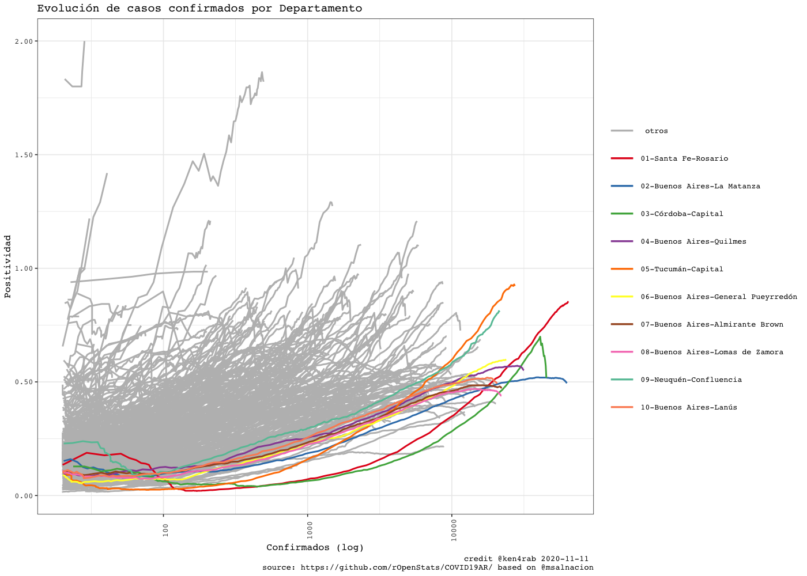

<!-- README.md is generated from README.Rmd. Please edit that file -->


COVID19AR
=========

A package for analysing COVID-19 Argentina’s outbreak

<!-- . -->

Package
=======

| Release                                                                                                | Usage                                                                                                    | Development                                                                                                                                                                                            |
|:-------------------------------------------------------------------------------------------------------|:---------------------------------------------------------------------------------------------------------|:-------------------------------------------------------------------------------------------------------------------------------------------------------------------------------------------------------|
|                                                                                                        | [](https://cran.r-project.org/) | [](https://travis-ci.org/rOpenStats/COVID19AR)                                                                                  |
| [](https://cran.r-project.org/package=COVID19AR) |                                                                                                          | [](https://codecov.io/gh/rOpenStats/COVID19AR)                                                                     |
|                                                                                                        |                                                                                                          | [](https://www.repostatus.org/#active) |

Argentina COVID19 open data
===========================

-   [Casos daily
    file](https://sisa.msal.gov.ar/datos/descargas/covid-19/files/Covid19Casos.csv)
-   [Determinaciones daily
    file](https://sisa.msal.gov.ar/datos/descargas/covid-19/files/Covid19Determinaciones.csv)

How to get started (Development version)
========================================

Install the R package using the following commands on the R console:

    # install.packages("devtools")
    devtools::install_github("rOpenStats/COVID19AR")

How to use it
=============

First add variable with your preferred configurations in `~/.Renviron`.
COVID19AR\_data\_dir is mandatory while COVID19AR\_credits can be
configured if you want to publish your own research.

    COVID19AR_data_dir = "~/.R/COVID19AR"
    COVID19AR_credits = "@youralias"

    library(COVID19AR)
    #> Loading required package: dplyr
    #> 
    #> Attaching package: 'dplyr'
    #> The following objects are masked from 'package:stats':
    #> 
    #>     filter, lag
    #> The following objects are masked from 'package:base':
    #> 
    #>     intersect, setdiff, setequal, union
    #> Loading required package: knitr
    #> Loading required package: magrittr
    #> Loading required package: lgr
    #> Warning: replacing previous import 'ggplot2::Layout' by 'lgr::Layout' when
    #> loading 'COVID19AR'
    #> Warning: replacing previous import 'readr::col_factor' by 'scales::col_factor'
    #> when loading 'COVID19AR'
    #> Warning: replacing previous import 'magrittr::equals' by 'testthat::equals' when
    #> loading 'COVID19AR'
    #> Warning: replacing previous import 'magrittr::not' by 'testthat::not' when
    #> loading 'COVID19AR'
    #> Warning: replacing previous import 'magrittr::is_less_than' by
    #> 'testthat::is_less_than' when loading 'COVID19AR'
    #> Warning: replacing previous import 'dplyr::matches' by 'testthat::matches' when
    #> loading 'COVID19AR'
    library(ggplot2)
    #> 
    #> Attaching package: 'ggplot2'
    #> The following object is masked from 'package:lgr':
    #> 
    #>     Layout

COVID19AR datos abiertos del Ministerio de Salud de la Nación
=============================================================

opendata From Ministerio de Salud de la Nación Argentina

    log.dir <- file.path(getEnv("data_dir"), "logs")
    dir.create(log.dir, recursive = TRUE, showWarnings = FALSE)
    log.file <- file.path(log.dir, "covid19ar.log")
    lgr::get_logger("root")$add_appender(AppenderFile$new(log.file))
    lgr::threshold("info", lgr::get_logger("root"))
    lgr::threshold("info", lgr::get_logger("COVID19ARCurator"))

    # Data from
    # http://datos.salud.gob.ar/dataset/covid-19-casos-registrados-en-la-republica-argentina
    covid19.curator <- COVID19ARCurator$new(report.date = Sys.Date() -1 , 
                                            download.new.data = FALSE)

    dummy <- covid19.curator$loadData()
    #> INFO  [08:09:20.578] Exists dest path? {dest.path: ~/.R/COVID19AR/Covid19Casos.csv, exists.dest.path: TRUE}
    dummy <- covid19.curator$curateData()
    #> INFO  [08:09:30.290] Normalize 
    #> INFO  [08:09:34.359] checkSoundness 
    #> INFO  [08:09:36.345] Mutating data 
    #> INFO  [08:12:10.341] Last days rows {date: 2020-08-12, n: 24927}
    #> INFO  [08:12:10.343] Last days rows {date: 2020-08-13, n: 15984}
    #> INFO  [08:12:10.345] Future rows {date: 2020-08-29, n: 1}
    # Dates of current processed file
    max(covid19.curator$data$fecha_apertura, na.rm = TRUE)
    #> [1] "2020-08-13"
    # Inicio de síntomas

    max(covid19.curator$data$fecha_inicio_sintomas,  na.rm = TRUE)
    #> [1] "2020-08-13"

    # Ultima muerte
    max(covid19.curator$data$fecha_fallecimiento,  na.rm = TRUE)
    #> [1] "2020-08-13"

    report.date <- max(covid19.curator$data$fecha_inicio_sintomas,  na.rm = TRUE)
    covid19.ar.summary <- covid19.curator$makeSummary(group.vars = NULL)

    kable(covid19.ar.summary %>% select(max_fecha_diagnostico, confirmados, fallecidos, letalidad.min.porc, letalidad.max.porc, count_fecha_diagnostico, tests, positividad.porc))

| max\_fecha\_diagnostico | confirmados | fallecidos | letalidad.min.porc | letalidad.max.porc | count\_fecha\_diagnostico |  tests | positividad.porc |
|:------------------------|------------:|-----------:|-------------------:|-------------------:|--------------------------:|-------:|-----------------:|
| 2020-08-29              |      276055 |       5362 |              0.014 |              0.019 |                       172 | 793114 |            0.348 |


    covid19.ar.provincia.summary <- covid19.curator$makeSummary(group.vars = c("residencia_provincia_nombre"))
    covid19.ar.provincia.summary.100.confirmed <- covid19.ar.provincia.summary %>% 
      filter(confirmados >= 100) %>%
      arrange(desc(confirmados))
    # Provinces with > 100 confirmed cases
    kable(covid19.ar.provincia.summary.100.confirmed %>% select(residencia_provincia_nombre, confirmados, fallecidos, confirmados, fallecidos, letalidad.min.porc, letalidad.max.porc, count_fecha_diagnostico, tests, positividad.porc))

| residencia\_provincia\_nombre | confirmados | fallecidos | letalidad.min.porc | letalidad.max.porc | count\_fecha\_diagnostico |  tests | positividad.porc |
|:------------------------------|------------:|-----------:|-------------------:|-------------------:|--------------------------:|-------:|-----------------:|
| Buenos Aires                  |      170546 |       3118 |              0.013 |              0.018 |                       170 | 416699 |            0.409 |
| CABA                          |       74017 |       1636 |              0.018 |              0.022 |                       167 | 182793 |            0.405 |
| Chaco                         |        4279 |        174 |              0.031 |              0.041 |                       155 |  26535 |            0.161 |
| Jujuy                         |        4204 |         52 |              0.006 |              0.012 |                       146 |  13293 |            0.316 |
| Córdoba                       |        4145 |         76 |              0.014 |              0.018 |                       157 |  37990 |            0.109 |
| Río Negro                     |        3535 |        101 |              0.026 |              0.029 |                       150 |  10517 |            0.336 |
| Santa Fe                      |        2764 |         29 |              0.007 |              0.010 |                       153 |  25964 |            0.106 |
| Mendoza                       |        2742 |         68 |              0.019 |              0.025 |                       156 |  10641 |            0.258 |
| Neuquén                       |        1719 |         30 |              0.015 |              0.017 |                       152 |   5763 |            0.298 |
| SIN ESPECIFICAR               |        1414 |          5 |              0.003 |              0.004 |                       143 |   3181 |            0.445 |
| Entre Ríos                    |        1365 |         17 |              0.009 |              0.012 |                       150 |   6443 |            0.212 |
| Tierra del Fuego              |        1215 |         12 |              0.008 |              0.010 |                       149 |   4239 |            0.287 |
| Santa Cruz                    |         914 |          4 |              0.004 |              0.004 |                       142 |   2561 |            0.357 |
| Salta                         |         818 |          6 |              0.005 |              0.007 |                       145 |   2747 |            0.298 |
| La Rioja                      |         640 |         21 |              0.028 |              0.033 |                       141 |   4877 |            0.131 |
| Tucumán                       |         501 |          5 |              0.002 |              0.010 |                       148 |  14232 |            0.035 |
| Chubut                        |         383 |          4 |              0.005 |              0.010 |                       136 |   3570 |            0.107 |
| Corrientes                    |         222 |          2 |              0.004 |              0.009 |                       147 |   5204 |            0.043 |
| Santiago del Estero           |         201 |          0 |              0.000 |              0.000 |                       136 |   6185 |            0.032 |
| La Pampa                      |         181 |          0 |              0.000 |              0.000 |                       130 |   1816 |            0.100 |

    covid19.ar.summary <- covid19.curator$makeSummary(group.vars = c("residencia_provincia_nombre"))
    nrow(covid19.ar.summary)
    #> [1] 25
    porc.cols <- names(covid19.ar.summary)[grep("porc", names(covid19.ar.summary))]
    kable((covid19.ar.summary %>% filter(confirmados > 0) %>% arrange(desc(confirmados))) %>% 
            select_at(c("residencia_provincia_nombre", "confirmados", "tests", "fallecidos", "dias.fallecimiento",porc.cols)))

| residencia\_provincia\_nombre | confirmados |  tests | fallecidos | dias.fallecimiento | letalidad.min.porc | letalidad.max.porc | positividad.porc | internados.porc | cuidado.intensivo.porc | respirador.porc |
|:------------------------------|------------:|-------:|-----------:|-------------------:|-------------------:|-------------------:|-----------------:|----------------:|-----------------------:|----------------:|
| Buenos Aires                  |      170546 | 416699 |       3118 |               14.1 |              0.013 |              0.018 |            0.409 |           0.097 |                  0.012 |           0.005 |
| CABA                          |       74017 | 182793 |       1636 |               15.1 |              0.018 |              0.022 |            0.405 |           0.187 |                  0.019 |           0.009 |
| Chaco                         |        4279 |  26535 |        174 |               14.6 |              0.031 |              0.041 |            0.161 |           0.113 |                  0.067 |           0.028 |
| Jujuy                         |        4204 |  13293 |         52 |               11.0 |              0.006 |              0.012 |            0.316 |           0.006 |                  0.001 |           0.001 |
| Córdoba                       |        4145 |  37990 |         76 |               19.1 |              0.014 |              0.018 |            0.109 |           0.044 |                  0.013 |           0.007 |
| Río Negro                     |        3535 |  10517 |        101 |               13.9 |              0.026 |              0.029 |            0.336 |           0.281 |                  0.015 |           0.010 |
| Santa Fe                      |        2764 |  25964 |         29 |               12.8 |              0.007 |              0.010 |            0.106 |           0.070 |                  0.016 |           0.007 |
| Mendoza                       |        2742 |  10641 |         68 |               12.1 |              0.019 |              0.025 |            0.258 |           0.305 |                  0.017 |           0.005 |
| Neuquén                       |        1719 |   5763 |         30 |               17.0 |              0.015 |              0.017 |            0.298 |           0.628 |                  0.017 |           0.010 |
| SIN ESPECIFICAR               |        1414 |   3181 |          5 |               25.6 |              0.003 |              0.004 |            0.445 |           0.066 |                  0.007 |           0.004 |
| Entre Ríos                    |        1365 |   6443 |         17 |               11.5 |              0.009 |              0.012 |            0.212 |           0.172 |                  0.012 |           0.003 |
| Tierra del Fuego              |        1215 |   4239 |         12 |               12.0 |              0.008 |              0.010 |            0.287 |           0.020 |                  0.007 |           0.007 |
| Santa Cruz                    |         914 |   2561 |          4 |               11.2 |              0.004 |              0.004 |            0.357 |           0.057 |                  0.016 |           0.010 |
| Salta                         |         818 |   2747 |          6 |                8.2 |              0.005 |              0.007 |            0.298 |           0.273 |                  0.020 |           0.010 |
| La Rioja                      |         640 |   4877 |         21 |               13.0 |              0.028 |              0.033 |            0.131 |           0.042 |                  0.009 |           0.003 |
| Tucumán                       |         501 |  14232 |          5 |               12.8 |              0.002 |              0.010 |            0.035 |           0.212 |                  0.030 |           0.006 |
| Chubut                        |         383 |   3570 |          4 |               21.5 |              0.005 |              0.010 |            0.107 |           0.050 |                  0.013 |           0.010 |
| Corrientes                    |         222 |   5204 |          2 |               12.0 |              0.004 |              0.009 |            0.043 |           0.032 |                  0.014 |           0.009 |
| Santiago del Estero           |         201 |   6185 |          0 |                NaN |              0.000 |              0.000 |            0.032 |           0.010 |                  0.005 |           0.000 |
| La Pampa                      |         181 |   1816 |          0 |                NaN |              0.000 |              0.000 |            0.100 |           0.083 |                  0.011 |           0.000 |
| Formosa                       |          78 |    962 |          0 |                NaN |              0.000 |              0.000 |            0.081 |           0.013 |                  0.000 |           0.000 |
| Catamarca                     |          62 |   2362 |          0 |                NaN |              0.000 |              0.000 |            0.026 |           0.000 |                  0.000 |           0.000 |
| Misiones                      |          55 |   2531 |          2 |                6.5 |              0.018 |              0.036 |            0.022 |           0.545 |                  0.109 |           0.055 |
| San Luis                      |          33 |    931 |          0 |                NaN |              0.000 |              0.000 |            0.035 |           0.273 |                  0.030 |           0.000 |
| San Juan                      |          22 |   1078 |          0 |                NaN |              0.000 |              0.000 |            0.020 |           0.227 |                  0.045 |           0.000 |

    rg <- ReportGeneratorCOVID19AR$new(covid19ar.curator = covid19.curator)
    rg$preprocess()
    #> Parsed with column specification:
    #> cols(
    #>   .default = col_double(),
    #>   residencia_provincia_nombre = col_character(),
    #>   residencia_departamento_nombre = col_character(),
    #>   fecha_apertura = col_date(format = ""),
    #>   max_fecha_diagnostico = col_date(format = ""),
    #>   max_fecha_inicio_sintomas = col_date(format = ""),
    #>   confirmados.inc = col_logical(),
    #>   confirmados.rate = col_logical(),
    #>   fallecidos.inc = col_logical(),
    #>   tests.inc = col_logical(),
    #>   tests.rate = col_logical(),
    #>   sospechosos.inc = col_logical()
    #> )
    #> See spec(...) for full column specifications.
    rg$getDepartamentosExponentialGrowthPlot()
    #> Scale for 'y' is already present. Adding another scale for 'y', which will
    #> replace the existing scale.


    rg$getDepartamentosCrossSectionConfirmedPostivityPlot()



    covid19.ar.summary <- covid19.curator$makeSummary(group.vars = c("sepi_apertura"))
    #> INFO  [08:12:52.557] Processing {current.group: }
    nrow(covid19.ar.summary)
    #> [1] 24
    porc.cols <- names(covid19.ar.summary)[grep("porc", names(covid19.ar.summary))]
    kable(covid19.ar.summary %>% 
            filter(confirmados > 0) %>% 
            arrange(sepi_apertura, desc(confirmados)) %>% 
            select_at(c("sepi_apertura", "max_fecha_diagnostico", "count_fecha_diagnostico", "confirmados", "tests", "internados", "fallecidos",  porc.cols)))

| sepi\_apertura | max\_fecha\_diagnostico | count\_fecha\_diagnostico | confirmados |  tests | internados | fallecidos | letalidad.min.porc | letalidad.max.porc | positividad.porc | internados.porc | cuidado.intensivo.porc | respirador.porc |
|---------------:|:------------------------|--------------------------:|------------:|-------:|-----------:|-----------:|-------------------:|-------------------:|-----------------:|----------------:|-----------------------:|----------------:|
|             10 | 2020-08-12              |                        20 |          15 |     86 |          9 |          1 |              0.048 |              0.067 |            0.174 |           0.600 |                  0.133 |           0.133 |
|             11 | 2020-08-12              |                        40 |          98 |    667 |         66 |          9 |              0.065 |              0.092 |            0.147 |           0.673 |                  0.122 |           0.061 |
|             12 | 2020-08-12              |                        64 |         415 |   2050 |        256 |         17 |              0.033 |              0.041 |            0.202 |           0.617 |                  0.092 |           0.053 |
|             13 | 2020-08-12              |                        98 |        1091 |   5518 |        601 |         63 |              0.049 |              0.058 |            0.198 |           0.551 |                  0.093 |           0.056 |
|             14 | 2020-08-12              |                       131 |        1788 |  11539 |        979 |        114 |              0.053 |              0.064 |            0.155 |           0.548 |                  0.094 |           0.056 |
|             15 | 2020-08-12              |                       155 |        2461 |  20259 |       1331 |        179 |              0.060 |              0.073 |            0.121 |           0.541 |                  0.089 |           0.050 |
|             16 | 2020-08-12              |                       165 |        3272 |  31865 |       1684 |        238 |              0.058 |              0.073 |            0.103 |           0.515 |                  0.080 |           0.044 |
|             17 | 2020-08-12              |                       168 |        4408 |  45920 |       2211 |        343 |              0.063 |              0.078 |            0.096 |           0.502 |                  0.072 |           0.038 |
|             18 | 2020-08-13              |                       169 |        5429 |  59115 |       2614 |        420 |              0.062 |              0.077 |            0.092 |           0.481 |                  0.065 |           0.034 |
|             19 | 2020-08-13              |                       169 |        6890 |  73250 |       3210 |        503 |              0.059 |              0.073 |            0.094 |           0.466 |                  0.060 |           0.031 |
|             20 | 2020-08-13              |                       169 |        9310 |  90616 |       4060 |        604 |              0.053 |              0.065 |            0.103 |           0.436 |                  0.055 |           0.028 |
|             21 | 2020-08-13              |                       169 |       13722 | 114053 |       5398 |        761 |              0.046 |              0.055 |            0.120 |           0.393 |                  0.048 |           0.025 |
|             22 | 2020-08-13              |                       169 |       18987 | 139424 |       6848 |        954 |              0.042 |              0.050 |            0.136 |           0.361 |                  0.044 |           0.022 |
|             23 | 2020-08-13              |                       169 |       25475 | 167699 |       8386 |       1189 |              0.039 |              0.047 |            0.152 |           0.329 |                  0.041 |           0.019 |
|             24 | 2020-08-13              |                       169 |       35145 | 202803 |      10536 |       1463 |              0.035 |              0.042 |            0.173 |           0.300 |                  0.036 |           0.017 |
|             25 | 2020-08-13              |                       169 |       48020 | 244205 |      12893 |       1815 |              0.032 |              0.038 |            0.197 |           0.268 |                  0.031 |           0.014 |
|             26 | 2020-08-13              |                       169 |       65792 | 296153 |      15962 |       2283 |              0.030 |              0.035 |            0.222 |           0.243 |                  0.028 |           0.012 |
|             27 | 2020-08-13              |                       169 |       84508 | 346831 |      18729 |       2803 |              0.028 |              0.033 |            0.244 |           0.222 |                  0.025 |           0.011 |
|             28 | 2020-08-13              |                       170 |      107819 | 405486 |      21974 |       3421 |              0.027 |              0.032 |            0.266 |           0.204 |                  0.023 |           0.010 |
|             29 | 2020-08-13              |                       171 |      136429 | 476118 |      25427 |       4063 |              0.025 |              0.030 |            0.287 |           0.186 |                  0.021 |           0.010 |
|             30 | 2020-08-13              |                       171 |      173356 | 560318 |      28866 |       4649 |              0.022 |              0.027 |            0.309 |           0.167 |                  0.019 |           0.009 |
|             31 | 2020-08-29              |                       172 |      211353 | 646231 |      31677 |       5032 |              0.020 |              0.024 |            0.327 |           0.150 |                  0.017 |           0.008 |
|             32 | 2020-08-29              |                       172 |      255522 | 744723 |      34161 |       5313 |              0.017 |              0.021 |            0.343 |           0.134 |                  0.016 |           0.007 |
|             33 | 2020-08-29              |                       172 |      276055 | 793114 |      35000 |       5362 |              0.014 |              0.019 |            0.348 |           0.127 |                  0.015 |           0.007 |


    ```r
    covid19.ar.summary <- covid19.curator$makeSummary(group.vars = c("residencia_provincia_nombre", "sepi_apertura"))
    #> INFO  [08:13:53.808] Processing {current.group: residencia_provincia_nombre = Buenos Aires}
    #> INFO  [08:14:26.444] Processing {current.group: residencia_provincia_nombre = CABA}
    #> INFO  [08:14:42.589] Processing {current.group: residencia_provincia_nombre = Catamarca}
    #> INFO  [08:14:44.519] Processing {current.group: residencia_provincia_nombre = Chaco}
    #> INFO  [08:14:49.230] Processing {current.group: residencia_provincia_nombre = Chubut}
    #> INFO  [08:14:51.779] Processing {current.group: residencia_provincia_nombre = Córdoba}
    #> INFO  [08:14:58.065] Processing {current.group: residencia_provincia_nombre = Corrientes}
    #> INFO  [08:15:00.818] Processing {current.group: residencia_provincia_nombre = Entre Ríos}
    #> INFO  [08:15:03.559] Processing {current.group: residencia_provincia_nombre = Formosa}
    #> INFO  [08:15:05.572] Processing {current.group: residencia_provincia_nombre = Jujuy}
    #> INFO  [08:15:08.832] Processing {current.group: residencia_provincia_nombre = La Pampa}
    #> INFO  [08:15:11.241] Processing {current.group: residencia_provincia_nombre = La Rioja}
    #> INFO  [08:15:13.823] Processing {current.group: residencia_provincia_nombre = Mendoza}
    #> INFO  [08:15:16.580] Processing {current.group: residencia_provincia_nombre = Misiones}
    #> INFO  [08:15:19.030] Processing {current.group: residencia_provincia_nombre = Neuquén}
    #> INFO  [08:15:21.677] Processing {current.group: residencia_provincia_nombre = Río Negro}
    #> INFO  [08:15:24.752] Processing {current.group: residencia_provincia_nombre = Salta}
    #> INFO  [08:15:27.140] Processing {current.group: residencia_provincia_nombre = San Juan}
    #> INFO  [08:15:29.527] Processing {current.group: residencia_provincia_nombre = San Luis}
    #> INFO  [08:15:31.943] Processing {current.group: residencia_provincia_nombre = Santa Cruz}
    #> INFO  [08:15:34.308] Processing {current.group: residencia_provincia_nombre = Santa Fe}
    #> INFO  [08:15:38.622] Processing {current.group: residencia_provincia_nombre = Santiago del Estero}
    #> INFO  [08:15:41.381] Processing {current.group: residencia_provincia_nombre = SIN ESPECIFICAR}
    #> INFO  [08:15:43.867] Processing {current.group: residencia_provincia_nombre = Tierra del Fuego}
    #> INFO  [08:15:46.570] Processing {current.group: residencia_provincia_nombre = Tucumán}
    nrow(covid19.ar.summary)
    #> [1] 536
    porc.cols <- names(covid19.ar.summary)[grep("porc", names(covid19.ar.summary))]
    sepi.fechas <- covid19.curator$data %>% 
      group_by(sepi_apertura) %>% 
      summarize(ultima_fecha_sepi = max(fecha_apertura), .groups = "keep")


    data2plot <- covid19.ar.summary %>%
                    filter(residencia_provincia_nombre %in% covid19.ar.provincia.summary.100.confirmed$residencia_provincia_nombre) %>%
                    filter(confirmados > 0 ) %>%
                    filter(positividad.porc <=0.6 | confirmados >= 20)

                    
    data2plot %<>% inner_join(sepi.fechas, by = "sepi_apertura")
    dates <- sort(unique(data2plot$ultima_fecha_sepi))

    covplot <- data2plot %>%
     ggplot(aes(x = ultima_fecha_sepi, y = confirmados, color = "confirmados")) +
     geom_line() +
     facet_wrap(~residencia_provincia_nombre, ncol = 2, scales = "free_y") +
     labs(title = "Evolución de casos confirmados y tests\n en provincias > 100 confirmados")
    covplot <- covplot +
     geom_line(aes(x = ultima_fecha_sepi, y = tests, color = "tests")) +
     facet_wrap(~residencia_provincia_nombre, ncol = 2, scales = "free_y")
    covplot <- setupTheme(covplot, report.date = report.date, x.values = dates, x.type = "dates",
                         total.colors = 2,
                         data.provider.abv = "@msalnacion", base.size = 6)
    covplot <- covplot + scale_y_log10()
    #> Scale for 'y' is already present. Adding another scale for 'y', which will
    #> replace the existing scale.
    covplot


    covplot <- data2plot %>%
     ggplot(aes(x = ultima_fecha_sepi, y = positividad.porc, color = "positividad.porc")) +
     geom_line() +
     facet_wrap(~residencia_provincia_nombre, ncol = 2, scales = "free_y") +
     labs(title = "Porcentajes de positividad, uso de UCI, respirador y letalidad\n en provincias > 100 confirmados")
    covplot <- covplot +
     geom_line(aes(x = ultima_fecha_sepi, y = cuidado.intensivo.porc, color = "cuidado.intensivo.porc")) +
     facet_wrap(~residencia_provincia_nombre, ncol = 2, scales = "free_y")
    covplot <- covplot  +
     geom_line(aes(x = ultima_fecha_sepi, y = respirador.porc, color = "respirador.porc"))+
     facet_wrap(~residencia_provincia_nombre, ncol = 2, scales = "free_y")
    covplot <- covplot +
     geom_line(aes(x = ultima_fecha_sepi, y = letalidad.min.porc, color = "letalidad.min.porc")) +
     facet_wrap(~residencia_provincia_nombre, ncol = 2, scales = "free_y")

    covplot <- setupTheme(covplot, report.date = report.date, x.values = dates, x.type = "dates",
                         total.colors = 4,
                         data.provider.abv = "@msalnacion", base.size = 6)
    covplot


    covid19.ar.summary <- covid19.curator$makeSummary(group.vars = c("residencia_provincia_nombre", "sexo"))
    nrow(covid19.ar.summary)
    #> [1] 64
    porc.cols <- names(covid19.ar.summary)[grep("porc", names(covid19.ar.summary))]
    kable((covid19.ar.summary %>% filter(confirmados >= 10) %>% arrange(desc(confirmados))) %>% select_at(c("residencia_provincia_nombre", "sexo", "confirmados", "internados", "fallecidos",  porc.cols)))

| residencia\_provincia\_nombre | sexo | confirmados | internados | fallecidos | letalidad.min.porc | letalidad.max.porc | positividad.porc | internados.porc | cuidado.intensivo.porc | respirador.porc |
|:------------------------------|:-----|------------:|-----------:|-----------:|-------------------:|-------------------:|-----------------:|----------------:|-----------------------:|----------------:|
| Buenos Aires                  | M    |       87407 |       8993 |       1759 |              0.015 |              0.020 |            0.427 |           0.103 |                  0.014 |           0.006 |
| Buenos Aires                  | F    |       82532 |       7479 |       1339 |              0.012 |              0.016 |            0.392 |           0.091 |                  0.010 |           0.004 |
| CABA                          | F    |       37354 |       6781 |        740 |              0.016 |              0.020 |            0.386 |           0.182 |                  0.014 |           0.006 |
| CABA                          | M    |       36377 |       6960 |        878 |              0.020 |              0.024 |            0.427 |           0.191 |                  0.023 |           0.011 |
| Jujuy                         | M    |        2590 |         19 |         30 |              0.006 |              0.012 |            0.353 |           0.007 |                  0.002 |           0.001 |
| Chaco                         | M    |        2143 |        240 |        106 |              0.038 |              0.049 |            0.162 |           0.112 |                  0.074 |           0.033 |
| Chaco                         | F    |        2134 |        244 |         68 |              0.024 |              0.032 |            0.160 |           0.114 |                  0.060 |           0.022 |
| Córdoba                       | M    |        2069 |         90 |         38 |              0.014 |              0.018 |            0.111 |           0.043 |                  0.013 |           0.008 |
| Córdoba                       | F    |        2068 |         92 |         38 |              0.013 |              0.018 |            0.107 |           0.044 |                  0.012 |           0.007 |
| Río Negro                     | F    |        1832 |        493 |         38 |              0.019 |              0.021 |            0.326 |           0.269 |                  0.008 |           0.004 |
| Río Negro                     | M    |        1702 |        500 |         63 |              0.033 |              0.037 |            0.348 |           0.294 |                  0.022 |           0.016 |
| Jujuy                         | F    |        1609 |          6 |         22 |              0.006 |              0.014 |            0.272 |           0.004 |                  0.001 |           0.001 |
| Santa Fe                      | F    |        1401 |         80 |         11 |              0.005 |              0.008 |            0.103 |           0.057 |                  0.013 |           0.004 |
| Mendoza                       | F    |        1376 |        429 |         25 |              0.014 |              0.018 |            0.255 |           0.312 |                  0.009 |           0.001 |
| Santa Fe                      | M    |        1363 |        114 |         18 |              0.009 |              0.013 |            0.110 |           0.084 |                  0.018 |           0.010 |
| Mendoza                       | M    |        1349 |        402 |         41 |              0.022 |              0.030 |            0.261 |           0.298 |                  0.025 |           0.009 |
| Neuquén                       | F    |         865 |        524 |         16 |              0.015 |              0.018 |            0.297 |           0.606 |                  0.018 |           0.010 |
| Neuquén                       | M    |         854 |        556 |         14 |              0.014 |              0.016 |            0.300 |           0.651 |                  0.015 |           0.009 |
| SIN ESPECIFICAR               | F    |         840 |         46 |          1 |              0.001 |              0.001 |            0.437 |           0.055 |                  0.004 |           0.000 |
| Tierra del Fuego              | M    |         706 |         15 |          7 |              0.008 |              0.010 |            0.314 |           0.021 |                  0.008 |           0.008 |
| Entre Ríos                    | F    |         683 |        110 |          7 |              0.008 |              0.010 |            0.205 |           0.161 |                  0.012 |           0.001 |
| Entre Ríos                    | M    |         681 |        125 |         10 |              0.011 |              0.015 |            0.219 |           0.184 |                  0.012 |           0.004 |
| Buenos Aires                  | NR   |         607 |         62 |         20 |              0.020 |              0.033 |            0.423 |           0.102 |                  0.028 |           0.013 |
| SIN ESPECIFICAR               | M    |         570 |         47 |          3 |              0.004 |              0.005 |            0.459 |           0.082 |                  0.011 |           0.009 |
| Tierra del Fuego              | F    |         508 |          9 |          5 |              0.008 |              0.010 |            0.256 |           0.018 |                  0.004 |           0.004 |
| Santa Cruz                    | M    |         483 |         25 |          2 |              0.004 |              0.004 |            0.366 |           0.052 |                  0.017 |           0.008 |
| Salta                         | M    |         475 |        130 |          6 |              0.009 |              0.013 |            0.281 |           0.274 |                  0.027 |           0.017 |
| Santa Cruz                    | F    |         430 |         27 |          2 |              0.004 |              0.005 |            0.346 |           0.063 |                  0.016 |           0.012 |
| Salta                         | F    |         342 |         93 |          0 |              0.000 |              0.000 |            0.327 |           0.272 |                  0.009 |           0.000 |
| La Rioja                      | M    |         324 |         12 |         13 |              0.034 |              0.040 |            0.128 |           0.037 |                  0.003 |           0.000 |
| La Rioja                      | F    |         313 |         15 |          8 |              0.022 |              0.026 |            0.135 |           0.048 |                  0.016 |           0.006 |
| CABA                          | NR   |         286 |         80 |         18 |              0.037 |              0.063 |            0.391 |           0.280 |                  0.045 |           0.031 |
| Tucumán                       | M    |         268 |         60 |          3 |              0.002 |              0.011 |            0.030 |           0.224 |                  0.022 |           0.004 |
| Tucumán                       | F    |         233 |         46 |          2 |              0.002 |              0.009 |            0.043 |           0.197 |                  0.039 |           0.009 |
| Chubut                        | M    |         213 |         15 |          2 |              0.005 |              0.009 |            0.116 |           0.070 |                  0.014 |           0.014 |
| Chubut                        | F    |         165 |          4 |          2 |              0.006 |              0.012 |            0.097 |           0.024 |                  0.012 |           0.006 |
| Corrientes                    | M    |         127 |          6 |          2 |              0.007 |              0.016 |            0.043 |           0.047 |                  0.016 |           0.016 |
| Santiago del Estero           | M    |         116 |          2 |          0 |              0.000 |              0.000 |            0.027 |           0.017 |                  0.009 |           0.000 |
| La Pampa                      | F    |         104 |         10 |          0 |              0.000 |              0.000 |            0.105 |           0.096 |                  0.010 |           0.000 |
| Corrientes                    | F    |          95 |          1 |          0 |              0.000 |              0.000 |            0.042 |           0.011 |                  0.011 |           0.000 |
| Santiago del Estero           | F    |          85 |          0 |          0 |              0.000 |              0.000 |            0.050 |           0.000 |                  0.000 |           0.000 |
| La Pampa                      | M    |          77 |          5 |          0 |              0.000 |              0.000 |            0.094 |           0.065 |                  0.013 |           0.000 |
| Formosa                       | M    |          65 |          0 |          0 |              0.000 |              0.000 |            0.114 |           0.000 |                  0.000 |           0.000 |
| Catamarca                     | M    |          40 |          0 |          0 |              0.000 |              0.000 |            0.027 |           0.000 |                  0.000 |           0.000 |
| Misiones                      | M    |          35 |         16 |          1 |              0.015 |              0.029 |            0.026 |           0.457 |                  0.114 |           0.057 |
| San Luis                      | M    |          24 |          7 |          0 |              0.000 |              0.000 |            0.046 |           0.292 |                  0.042 |           0.000 |
| Catamarca                     | F    |          22 |          0 |          0 |              0.000 |              0.000 |            0.026 |           0.000 |                  0.000 |           0.000 |
| Misiones                      | F    |          20 |         14 |          1 |              0.022 |              0.050 |            0.017 |           0.700 |                  0.100 |           0.050 |
| Mendoza                       | NR   |          17 |          5 |          2 |              0.074 |              0.118 |            0.224 |           0.294 |                  0.000 |           0.000 |
| San Juan                      | M    |          15 |          2 |          0 |              0.000 |              0.000 |            0.025 |           0.133 |                  0.000 |           0.000 |
| Formosa                       | F    |          13 |          1 |          0 |              0.000 |              0.000 |            0.033 |           0.077 |                  0.000 |           0.000 |


    covid19.ar.summary <- covid19.curator$makeSummary(group.vars = c("residencia_provincia_nombre", "edad.rango"))

     # Share per province
      provinces.cases <-covid19.ar.summary %>%
        group_by(residencia_provincia_nombre) %>%
        summarise(fallecidos.total.provincia = sum(fallecidos),
                  confirmados.total.provincia = sum(confirmados),
                  .groups = "keep")
     covid19.ar.summary %<>% inner_join(provinces.cases, by = "residencia_provincia_nombre")
     covid19.ar.summary %<>% mutate(fallecidos.prop = fallecidos/fallecidos.total.provincia)
     covid19.ar.summary %<>% mutate(confirmados.prop = confirmados/confirmados.total.provincia)

     # Data 2 plot
     data2plot <- covid19.ar.summary %>% filter(residencia_provincia_nombre %in%
     # Proporción de confirmados por rango etario
     covid19.ar.provincia.summary.100.confirmed$residencia_provincia_nombre)

     
     covidplot <-
       data2plot %>%
       ggplot(aes(x = edad.rango, y = confirmados.prop, fill = edad.rango)) +
       geom_bar(stat = "identity") + facet_wrap(~residencia_provincia_nombre, ncol = 2, scales = "free_y") +
       labs(title = "Proporción de confirmados por rango etario\n en provincias > 100 confirmados")

     covidplot <- setupTheme(covidplot, report.date = report.date, x.values = NULL, x.type = NULL,
                             total.colors = length(unique(data2plot$edad.rango)),
                             data.provider.abv = "@msalnacion", base.size = 6)
     # Proporción de muertos por rango etario
     covidplot


     #Plot of deaths share
     covidplot <-
        data2plot %>%
        ggplot(aes(x = edad.rango, y = fallecidos.prop, fill = edad.rango)) +
        geom_bar(stat = "identity") + facet_wrap(~residencia_provincia_nombre, ncol = 2, scales = "free_y") +
        labs(title = "Proporción de muertos por rango etario\n en provincias > 100 confirmados")
     covidplot <- setupTheme(covidplot, report.date = report.date, x.values = NULL, x.type = NULL,
                          total.colors = length(unique(data2plot$edad.rango)),
                          data.provider.abv = "@msalnacion", base.size = 6)
     # Proporción de muertos por rango etario
     covidplot
    #> Warning: Removed 32 rows containing missing values (position_stack).


     # UCI rate
     covidplot <- data2plot %>%
       ggplot(aes(x = edad.rango, y = cuidado.intensivo.porc, fill = edad.rango)) +
       geom_bar(stat = "identity") + facet_wrap(~residencia_provincia_nombre, ncol = 2, scales = "free_y") +
        labs(title = "Porcentaje de pacientes en Unidades de Cuidados Intensivos por rango etario\n en provincias > 100 confirmados")
     covidplot <- setupTheme(covidplot, report.date = report.date, x.values = NULL, x.type = NULL,
                          total.colors = length(unique(data2plot$edad.rango)),
                          data.provider.abv = "@msalnacion", base.size = 6)
     covidplot


     # ventilator rate
     covidplot <- data2plot %>%
       ggplot(aes(x = edad.rango, y = respirador.porc, fill = edad.rango)) +
       geom_bar(stat = "identity") +
       facet_wrap(~residencia_provincia_nombre, ncol = 2, scales = "free_y") +
       labs(title = "Porcentaje de pacientes que utilizaron respirador mecánico por rango etario\n en provincias > 100 confirmados")
     covidplot <- setupTheme(covidplot, report.date = report.date, x.values = NULL, x.type = NULL,
                          total.colors = length(unique(data2plot$edad.rango)),
                          data.provider.abv = "@msalnacion", base.size = 6)
     covidplot


     # fatality rate

     covidplot <- data2plot %>%
      ggplot(aes(x = edad.rango, y = letalidad.min.porc, fill = edad.rango)) +
      geom_bar(stat = "identity") +
      facet_wrap(~residencia_provincia_nombre, ncol = 2, scales = "free_y") +
      labs(title = "Porcentaje de letalidad por rango etario\n en provincias > 100 confirmados")
     covidplot <- setupTheme(covidplot, report.date = report.date, x.values = NULL, x.type = NULL,
                          total.colors = length(unique(data2plot$edad.rango)),
                          data.provider.abv = "@msalnacion", base.size = 6)
     covidplot


Generar diferentes agregaciones y guardar csv / Generate different aggregations
===============================================================================

    output.dir <- "~/.R/COVID19AR/"
    dir.create(output.dir, showWarnings = FALSE, recursive = TRUE)
    exportAggregatedTables(covid19.curator, output.dir = output.dir,
                           aggrupation.criteria = list(provincia_residencia = c("residencia_provincia_nombre"),
                                                       provincia_localidad_residencia = c("residencia_provincia_nombre", "residencia_departamento_nombre"),
                                                       provincia_residencia_sexo = c("residencia_provincia_nombre", "sexo"),
                                                       edad_rango_sexo = c("edad.rango", "sexo"),
                                                       provincia_residencia_edad_rango = c("residencia_provincia_nombre", "edad.rango"),
                                                       provincia_residencia_sepi_apertura = c("residencia_provincia_nombre", "sepi_apertura"),
                                                       provincia_residencia = c("residencia_provincia_nombre", "residencia_departamento_nombre", "sepi_apertura"),
                                                       provincia_residencia_fecha_apertura = c("residencia_provincia_nombre", "fecha_apertura")))
                                                       
                                                      

All this tables are accesible at
[COVID19ARdata](https://github.com/rOpenStats/COVID19ARdata/tree/master/curated)

How to Cite This Work
=====================

Citation

    Alejandro Baranek, COVID19AR, 2020. URL: https://github.com/rOpenStats/COVID19AR

    BibTex
    @techreport{baranek2020Covid19AR,
    Author = {Alejandro Baranek},
    Institution = {rOpenStats},
    Title = {COVID19AR: a package for analysing Argentina COVID-19 outbreak},
    Url = {https://github.com/rOpenStats/COVID19AR},
    Year = {2020}}
